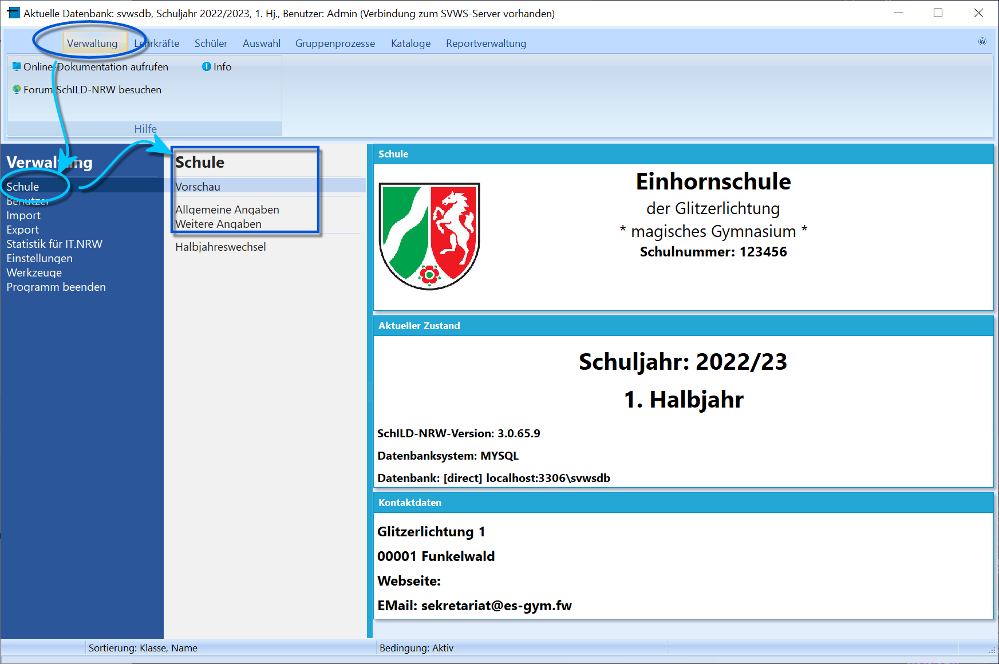

# Schuldaten bearbeiten (Einführung in SchILD-NRW)

Über *"Verwaltung ➜ Schule"* kann die Schule eingerichtet werden.

Die Einstellungen öffnen sich der *Vorschau*, in der die wesentlichen
Daten zur Schule angezeigt werden.Alle Einstellungen werden über-   **Allgemeine Angaben** und
-   **Weitere Angaben** vorgenommen.Konsultieren Sie hierzu bitte die entsprechenden Wikiartikel.