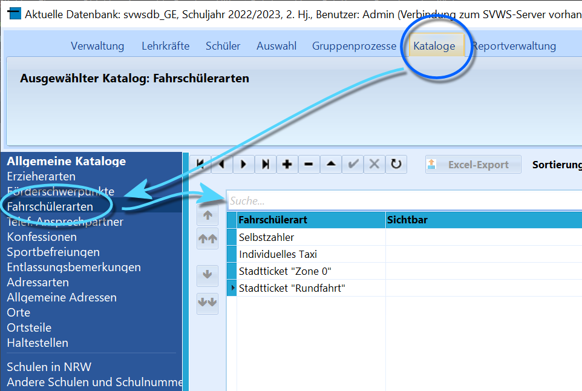
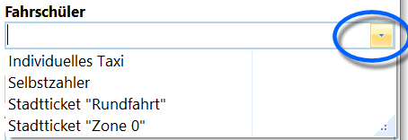

# Vom Katalog zum Eintrag (Einführung)

 In SchILD-NRW werden viele Dropdown-Menüs benutzt oder
Felder mit Daten befüllt, die für jede Schule angepasst werden sollen.Hinter vielen dieser Dropdown-Menüs verbirgt sich ein **"Katalog"** über
den eingestellt wird, welche Einträge in welcher Reihenfolge zur
Verfügung stehen.Als Katalog werden in SchILD-NRW Daten vorbereitet, bei denen dies zu
erwarten ist, zum Beispiel-   Die anwählbaren **Konfessionen** mit ihren Zeugnisbezeichnungen
-   Welche **Fahrschülerarten** vorliegen, hier kann zum Beispiel auch
    nach Buslinien unterschieden werden
-   Aus welchen **Orten** oder **Ortsteilen** kommen Ihre Schüler?
-   Es können **(DSGVO-)Einwilligungen** oder **Lernplattformen**
    angelegt werden, die sich dann für jeden Schüler gesondert markieren
    lassen.  

 Aber auch anderes wird über Kataloge vorbereitet, zum
Beispiel-   **Kurse**, die Schülern gegeben werden können, werden zuerst als
    Katalog angelegt
-   Gleiches gilt für **Unterrichtsfächer**. Dieser Katalog ist sehr
    ausführlich, da für ein Unterrichtsfach noch viele andere
    Informationen erfasst werden, etwa, ob es bilingual unterrichtet
    wird, Teil einer Zwischenprüfung oder ein Fach der Sekundarstufe II
    ist, ob es auf ein Zeugnis gedruckt werden soll und so weiter.In Bezug auf Zeugnisse können zum Beispiel-   vorgefertigte **Floskeln** aller Art oder
-   **Ankreuzskompetenzen** für Ankreuzzeugnisseüber einen Katalog vorbereitet werden.Bei vielen Arbeitsprozessen in SchILD-NRW gilt somit: Zuerst wird im
Katalog vorbereitet, dann sind die Daten konkret bei Schülern oder
Lehrkräften zu verwenden.