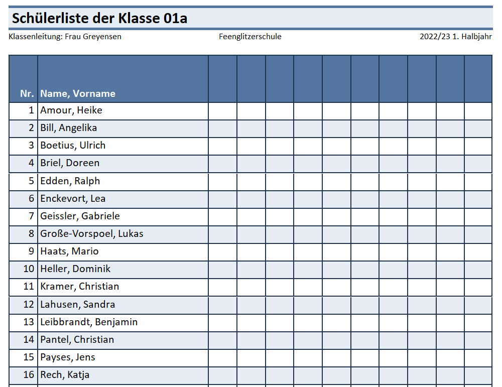
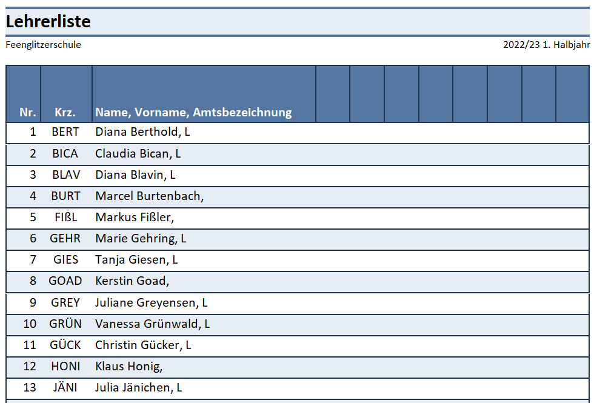
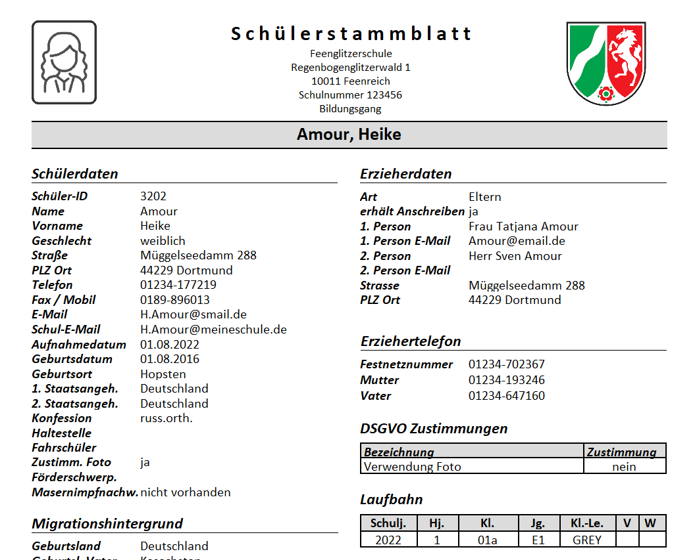
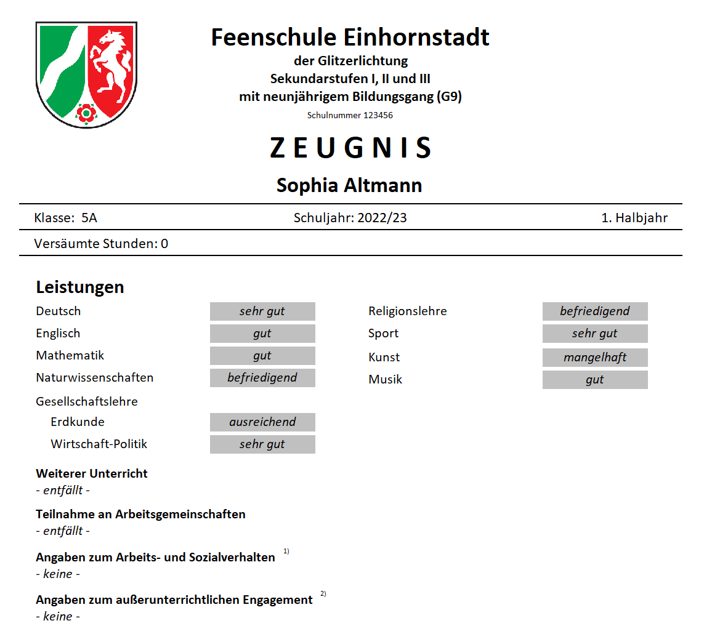

# Was ist ein Report? (Einführung)

In SchILD-NRW werden Daten von Schülern, Lehrkräfte, der Schule und
mitunter noch mehr verwaltet.Um diese Daten auszugeben, können Sie *exportiert* werden, um mit einem
Tabellenkalkulationsprogramm weiter verwendet zu werden.

Die Daten lassen sich aber auch direkt aus der Datenbank mit einem sehr
flexiblen Reportbaukasten in nahezu beliebiger Form ausgeben. Eine
bestimmte Form der Ausgabe heißt in SchILD-NRW *Report*.Bei einem Report kann es sich um eine Klassen- oder Kursliste mit Daten
wie den Telefonnummern, Geburtsdatum oder Leistungsdaten zu den Schülern
handeln.Aber auch Stammblätter und Schulbescheinigungen und Zeugnisse werden in
SchILD-NRW als Report angelegt und dann ausgegeben.Fertige Reports können Sie über die Webseite des [MSB fürSchulverwaltungssoftware beziehen.](https://www.svws.nrw.de)In diesem Wiki finden sich ausführliche Tutorials zur Verwendung,
Veränderung und Erstellung von Reports.In diesem Artikel einige Beispiel aufgeführt, um die Flexibilität des
Reportbaukastens zu zeigen.