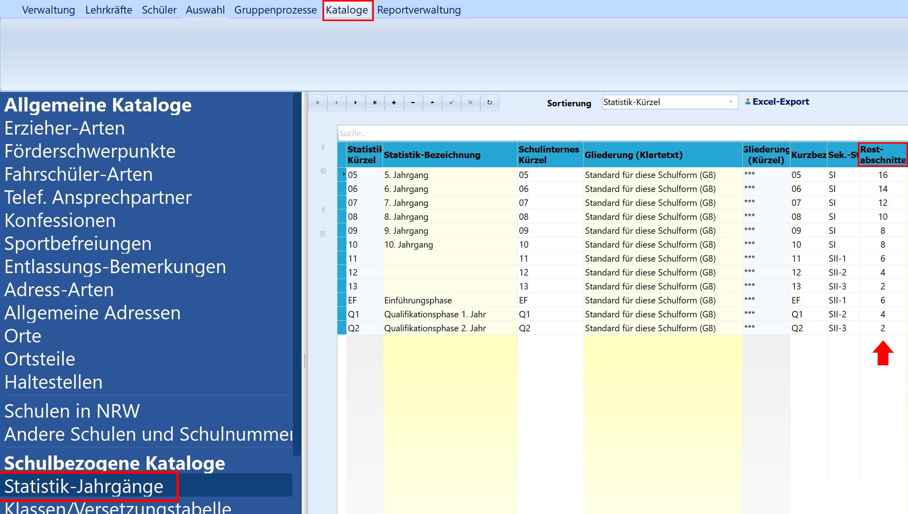
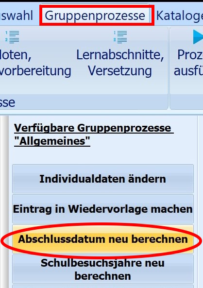
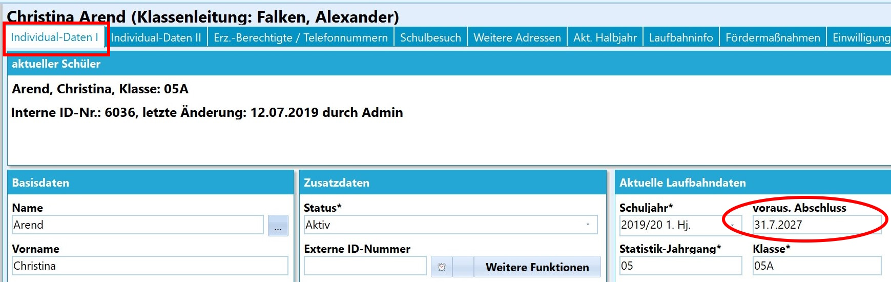

# Abschlussdatum neu berechnen (Gruppenprozesse Allgemein) 

 Dieser Gruppenprozess realisiert das
automatisierte Berechnen des Abschlussdatums.Damit diese Berechnung korrekt funktioniert, müssen bei den
*Statistik-Jahrgängen*, die über Reiter *"Kataloge ➜ Schulbezogene
Kataloge"* zu finden sind, die Restabschnitte, also die Anzahl der noch
zu absolvierenden Halbjahre oder Quartale bis zum höchsten erreichbaren
Abschluss, korrekt eingetragen sein.  

 Sind die Einträge korrekt, kann der entsprechende
Gruppenprozess angestoßen werden.  

 Nach diesem Gruppenprozess steht das neu berechnete
Abschlussdatum auf der Registerkarte unter Individualdaten I.  

### Videotutorial
<youtube>xFFvSDb6HWU</youtube>
