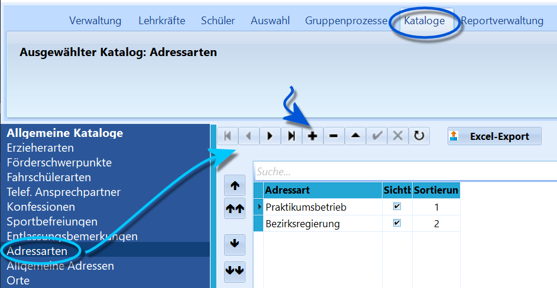

# Adress-Arten (Allgemeine Kataloge)Ein SchILD NRW werden an manchen Stellen Adressen verarbeitet. Zum
Beispiel können unter "Schüler" ➜ "Weitere Adressen" Ausbildungsbetriebe
erfasst werden. Adressen wird eine *Adressart* zugeordnet. Diese
Adressarten müssen hier in diesem Katalog zentral eingestellt werden,
somit sie über Dropdown-Menüs bei den jeweiligen Fenstern zur
Adressverarbeitung zur Verfügung stehen.Hier lassen sich alle Adressen erfassen, die nach den individuellen
Bedürfnissen wichtig sind.

 Einträge könne mit dem "**+**" und "**-**" erstellt und
entfernt werden, weiterhin lassen sich Einträge bearbeiten, sofern Sie
nicht schon in Datensätzen eingebunden wurden.Auch lässt sich die Sortierreihenfolge für die Anzeige im Dropdown-Menü
über die schwarzen Pfeile links oder direkt über die Indizes unter
*"Sortierung"* vorgeben.Ob ein Eintrag zwar im Katalog vorhanden, im Dropdown-Menü aber
ausgeblendet wird, lässt sich wie in anderen Katalogen auch mit
*"Sichtbar"* steuern.