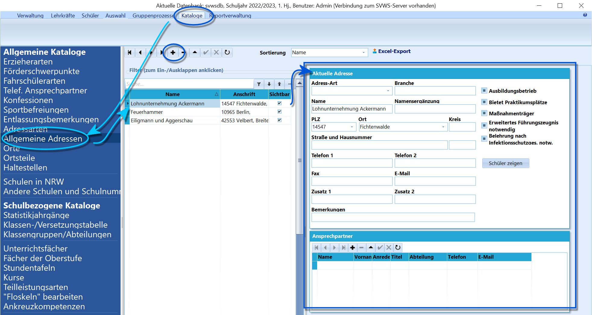

# Allgemeine Adressen (Allgemeine Kataloge)

 In den Berufskollegs ist es erforderlich, Informationen zu
den von den Schülern besuchten Betrieben zu erhalten.Auch der SI-Bereich kann diesen Katalog nutzen, um Praktikumsstellen
sowie Ausbildungsbetriebe zu verwalten und den Schülern später
zuzuordnen.Neue Datensätze werden wie üblich in SchILD über das **+** angelegt.
Geben Sie direkt den **Namen** des Unternehmens ein, damit der Datensatz
gespeichert werden kann.Unter *Aktuelle Adresse* lassen sich die Daten des Betriebs erfassen.Zu jeder Adresse können beliebig viele *Ansprechpartner* mit Name,
Abteilung, Telefon, E-Mail hinzugefügt werden. Diese Ansprechpartner
können dann auch den Schülern als Betreuer zugewiesen werden.