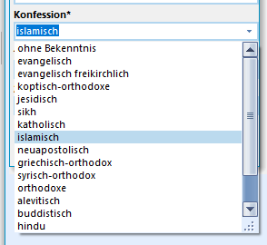
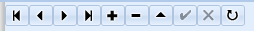
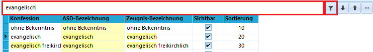
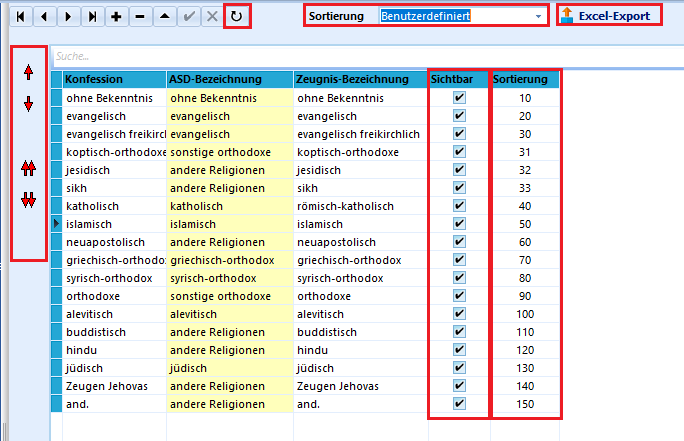

# Allgemeine Kataloge (Kataloge)

 In SchILD-NRW gibt es an vielen Stellen Felder, deren Werte
über Aufklappmenüs oder Drop-Down-Menüs ausgewählt werden.Welche Auswahloptionen hier jeweils angezeigt werden und in welcher
Reihenfolge sie stehen, kann im Karteireiter *Kataloge* eingestellt
werden.  
==Gemeinsamkeiten aller Kataloge==

## Einfügen und Löschen von Einträgen

 Durch einen Klick auf das **+** kann ein neuer Eintrag vor
der aktuell ausgewählten Position eingefügt werden.Der Eintrag wird durch einen Klick auf den Haken **✓** oder durch den
Klick in eine andere Zeile der Tabelle übernommen.Durch einen Klick auf das **-** kann der aktuell ausgewählte Datensatz,
in einem Katalog ist das eine *Tabellenzeile*, gelöscht werden.

## Suchen

 Bei Katalogen mit sehr vielen Einträgen kann es hilfreich
sein die Suchfunktion zu benutzen.Hierzu wird der Suchbegriff in das Feld über der Tabelle eingegeben und
entweder mit der Return-Taste oder durch einen Klick auf das
Filtersymbol am rechten Ende des Eingabefeldes bestätigt.Zur Aufhebung des Suchfilters kann dann das **X** rechts neben dem
Suchfeld angeklickt werden.

## Sortierung

 Alle Kataloge lassen sich entweder nach einer vorgegebenen
Spalte alphabetisch sortieren, oder nach einer benutzerdefinierten
Sortierreihenfolge:Hierzu wird die Sortierung auf **Benutzerdefiniert** gestellt, so dass
links neben der Tabelle mit den Katalogeinträgen rote Pfeile aktiv
werden.Nun kann die Reihenfolge der Tabelleneinträge verändert werden-   indem der zu verschiebende Eintrag angeklickt und anschließend mit
    Hilfe der Pfeile nach oben oder nach unten verschoben wird. Ein
    einfacher Pfeil verschiebt den Eintrag um eine Stelle, ein doppelter
    Pfeil um zehn. Erreichen Sie mit einer Verschiebungsaktion das Ende
    der Liste, fragt SchILD-NRW, ob die Daten "reorganisiert" werden
    sollen. Diese Frage kann bejaht werden, hier werden dann die Indizes
    neu geschrieben.
-   indem in der Spalte **Sortierung** Zahlen eingetragen werden, die
    der gewünschten Reihenfolge entsprechen. Durch einen Klick auf
    **Daten aktualisieren** wird die Tabelle der neuen Reihenfolge
    entsprechend sortiert.  
=== Sichtbarkeit === Durch Abwahl des Häkchens in der Spalte
**Sichtbar** können Einträge aus den Aufklappmenüs entfernt werden, die
aktuell nicht benötigt werden aber nicht endgültig gelöscht werden
sollen.

Dass Daten zwar noch im Katalog enthalten sind, aber nicht mehr im
Dropdown-Menü in SchILD-NRW angezeigt werden, ist in vielen Fällen sehr
sinnvoll. Sie können so ausgeschiedene Lehrkräfte noch in der Datenbank
behalten, verstecken Sie aber im Tagesbetrieb. Die Klasse 5f wird gerade
nicht benötigt, behalten Sie diese aber noch in der Versetzungstabelle
und schalten Sie sie nur auf *unsichtbar*.

## Excel-Export

Die Kataloge können im Excel-Format exportiert werden, um außerhalb von
SchILD-NRW verwendet zu werden.