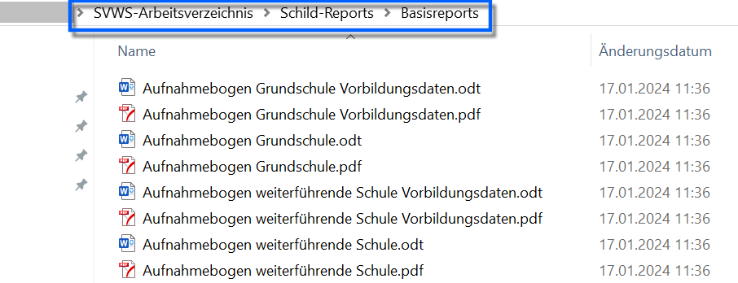
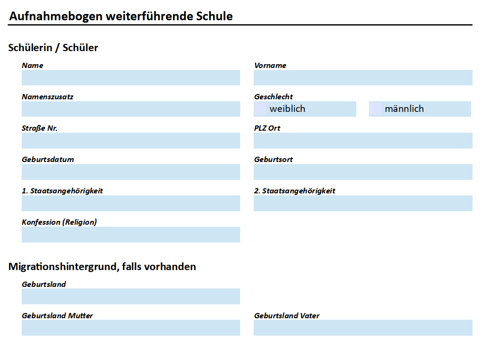

# Basisreportsammlung: Aufnahmebögen

 Mit der ***Basisreportsammlung*** in SchILD-NRW 3 werden
Vorlagen für die Aufnahme von Schülerinnen und Schülern bereitgestellt.

Diese liegen als ausfüllbare PDF-Datei und als ODT-Datei vor, die mit
Textverarbeitungsprogrammen wie LibreOffice oder OpenOffice ausgefüllt
und ausgedruckt werden können. Die ODT-Dateien können an die eigenen
Bedürfnisse angepasst und anschließend in ein PDF-Dokument überführt
werden.

Das PDF-Dokument kann den Erziehungsberechtigten zum Beispiel über die
Schulhomepage zur Verfügung gestellt werden. Dies hat den Vorteil, dass
Eltern mit einem gegliederten und gut lesbaren Dokument zur Anmeldung
erscheinen.

Der Aufbau der Aufnahmebögen orientiert sich am Schnelleingabemodul von
SchILD-NRW 3. Bei der Anlage eines neuen Schulkindes muss das
Sekretariat daher nicht zwischen unterschiedlichen Datenfeldern
springen.Für *Grundschulen* und *weiterführende Schulen* stehen jeweils ein
**Aufnahmebogen** sowie ein zusätzlicher Bogen für die
**Vorbildungsdaten** zur Verfügung.