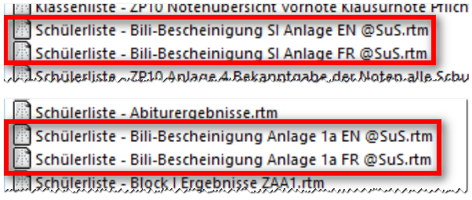
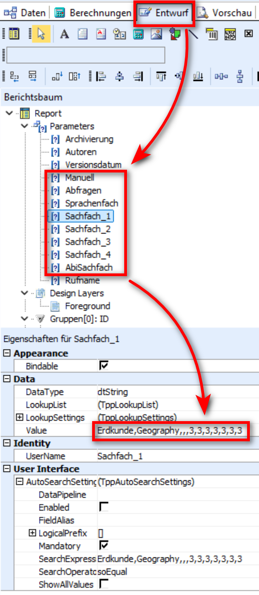
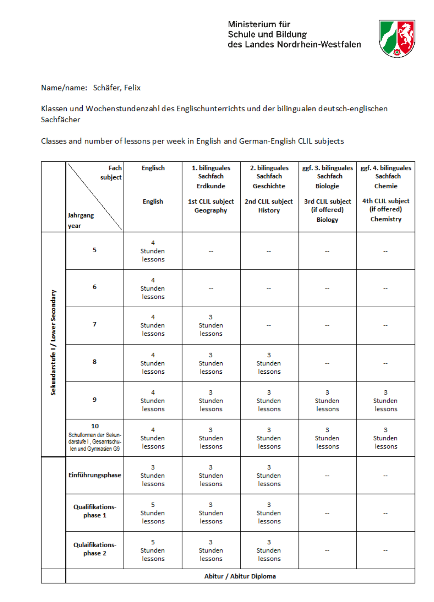

# Basisreportsammlung: Bescheinigungen des Bilingualen Bildungsgangs

## Bescheinigung des bilingualen Bildungsgangs Ende der SI und Ende der SII

In der Basisreportsammlung von SchILD-NRW 3 befinden sich
Bescheinigungen des bilingualen Bildungsgangs für die Sekundarstufe I
und II. Diese sind mit dem MSB abgestimmt und entsprechen den aktuellen
Vorgaben. Sie finden diese Reports in den Unterordnern *Reports SI* und
*Reports SII*.Es gibt jeweils eine Bescheinigung in englischer und französischer
Sprache. Jede Bescheinigung kann mit drei oder vier Sachfächern gedruckt
werden. Werden nur drei Sachfächer angegeben, passt der Report
automatisch die Anzahl der ausgegebenen Spalten an.

## Parameter zur Steuerung der Reports

In der Standardeinstellung erfolgen beim Aufruf der Bescheinigungen
mehrere Abfragen zu den Fächern und den unterrichteten Stundenzahlen.
Die Reports können so bearbeitet werden, dass die Abfragen bereits die
korrekten Bezeichnungen und Stundenzahlen Ihrer Schule enthalten oder
dass der Report ohne Abfragen direkt gedruckt wird.Anpassungen der Parameter werden mit dem `Speichern` des Reports
dauerhaft übernommen.

## Parameter Manuell

Dieser Parameter wird verwendet, wenn Sie den Report in den Textteilen
vollständig manuell anpassen und die Platzhalter nicht nutzen möchten.
Setzen Sie den Parameter in diesem Fall auf ***True**''. Es erfolgen
dann keine Abfragen beim Start des Reports. Im Textteil werden nur noch
die Namen der Schülerinnen und Schüler dynamisch eingesetzt. Alle
anderen Platzhalter ersetzen Sie durch feste Einträge. Die
Standardeinstellung dieses Parameters ist***False**''.

## Parameter Abfragen

Mit diesem Parameter steuern Sie, ob beim Start des Reports Abfragen zum
Sprachenfach, zu den Sachfächern 1 bis 4 und in der SII zusätzlich zum
AbiSachfach erfolgen sollen. Die Standardeinstellung ist ***True***. In
dieser Einstellung erscheinen mehrere Abfragefenster zu den Fächern
entsprechend den `Values` der zugehörigen Parameter. So können vor dem
Druck Anpassungen vorgenommen werden, ohne den Report bearbeiten zu
müssen.Wird der Parameter auf ***False*** gesetzt, erfolgen keine Abfragen. In
diesem Fall verwendet der Report unmittelbar die in den Parametern
gespeicherten `Values`.

## Parameter Sprachenfach

Dieser Parameter enthält Angaben zur bilingualen Unterrichtssprache
sowie zu den in der Fremdsprache unterrichteten Wochenstunden von Klasse
5 bis 10 (SI) beziehungsweise von Klasse 5 bis Q2 (SII). Die Struktur
lautet:*"Deutsche Bezeichnung,Bezeichnung in der Fremdsprache,Stundenzahl
Jahrgangsstufe 5,Stundenzahl Jahrgangsstufe 6,Stundenzahl Jahrgangsstufe
7,..."*Ein typischer Eintrag für die SI ist beispielsweise:
*"Englisch,English,4,4,4,4,4,4"* für vierstündigen Englischunterricht
von Jahrgangsstufe 5 bis 10.

## Parameter Sachfach_1 bis Sachfach_4

Diese Parameter enthalten Angaben zu bilingual unterrichteten
Sachfächern sowie zu den jeweiligen Wochenstundenzahlen von Klasse 5 bis
10 (SI) beziehungsweise von Klasse 5 bis Q2 (SII). Die Struktur
entspricht der des Parameters Sprachenfach:*"Deutsche Bezeichnung,Bezeichnung in der Fremdsprache,Stundenzahl
Jahrgangsstufe 5,Stundenzahl Jahrgangsstufe 6,Stundenzahl Jahrgangsstufe
7,..."*Ein typischer Eintrag für die SI ist beispielsweise:
*"Erdkunde,Geography,,,3,3,3,3"* für bilingualen Erdkundeunterricht von
Jahrgangsstufe 7 bis 10.Wenn an Ihrer Schule kein viertes Sachfach bilingual angeboten wird,
darf der Parameter Sachfach_4 keinen Eintrag enthalten. Der Wert der
Parametereigenschaft `Value` kann nicht direkt gelöscht, sondern nur
überschrieben werden. Das vollständige Löschen ist über die
Parametereigenschaft `SearchExpression` möglich, indem Sie dort den Text
markieren, mit `Entf` löschen und mit `Enter` bestätigen.

## Parameter AbiSachfach (nur SII)

Dieser Parameter legt fest, welches der belegten bilingualen Sachfächer
als drittes oder viertes Abiturfach gewählt wurde. Hinterlegen Sie hier
die deutsche Bezeichnung eines belegten Sachfachs. Ein typischer Eintrag
für die SII ist beispielsweise: *"Geschichte"*

## ErgebnisNachfolgend sehen Sie ein Beispiel der zweiten Seite einer
englischsprachigen bilingualen Bescheinigung.

