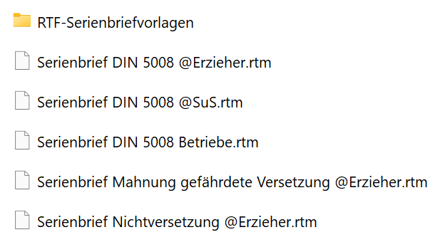
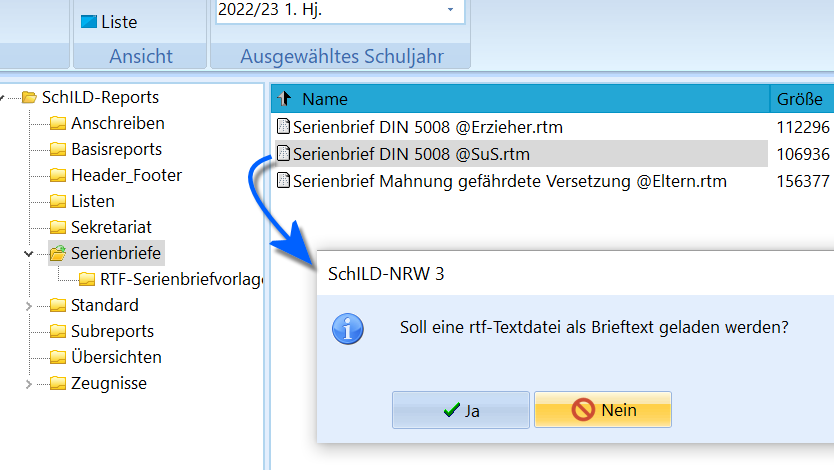
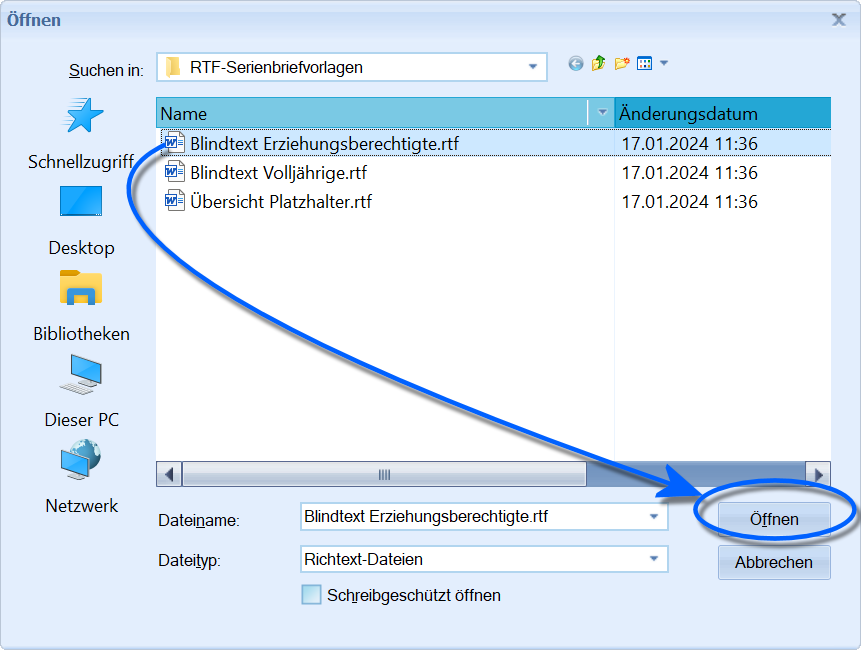
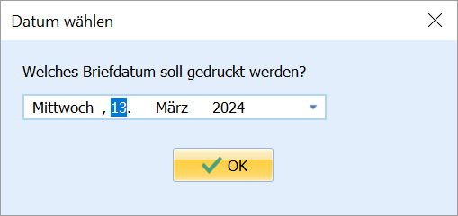
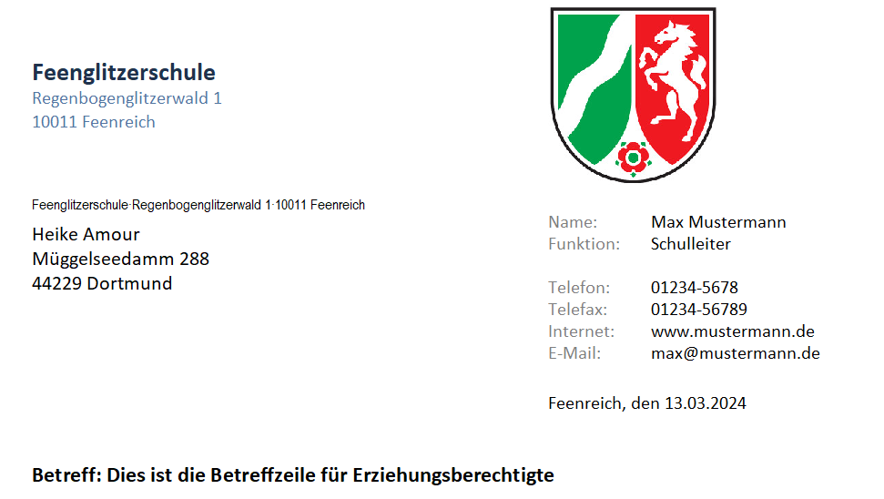
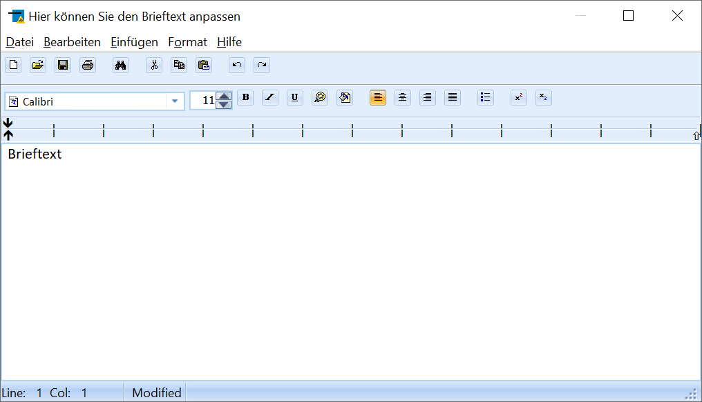
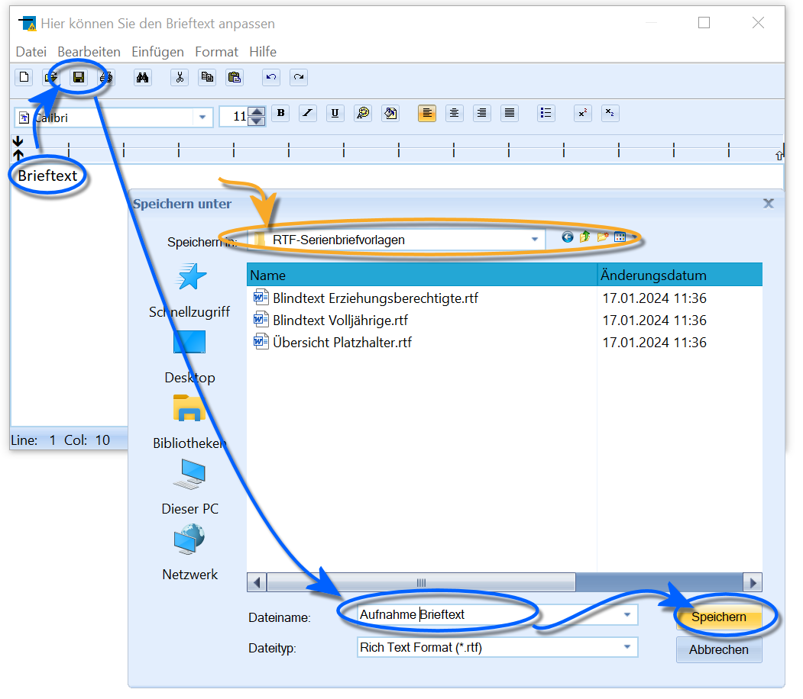
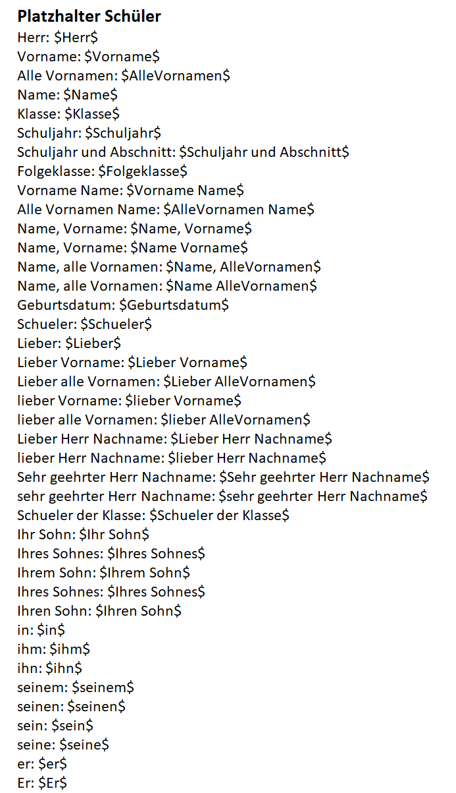
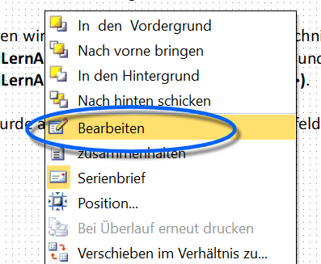
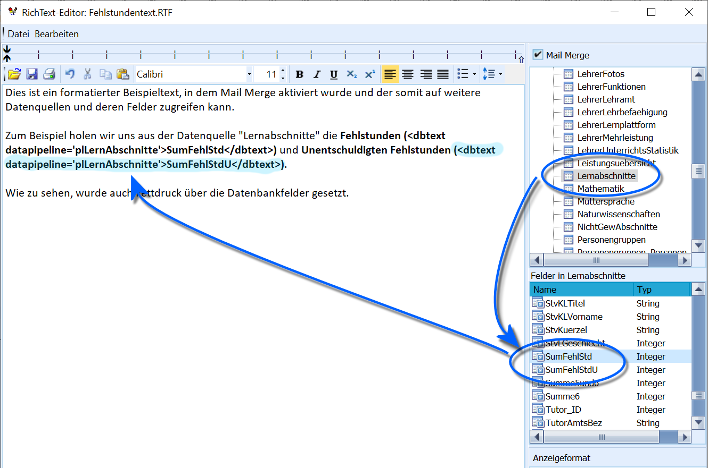

# Basisreportsammlung: Einen Serienbrieftext erstellen - Schritt für Schritt Die Serienbriefe wurden für SchILD-NRW 3 überarbeitet und
stehen nun als einfach und sehr flexibel einsetzbare Vorlagen zur
Verfügung.

## Übersicht

 SchILD-NRW 3 wird mit flexibel einsetzbaren *Serienbriefen*
ausgeliefert.Sie finden diese in Ihrem *SVWS-Arbeitsverzeichnis* unter
*\SchILD-Reports\Serienbriefe*.Derzeit werden folgende Standard-Serienbriefe ausgeliefert:-   Ein Serienbrief an Erzieher
-   Ein Serienbrief an Schülerinnen und Schüler
-   Ein Serienbrief an Betriebe
-   Ein Serienbrief zur Mahnung über eine gefährdete Versetzung. Der
    Inhalt dieses Serienbriefs ist mit dem MSB abgestimmt.
-   Ein Serienbrief an Erzieher, der über eine Nichtversetzung und deren
    Folgen informiert

Die Serienbriefe entsprechen der DIN 5008 für Briefe, insbesondere in
Bezug auf Adressblöcke, Falzmarken und die allgemeine Seitenstruktur.Ein Serienbrief besteht aus drei Teilen:-   dem **Serienbrief** selbst, also dem Serienbrief-Report
-   dem **Brieftext**, den Sie jeweils manuell verfassen oder aus einer
    zuvor gespeicherten RTF-Datei laden können. Diese Vorlagen finden
    Sie im Unterordner *\RTF-Serienbriefvorlagen\\*
-   den **Platzhaltern**, die im Serienbrief und im Brieftext verwendet
    werden können

## Der Brieftext

## Einen Brieftext laden

 Starten Sie einen Serienbrief im *Report-Explorer* per
`Doppelklick`, werden Sie gefragt, ob eine RTF-Textdatei als Brieftext
geladen werden soll.Der Vorteil dieses Vorgehens besteht darin, dass für unterschiedliche
Serienbriefe jeweils nur der Brieftext gespeichert werden muss, während
die Standardvorlage unverändert genutzt werden kann. Wird die Vorlage
beispielsweise durch das MSB überarbeitet, können Sie diese neue Vorlage
weiterhin mit Ihren individuellen Brieftexten verwenden.  

 Es öffnet sich ein Fenster, in dem die im Unterordner
*RTF-Serienbriefvorlagen* gespeicherten Dateien angezeigt werden.Wählen Sie die gewünschte Vorlage aus. Im Beispiel wird ein Blindtext
verwendet.Bestätigen Sie mit `Öffnen`.  

 Wählen Sie anschließend das Briefdatum und bestätigen Sie
mit `OK`.  

 Der Serienbrief wird nun erzeugt und ist am Betreff zu
erkennen. Im Beispiel ist ein Platzhaltertext enthalten.In dieser Beispieldatenbank ist das Wappen von Nordrhein-Westfalen als
*Schullogo* gesetzt. In einem realen Serienbrief erscheint hier das Logo
Ihrer Schule.  

## Einen Brieftext selbst erstellen und speichern

 Antworten Sie bei der Nachfrage` Soll eine RTF-Textdatei als Brieftext geladen werden?`mit `Nein`, öffnet sich das Eingabefenster für den Brieftext.Hier können Sie über den Texteditor einen formatierten Brieftext
eingeben. Nutzen Sie **Platzhalter**, um dynamisch Informationen aus der
Datenbank zu laden. Diese werden weiter unten ausführlich erläutert.  

 Soll der Brieftext später erneut verwendet werden, klicken
Sie auf `Speichern`.Navigieren Sie zum *SVWS-Arbeitsverzeichnis* und dort zu
*SchILD-Reports\Serienbriefe\RTF-Serienbriefvorlagen\\* und speichern
Sie den Brieftext unter einem passenden Namen.Schließen Sie den Brieftext-Editor anschließend über das `X` oben rechts
und übernehmen Sie die Änderungen. Der Serienbrief wird nun generiert.  

### Einen Brieftext nur einmal verwendenWenn Sie einen Serienbrief nur einmalig erzeugen möchten, ohne den
Brieftext dauerhaft zu speichern, gehen Sie wie folgt vor:-   Starten Sie den Serienbrief-Report.
-   Wählen Sie bei der Nachfrage nach einer RTF-Textdatei die Option
    `Nein`.
-   Öffnen Sie den RichText-Editor per `Rechtsklick` auf das
    RichText-Feld und wählen Sie `Bearbeiten`.
-   Geben Sie Ihren Brieftext mit den gewünschten Platzhaltern in den
    Editor ein.
-   Schließen Sie den Editor über das `X`.
-   Bestätigen Sie die Übernahme der Änderungen mit `Ja`.
-   Erzeugen Sie den Serienbrief über „Vorschau“ oder speichern Sie den
    Report und generieren ihn anschließend.

## Platzhalter verwenden

 Die Stärke automatisch generierter Serienbriefe liegt in
der Verwendung von Platzhaltern, die beim Erzeugen des Briefes dynamisch
mit Daten aus der Datenbank gefüllt werden.Ein Platzhalter wird durch ein von Dollarzeichen eingeschlossenes Wort
gekennzeichnet. So wird beispielsweise der Platzhalter *$Schuljahr$*
beim Generieren des Serienbriefs durch das aktuelle Schuljahr ersetzt.Ist ein Platzhalter geschlechtsspezifisch, wird die passende
grammatikalische Form anhand des in der Datenbank hinterlegten
Geschlechts gewählt. So wird *$Herr$* zu *Herr* oder *Frau* und
*$Schueler$* zu *Schüler* oder *Schülerin*.Der Text` $Vorname$ aus der Klasse $Klasse$ hat so gut gelernt, dass $er$ die Folgeklasse $Folgeklasse$ überspringen kann.`wird zum Beispiel zu` Kevin aus der Klasse 6b hat so gut gelernt, dass er die Folgeklasse 7b überspringen kann.`Es gibt Platzhalter in unterschiedlichen Kategorien:-   **Schüler**
-   **Erzieher**
-   **Anrede der Erzieher**
-   **Klassenleitung** und **stv. Klassenleitung**
-   **Schulleitung**
-   **Platzhalter**
-   **Sonderfunktionen**

## Zugriff auf weitere Datenbankfelder

 Öffnen Sie einen Serienbrief im Bearbeitungsmodus und
klicken Sie mit der `rechten Maustaste` auf das RichText-Feld, um den
Editor zu öffnen.  

 Neben den im Serienbrief enthaltenen Platzhaltern ist es
möglich, über MailMerge auch direkt auf Datenquellen von SchILD-NRW 3
und deren Felder zuzugreifen.Aktivieren Sie hierzu im RichText-Editor die Option **MailMerge**.
Anschließend stehen Ihnen alle verfügbaren *Datenquellen* sowie die
zugehörigen *Datenfelder* zur Verfügung.Fügen Sie gewünschte Datenfelder per `Doppelklick` in den Text ein.
Diese Codestücke dürfen anschließend nicht mehr verändert werden.Im Beispiel werden die Felder *SumFehlStd* und *SumFehlStdU* aus der
Datenquelle *Lernabschnitte* verwendet, um Fehlstunden aus dem aktuellen
Lernabschnitt eines Schülers auszulesen.

0 Speichern Sie den Brieftext im Ordner
*SchILD-Reports\Serienbriefe\RTF-Serienbriefvorlagen*, um ihn später
erneut verwenden zu können.  

1 Der Serienbrief wird nun mit den über MailMerge geladenen
Daten aus der Datenbank erzeugt.