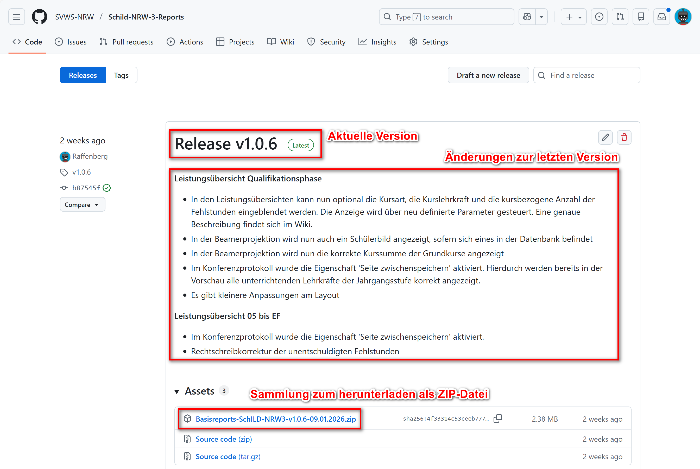
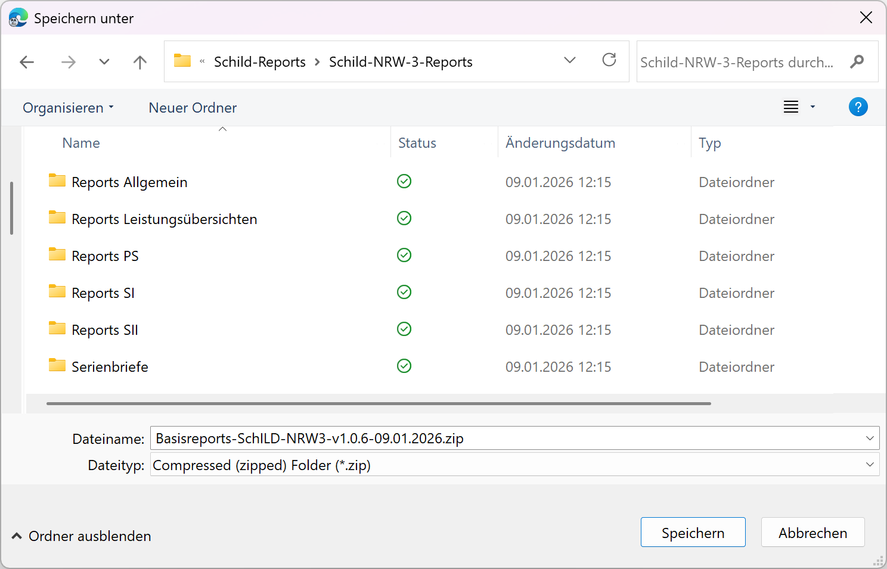
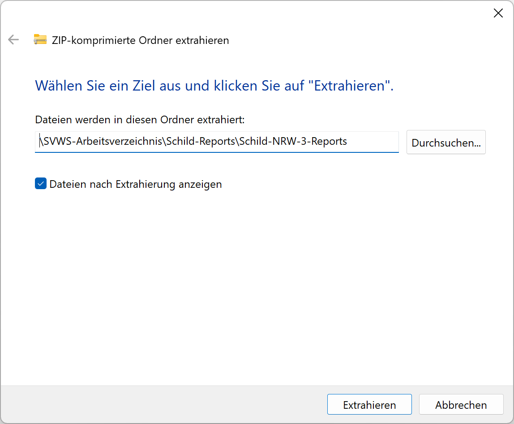

# Basisreportsammlung: Herunterladen und aktualisieren

Die Basisreportsammlung wird bei der Installation von SchILD-NRW 3
mitgeliefert. Die Reportdateien sind standardmäßig im Verzeichnis
**\SVWS-Arbeitsverzeichnis\Schild-Reports\Schild-NRW-3-Reports** zu
finden. Bei Updates von SchILD-NRW 3 werden Änderungen und Anpassungen
an der Basisreportsammlung nicht automatisch übernommen, damit eigene
Anpassungen an den Reports nicht überschrieben werden. Sie können die
Reports der Basisreportsammlung aber jederzeit manuell herunterladen und
aktualisieren.

## Download der Basisreportsammlung

Die aktuelle Version der Basisreportsammlung für SchILD-NRW 3 finden Sie
im Release-Bereich des offiziellen GitHub-Repositories. Dort ist zu
jedem Update eine Versionsgeschichte mit den Änderungen innerhalb der
Sammlung hinterlegt. Um die neueste Sammlung herunterzuladen, klicken
Sie auf den folgenden Link:Es öffnet sich ihr Standardbrowser (Edge, Chrome, Firefox etc.) und
zeigt Ihnen den Release-Bereich der Basisreportsammlung. Die neuste
Sammlung finden Sie zuoberst mit Informationen zu den Änderungen seit
der letzten Veröffentlichung. Weiter unten finden Sie ältere Versionen
mit den zugehörigen Änderungsbeschreibungen.

Klicken Sie auf den Link zur ZIP-Datei im Bereich *Assets*. Alternativ
können Sie einen Klick mit der rechten Maustaste auf die ZIP-Datei
machen und im Kontextmenü *Link speichern unter* auswählen.

Die ZIP-Datei wird entweder automatisch in den Ordner „Downloads“
gespeichert oder in einen Ordner Ihrer Wahl. Die ZIP-Datei sollte in den
Ordner
**\\SVWS-Arbeitsverzeichnis\\Schild-Reports\\Schild-NRW-3-Reports**
gespeichert bzw. im Anschluss dorthin verschoben werden.

## Basisreportsammlung ZIP-Datei entpacken

Entpacken Sie die ZIP-Datei, indem Sie im Kontextmenü des Archivs den
Punkt „Alle extrahieren...“ auswählen. Geben Sie als Zielpfad
**\SVWS-Arbeitsverzeichnis\Schild-Reports\Schild-NRW-3-Reports** ein und
klicken Sie auf „Extrahieren“. Die Reportdateien der Basisreportsammlung
werden nun aus der ZIP-Datei entpackt. Bereits vorhandene Dateien werden
dabei überschrieben.Wenn Sie nun SchILD-NRW 3 neu starten, finden Sie die aktuellen Reports
aus der Basisreportsammlung in der Reportverwaltung. Wenn SchILD-NRW 3
bereits geöffnet war, erscheinen die neuen Dateien im Reportdesigner
erst, nachdem Sie die Ansicht in der Reportverwaltung über
\*\*„Verzeichnisbaum aktualisieren“\*\* aktualisiert haben.Sie können die Reports aus der Basisreportsammlung nun in SchILD-NRW 3
nutzen.