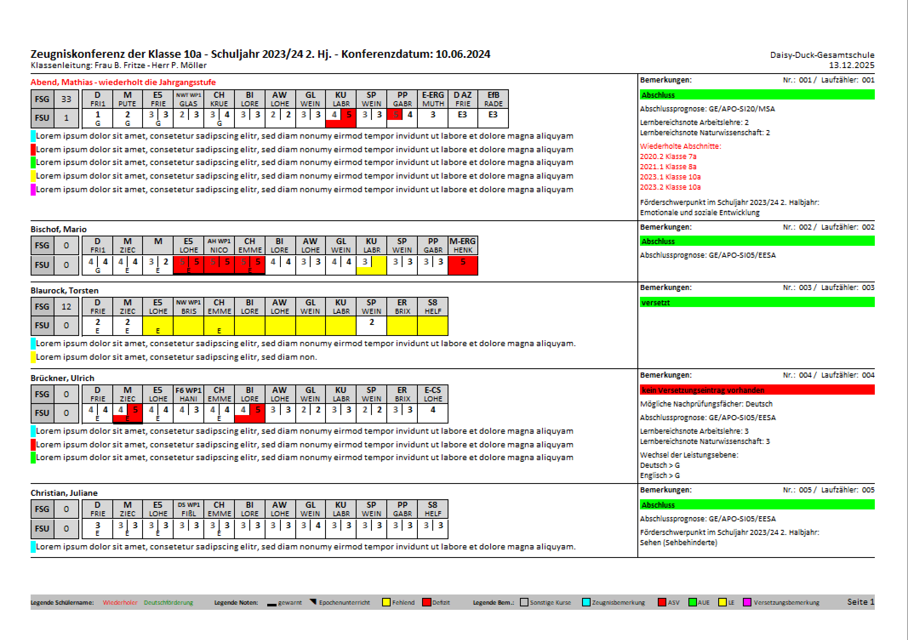
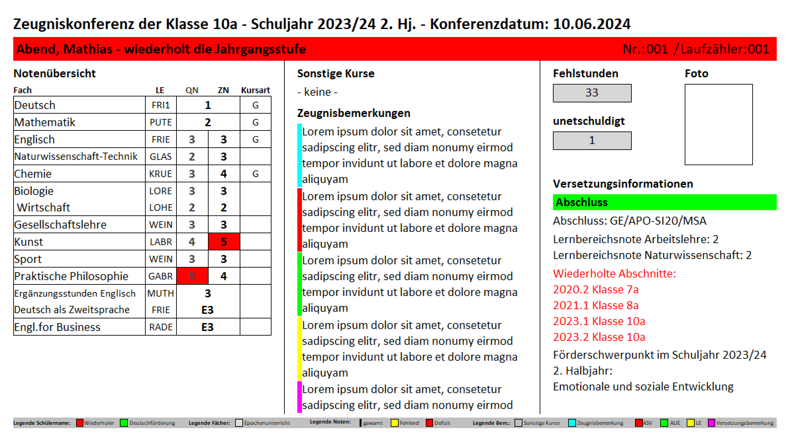
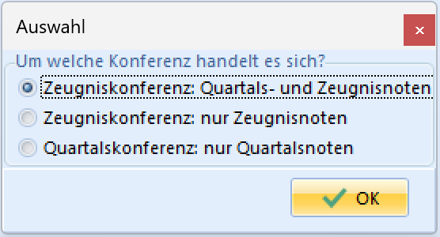
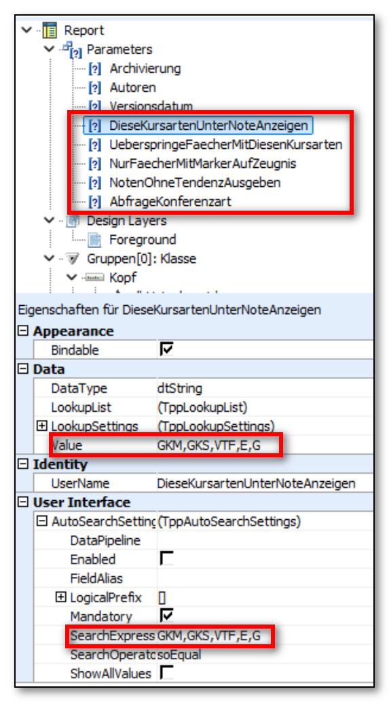

# Basisreportsammlung: Leistungsübersicht Jg. 05 bis EF

## Die Leistungsübersichten

Die Leistungsübersichten in SchILD-NRW 3 sind für die Nutzung in den
Jahrgängen 05 bis EF der Sekundarstufen I und II entwickelt worden. Sie
funktionieren in der Regel auch in der Grundschule in den Jahrgängen 03
und 04. Für Berufskollegs kann die Leistungsübersicht eine gute
Grundlage darstellen, um mit kleinen Anpassungen eine BK-spezifische
Leistungsübersicht zu erstellen.

Die Leistungsübersichten liefern Informationen zu einem beliebigen
Halbjahr beziehungsweise Abschnitt. Den gewünschten Abschnitt können Sie
in der Reportverwaltung auswählen. Die Leistungsübersichten können bei
Bedarf auch Quartalsnoten anzeigen.

## Konferenzprotokoll und Beamerprojektion

Die Leistungsübersichten bestehen aus zwei Reports – einem
Konferenzprotokoll und einer zugehörigen Beamerprojektion. Das
Konferenzprotokoll sollte für Konferenzen in Papierform ausgedruckt
werden. Die Beamerprojektion sollte als PDF erzeugt und in der Konferenz
als PDF-Anzeige verwendet werden. Das PDF für die Beamerprojektion hat
ein Seitenverhältnis von 16:9.

Beide Reports geben Informationen über Fächer, Noten, Fachlehrkräfte,
Epochenunterricht, Mahnungen, Fehlstunden, Zeugnisbemerkungen,
Versetzung, Abschlüsse, Prognoseabschlüsse, Nachprüfungsfächer,
wiederholte Abschnitte, Wiederholer, die Klassenart Deutschförderklasse,
das Ende der Erstförderung, Wechsel des Leistungsniveaus und
Förderschwerpunkte aus.

Das Konferenzprotokoll schließt nach jeder Klasse mit einer Liste aller
Lehrkräfte ab, die in der Klasse unterrichten, sowie mit Feldern für die
Protokollunterschrift. Die Beamerprojektion zeigt zusätzlich das Bild
des Schulkindes an, sofern dieses in der Datenbank gespeichert ist.

Das Konferenzprotokoll fasst mehrere Schulkinder pro Seite zusammen.
Jedes Schulkind erhält einen Klassenzähler und einen laufenden Zähler.
Die Beamerprojektion fasst ein Schulkind pro Seite zusammen. Auch hier
erhält jedes Schulkind einen Klassenzähler und einen laufenden Zähler.
In der Regel stimmt der laufende Zähler mit der Seitennummer der
Beamerprojektion überein, sodass schnell zwischen Schulkindern
gewechselt werden kann.

## Zeugniskonferenz oder Quartalskonferenz

Die Leistungsübersichten können in Quartalskonferenzen und in
Zeugniskonferenzen eingesetzt werden. Die Reports werden so
ausgeliefert, dass sie standardmäßig eine Zeugniskonferenzansicht
liefern. Schulen mit Quartalsbetrieb können jedoch den Parameter
***AbfrageKonferenzart**'' auf den Wert***True**'' setzen (siehe
Parameter unten). Ist der Parameter gesetzt, wird bei jedem Aufruf der
Reports zunächst abgefragt, ob eine Ansicht für eine Quartalskonferenz
oder eine Zeugniskonferenz gewünscht ist.

## Zeugniskonferenz: Quartals- und Zeugnisnoten

In dieser Zeugniskonferenzansicht werden Quartalsnoten und Zeugnisnoten
angezeigt. Die Spaltenüberschrift der Beamerprojektion trägt die Titel
QN und ZN für Quartalsnote und Zeugnisnote. Der Titel des Berichts weist
zusätzlich darauf hin, dass es sich um eine Zeugniskonferenz handelt.Existiert eine Quartalsnote, wird diese in dunkelgrauer Schrift links
von der Zeugnisnote angezeigt. Quartalsnote und Zeugnisnote befinden
sich dann in zwei Spalten. Fehlt eine Zeugnisnote, wird die leere
Zeugnisnotenspalte farbig hervorgehoben. Fehlt die Quartalsnote, wird
nur die Zeugnisnote in einer einzelnen Spalte ohne Quartalsspalte
angezeigt. In diesem Fall wird davon ausgegangen, dass es sich um ein
Fach ohne Quartalsnote handelt. Defizitäre Noten werden farbig
hervorgehoben.

## Zeugniskonferenz: nur Zeugnisnoten

In dieser Zeugniskonferenzansicht werden ausschließlich Zeugnisnoten
angezeigt. Die Spaltenüberschrift der Beamerprojektion trägt den Titel
ZN für Zeugnisnote. Der Titel des Berichts weist ebenfalls auf die
Zeugniskonferenz hin.Fehlende Zeugnisnoten werden durch eine farbig hervorgehobene leere
Notenspalte kenntlich gemacht. Defizitäre Noten werden farbig
hervorgehoben.

## Quartalskonferenz: nur Quartalsnoten

In der Quartalskonferenzansicht werden ausschließlich Quartalsnoten in
einer einzelnen Spalte angezeigt. Die Spaltenüberschrift trägt den Titel
QN für Quartalsnote. Der Titel des Berichts weist auf die
Quartalskonferenz hin. Fehlende Quartalsnoten und defizitäre
Quartalsnoten werden farbig hervorgehoben.

## ParameterMithilfe von Parametern im Report können Sie die Ausgabe beeinflussen,
ohne in den Code eingreifen zu müssen. Um Parameter zu ändern, wechseln
Sie in den Bearbeitungsmodus des Reports. Ändern Sie in den
Eigenschaften des jeweiligen Parameters den Wert unter Value.Wenn Sie einen vorgegebenen Wert vollständig löschen möchten, ist dies
nur über die Eigenschaft SearchExpression möglich. Markieren Sie dort
die Zeichenkette und drücken Sie die Taste Entf.Löschen Sie keine Parameter aus dem Report. Der Code erwartet alle
Parameter und wertet diese aus.

## Parameter DieseKursartenUnterNoteAnzeigen

Mit dem Parameter DieseKursartenUnterNoteAnzeigen wird gesteuert, welche
Kursarten unter der Note angezeigt werden. Die Standardeinstellung ist
***GKM,GKS,VTF,E,G***. Sie können hier beliebige Kursarten, durch Komma
getrennt, eintragen. Verwenden Sie keine Leerzeichen.

## Parameter UeberspringeFaecherMit

DiesenKursartenMit dem Parameter UeberspringeFaecherMit

DiesenKursarten wird gesteuert,
dass Fächer nicht in der Fächertabelle, sondern gesondert unterhalb der
Fächertabelle ausgegeben werden. Die Standardeinstellung ist
***AGGT,ZUV***. Sie können beliebige allgemeine Kursarten eintragen.
Verwenden Sie keine Leerzeichen.

## Parameter NurFaecherMitMarkerAufZeugnis

Mit dem Parameter NurFaecherMitMarkerAufZeugnis wird gesteuert, ob nur
Fächer mit dem Marker ***Auf Zeugnis ausgegeben**'' gedruckt werden. Sie
können dem Parameter die Werte True oder False zuweisen. Die
Standardeinstellung ist***True**''.

## Parameter NotenOhneTendenzAusgeben

Mit dem Parameter NotenOhneTendenzAusgeben wird gesteuert, ob Noten mit
oder ohne Tendenz ausgegeben werden. Sie können dem Parameter die Werte
True oder False zuweisen. Die Standardeinstellung ist ***True***.

## Parameter AbfrageKonferenzart

Über den Parameter AbfrageKonferenzart wird geregelt, ob beim Start nach
der Konferenzart gefragt werden soll. Ist der Parameter aktiviert,
erscheint beim Aufruf des Reports ein Abfragefenster zur Auswahl der
Konferenzart und der zugehörigen Ansicht. Zur Auswahl stehen drei
Zustände:-   Zeugniskonferenz: Quartals- und Zeugnisnoten (Standard bei fehlender
    Abfrage)
-   Zeugniskonferenz: nur Zeugnisnoten
-   Quartalskonferenz: nur QuartalsnotenSie können dem Parameter die Werte True oder False zuweisen. Die
Standardeinstellung ist ***False***.Empfehlung: An Schulen mit Quartalskonferenzen sollte der Parameter auf
True gesetzt werden. An Schulen ohne Quartalskonferenzen sollte der
Parameter auf False gesetzt werden.