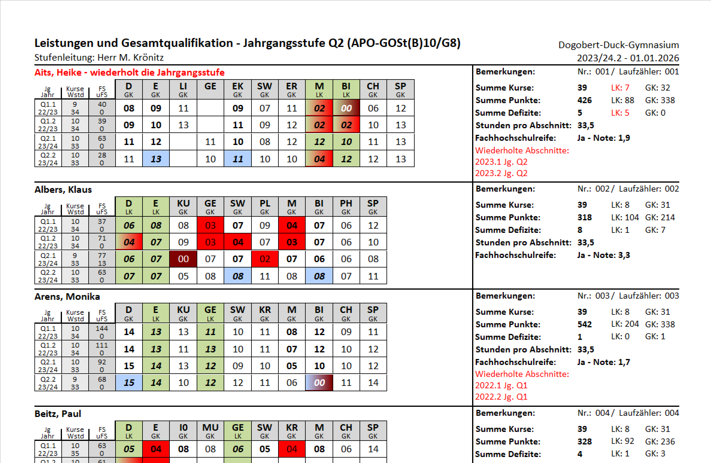
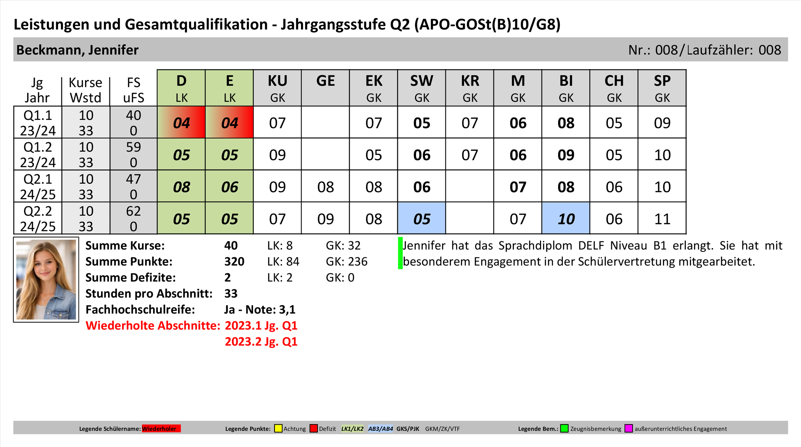
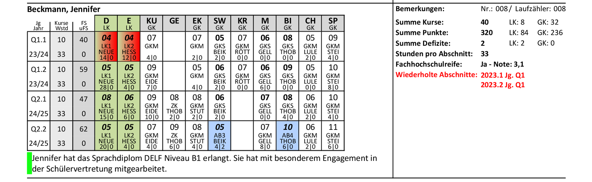
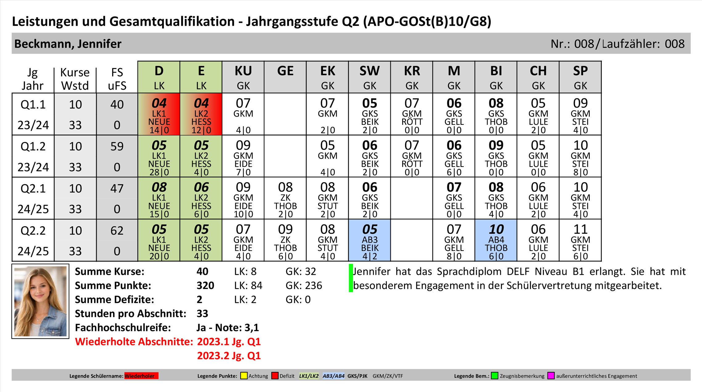
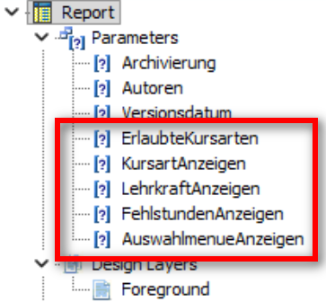
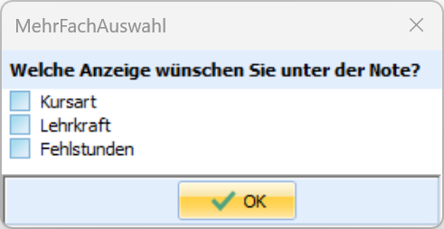

# Basisreportsammlung: Leistungsübersicht Jg. Q1 bis Q2

## Konferenzprotokoll und Beamerprojektion

Die Leistungsübersichten in SchILD-NRW 3 bestehen aus zwei Reports –
einem Konferenzprotokoll und einer zugehörigen Beamerprojektion. Das
Konferenzprotokoll sollte für Konferenzen in Papierform ausgedruckt
werden. Die Beamerprojektion sollte als PDF erzeugt und in der Konferenz
als PDF-Anzeige verwendet werden. Das PDF für die Beamerprojektion hat
ein Seitenverhältnis von 16:9.Beide Reports geben Informationen über Fächer, Punkte, Kursarten,
Fehlstunden, Zeugnisbemerkungen, wiederholte Abschnitte, Wiederholer,
Defizite und belegte Kurssummen aus. Das Konferenzprotokoll schließt
nach jeder Klasse mit einer Liste aller Lehrkräfte ab, die im letzten
Abschnitt unterrichtet haben, sowie mit Feldern für die
Protokollunterschrift.

Das Konferenzprotokoll fasst mehrere Schulkinder pro Seite zusammen.
Jedes Schulkind erhält einen Klassenzähler und einen laufenden Zähler.
Die Beamerprojektion fasst ein Schulkind pro Seite zusammen. Auch hier
erhält jedes Schulkind einen Klassenzähler und einen laufenden Zähler.
In der Regel stimmt der laufende Zähler mit der Seitennummer der
Beamerprojektion überein, sodass schnell zwischen Schulkindern
gewechselt werden kann.

## Optional Kursart, Lehrkraft, Fehlstunden einblenden

Mithilfe von Parametern kann gesteuert werden, ob zusätzliche
Informationen unterhalb der Note eingeblendet werden sollen. So können
zusätzlich zur Note die Kursart, die Kurslehrkraft und die
kursindividuellen Fehlstunden angezeigt werden. Dadurch erhöht sich
jedoch der Platzbedarf der Abschnitte, sodass im Konferenzprotokoll
weniger Schülerinnen und Schüler pro Seite ausgegeben werden.Sie können frei festlegen, welche Informationen unterhalb der Note
angezeigt werden sollen. Die Darstellung wird entsprechend der gewählten
Optionen automatisch angepasst.

## Darstellung

Leistungskurse werden in kursiver Fettschrift mit grünem Hintergrund
dargestellt. Die Kurse AB3 und AB4 werden ebenfalls in kursiver
Fettschrift mit blauem Hintergrund dargestellt. Schriftliche Kurse
werden in Fettschrift ausgegeben, mündliche Kurse in normaler Schrift.Defizite erhalten einen roten Hintergrund. Kurse mit 0 Punkten erhalten
einen dunkelroten Hintergrund mit weißer Schrift.Überschreitet die Anzahl der Defizite typische Grenzwerte, werden die
Summen rot dargestellt. Unterschreiten die Kurssummen typische
Grenzwerte, werden auch diese Summen rot dargestellt.

Die Anzeige ist auf maximal 13 Kurse in der Q1 und Q2 ausgelegt und
deckt damit die üblichen Anforderungen ab.Unterhalb der Fächer wird die KursartAllgemein ausgegeben. Insbesondere
bei Zusatzkursen, die nur in der Q2 angeboten werden, fehlt die Anzeige
der Kursart, da diese in der Q1 noch nicht hinterlegt ist. Dies ist eine
Einschränkung der zugrunde liegenden Datenquelle.In der Vorschau des Reportdesigners kann es zu leichten
Darstellungsabweichungen kommen, die im Ausdruck oder bei höherer
Zoomstufe nicht sichtbar sind (Linienausgabe, Linienstärke, Bündigkeit).

## Verwendete Pipeline und Ausdruck zurückliegender Abschnitte

Der Report verwendet die Pipelines Schuelerlaufbahn und
Leistungsuebersicht. Die Ansicht ist jedoch auf die Q1 und Q2
eingeschränkt. Wenn Sie eine Leistungsübersicht für Schülerinnen und
Schüler aus zurückliegenden Abschnitten drucken möchten, filtern Sie die
Schülerinnen und Schüler zunächst auf dem Reiter Auswahl. Geben Sie dort
den passenden Status ein und filtern Sie nach dem gewünschten
Lernabschnitt und Jahrgang.Wechseln Sie anschließend in den Reiter Reportverwaltung und wählen Sie
auch dort das passende Schuljahr sowie den passenden Abschnitt aus.

## Parameter

Mithilfe von Parametern im Report können Sie die Ausgabe beeinflussen,
ohne den Code ändern zu müssen. Um einen Parameter zu ändern, wechseln
Sie in den Bearbeitungsmodus des Reports. Ändern Sie in den
Eigenschaften des Parameters den Wert unter Value.Wenn Sie einen vorgegebenen Wert vollständig löschen möchten, ist dies
nur über die Eigenschaft SearchExpression möglich. Markieren Sie dort
die Zeichenkette und drücken Sie die Taste Entf.Löschen Sie keinen Parameter aus dem Report, da der Code alle Parameter
erwartet und auswertet.

## Parameter ErlaubteKursarten

Mit dem Parameter ErlaubteKursarten wird gesteuert, welche Fächer
beziehungsweise Kursarten im Report angezeigt werden. Die
Standardeinstellung ist ***LK1,LK2,AB3,AB4,GKS,GKM,VTF,PJK***. Sie
können beliebige Kursarten kommasepariert eintragen. Verwenden Sie keine
Leerzeichen.

## Parameter KursartAnzeigen

Mit diesem Parameter wird gesteuert, ob unterhalb der Kursnote die
Kursart angezeigt wird. Die Anzeige der Kursart erhöht den Platzbedarf
der Zeile. Die Standardeinstellung ist ***False***.

## Parameter LehrkraftAnzeigen

Mit diesem Parameter wird gesteuert, ob unterhalb der Kursnote das
Kürzel der Kurslehrkraft angezeigt wird. Die Anzeige erhöht den
Platzbedarf der Zeile. Die Standardeinstellung ist ***False***.

## Parameter FehlstundenAnzeigen

Mit diesem Parameter wird gesteuert, ob unterhalb der Kursnote
kursindividuelle Fehlstunden angezeigt werden. Die Darstellung erfolgt
in der Form ***Fehlstunden\|unentschuldigte Fehlstunden**''. Die Anzeige
erhöht den Platzbedarf der Zeile. Die Standardeinstellung
ist***False**''.

## Parameter AuswahlmenueAnzeigen

Mit diesem Parameter wird gesteuert, ob bei jedem Aufruf des Reports ein
Auswahlmenü angezeigt wird, in dem die Anzeige von Kursart, Lehrkraft
und Fehlstunden ausgewählt werden kann. So kann bei jedem Aufruf neu
entschieden werden, wie die Ausgabe erfolgen soll. Die
Standardeinstellung ist ***False***.