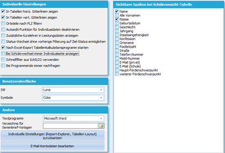

# Beispiel zum Bildereinbinden

## Beispiel 1 - thumb\|hochkant

## Syntax    

Das Bild wird rechtsbündig in den Fließtext eingebettet. Der obere Rand
der Bildes ist auf der gleichen Höhe wie der Text, der unterhalb von dem
Befehl steht.

### Vorschau Beispiel 1

Hier kommt jetzt ganz viel Text. Hier kommt jetzt ganz viel Text. Hier
kommt jetzt ganz viel Text. Hier kommt jetzt ganz viel Text. Hier kommt
jetzt ganz viel Text. Hier kommt jetzt ganz viel Text. Hier kommt jetzt
ganz viel Text. Hier kommt jetzt ganz viel Text. Hier kommt jetzt ganz
viel Text. Hier kommt jetzt ganz viel Text. Hier kommt jetzt ganz viel
Text. Hier kommt jetzt ganz viel Text. Hier kommt jetzt ganz viel Text.
Hier kommt jetzt ganz viel Text. Hier kommt jetzt ganz viel Text. Hier
kommt jetzt ganz viel Text. Hier kommt jetzt ganz viel Text. Hier kommt
jetzt ganz viel Text. Hier kommt jetzt ganz viel Text. Hier kommt jetzt
ganz viel Text. Hier kommt jetzt ganz viel Text. Hier kommt jetzt ganz
viel Text. Hier kommt jetzt ganz viel Text. Hier kommt jetzt ganz viel
Text. Hier kommt jetzt ganz viel Text. Hier kommt jetzt ganz viel Text.
Hier kommt jetzt ganz viel Text. Hier kommt jetzt ganz viel Text. Hier
kommt jetzt ganz viel Text. Hier kommt jetzt ganz viel Text. Hier kommt
jetzt ganz viel Text. Hier kommt jetzt ganz viel Text. Hier kommt jetzt
ganz viel Text. Hier kommt jetzt ganz viel Text. Hier kommt jetzt ganz
viel Text. Hier kommt jetzt ganz viel Text. Hier kommt jetzt ganz viel
Text. Hier kommt jetzt ganz viel Text. Hier kommt jetzt ganz viel Text.
Hier kommt jetzt ganz viel Text. Hier kommt jetzt ganz viel Text. Hier
kommt jetzt ganz viel Text. Hier kommt jetzt ganz viel Text. Hier kommt
jetzt ganz viel Text. Hier kommt jetzt ganz viel Text. Hier kommt jetzt
ganz viel Text. Hier kommt jetzt ganz viel Text. Hier kommt jetzt ganz
viel Text. Hier kommt jetzt ganz viel Text. Hier kommt jetzt ganz viel
Text. Hier kommt jetzt ganz viel Text. Hier kommt jetzt ganz viel Text.
Hier kommt jetzt ganz viel Text. Hier kommt jetzt ganz viel Text. Hier
kommt jetzt ganz viel Text. Hier kommt jetzt ganz viel Text.

## Beispiel 2 - thumb\|width

## Syntax    

Das Bild wird rechtsbündig in den Fließtext eingebettet. Der obere Rand
der Bildes ist auf der gleichen Höhe wie der Text, der unterhalb des
Befehls steht. Die Angabe der Größe erfolgt in Pixeln (300px).

## Vorschau Beispiel 2

Hier kommt jetzt ganz viel Text. Hier kommt jetzt ganz viel Text. Hier
kommt jetzt ganz viel Text. Hier kommt jetzt ganz viel Text. Hier kommt
jetzt ganz viel Text. Hier kommt jetzt ganz viel Text. Hier kommt jetzt
ganz viel Text. Hier kommt jetzt ganz viel Text. Hier kommt jetzt ganz
viel Text. Hier kommt jetzt ganz viel Text. Hier kommt jetzt ganz viel
Text. Hier kommt jetzt ganz viel Text. Hier kommt jetzt ganz viel Text.
Hier kommt jetzt ganz viel Text. Hier kommt jetzt ganz viel Text. Hier
kommt jetzt ganz viel Text. Hier kommt jetzt ganz viel Text. Hier kommt
jetzt ganz viel Text. Hier kommt jetzt ganz viel Text. Hier kommt jetzt
ganz viel Text. Hier kommt jetzt ganz viel Text. Hier kommt jetzt ganz
viel Text. Hier kommt jetzt ganz viel Text. Hier kommt jetzt ganz viel
Text. Hier kommt jetzt ganz viel Text. Hier kommt jetzt ganz viel Text.
Hier kommt jetzt ganz viel Text. Hier kommt jetzt ganz viel Text. Hier
kommt jetzt ganz viel Text. Hier kommt jetzt ganz viel Text. Hier kommt
jetzt ganz viel Text. Hier kommt jetzt ganz viel Text. Hier kommt jetzt
ganz viel Text. Hier kommt jetzt ganz viel Text. Hier kommt jetzt ganz
viel Text. Hier kommt jetzt ganz viel Text.

## Beispiel 3 - wenig Text neben dem Bild

Manchmal ist neben dem Bild nur wenig Text, der sich auf das Bild
bezieht. In einem solchen Fall ist es wünschenswert, den Folgetext erst
unterhalb des Bildes fortzuführen. In diesem Fall hilft der Befehl
` `. Er sorgt dafür, dass der restliche Bereich neben dem
Bild frei bleibt und der Folgetext erst unterhalb beginnt.

Hier steht nur ganz wenig. Jetzt kommt der Befehl ` `.  
Dieser Satz leitet einen Abschnitt unterhalb des Bildes ein.[Zurück zu den Vorgaben](Vorgaben_für_Wiki-Autoren.md)[Zurück zur Hauptseite](Hauptseite.md)