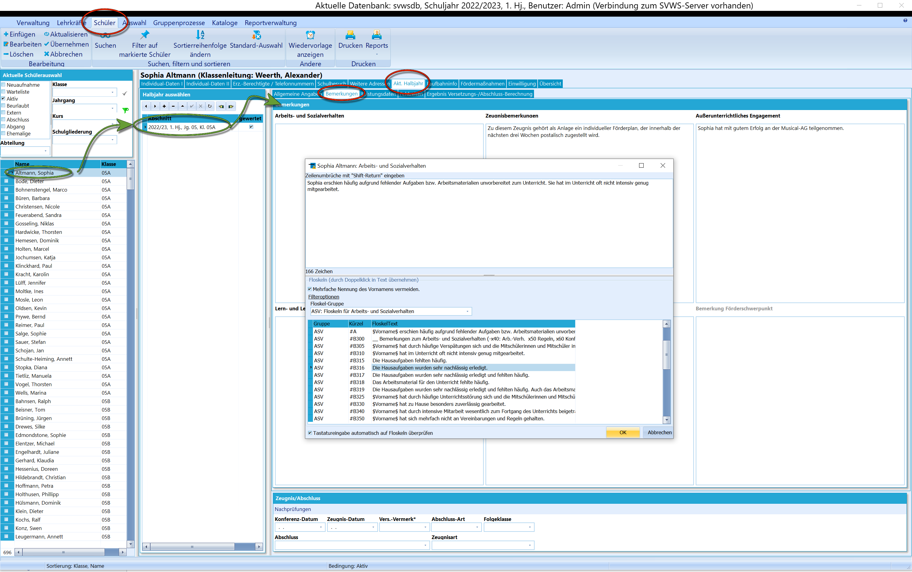
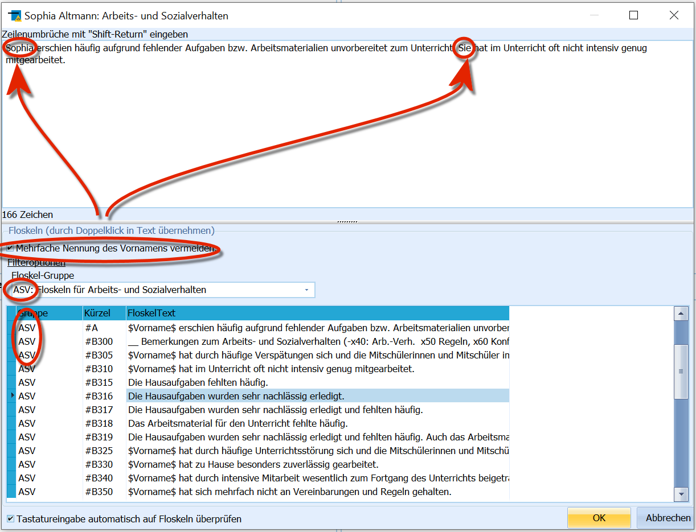
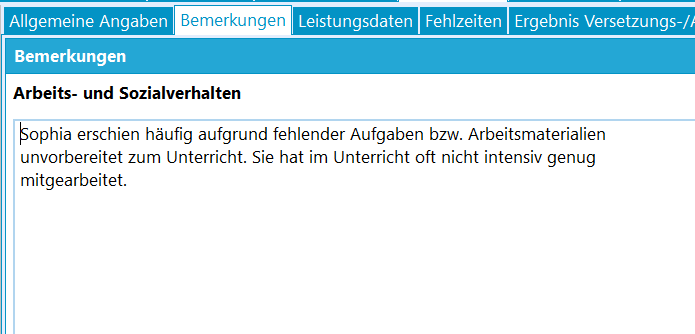

# Bemerkungen (Aktuelles Halbjahr / Aktueller Abschnitt

 Zu jedem Lernabschnitt können *Bemerkungen* erfasst werden.
Diese können über Reports ausgegeben werden, zum Beispiel auf
Zeugnissen.Es können Bemerkungen zu unterschiedlichen Kategorien erfasst werden,
wie dem **Arbeits- und Sozialverhalten**, den **Zeugnisbemerkungen und
dem Außerunterrichtlichen Engagement**.  

 Um Bemerkungen zu bearbeiten, ist mit einem Doppelklick in
das jeweilige Feld zu klicken. Es öffnet sich ein weiteres Fenster, in
dem die bisherigen Bemerkungen editiert werden können.In diesem Feld kann frei geschrieben werden. Es empfiehlt sich jedoch,
die meisten Bemerkungen als Floskeln zu hinterlegen, die mit einem
Doppelklick eingefügt werden können.Im Floskeleditor kann über das Dropdown-Menü zum Filtern eingestellt
werden, welche *Floskelgruppe* angezeigt wird. Per Standard ist der
Filter auf das Feld eingestellt, über welches der Floskeleditor geöffnet
wurde.Der Editor unterstützt Variablen, enthält eine Floskel z.B. die
Zeichenkette *"$Vorname$"* wird dort automatisch der Vorname der
aktuellen Person eingesetzt.Mit einem Haken bei **Mehrfache Nennung des Vornamens vermeiden** wird
bei weiteren direkt im Anschluss eingefügten Floskeln der Vorname durch
"er" oder "sie" ersetzt.

  
Unter den Bemerkungen wird hier auch der Bereich für die *Zeugnis- und
Abschlussdaten* des aktuellen Abschnitts eingeblendet.