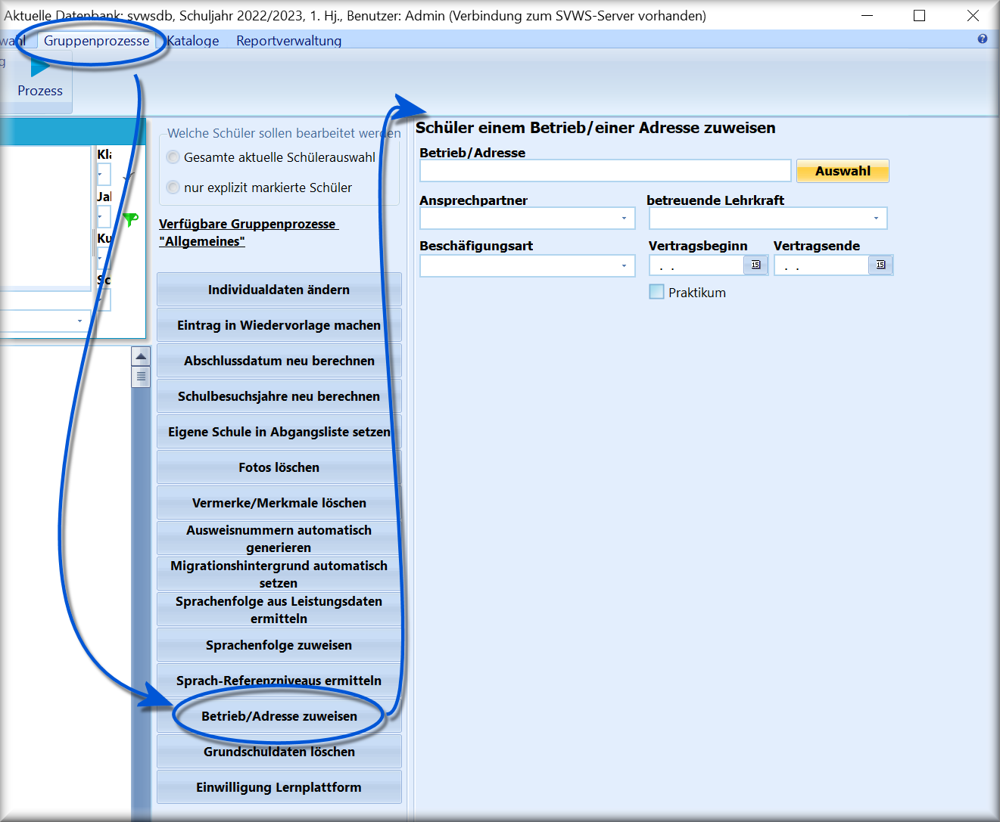

# Betrieb/Adresse zuweisen (Gruppenprozesse Allgemein)

Wenn mehrere Schülerinnen oder Schüler in einem Betrieb ihr Praktikum
oder ihre Ausbildung absolvieren, kann die Zuweisung der Adresse des
Betriebes auch über einen Gruppenprozess erfolgen.Hierbei werden die erforderlichen Daten erfragt und anschließend den
Schülern zugewiesen.Über den Schaltknopf *Auswahl* gelangt man zu den schon im System
verwalteten Adressen, die über *Verwaltung ➜ Allgemeine Adressen*
angelegt wurden.