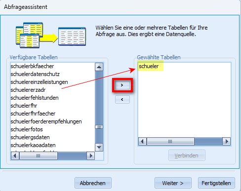
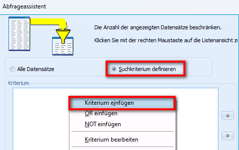
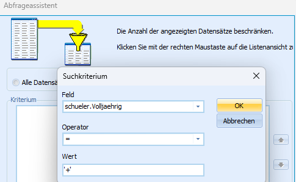
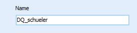
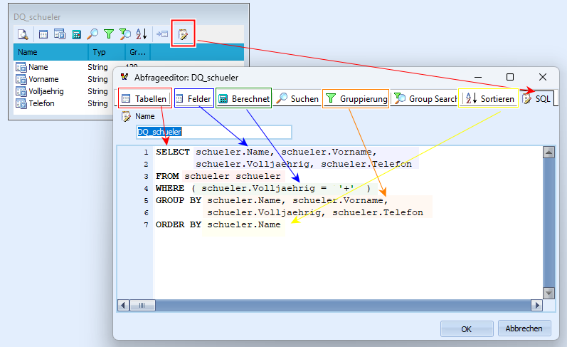
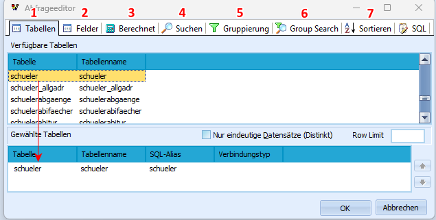
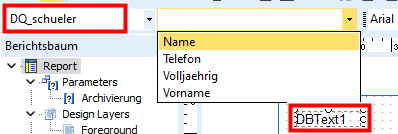

# Eigene Datenquellen definieren
Über den Menüpunkt "Daten" können eigene Datenquellen definiert werden,
die dann für den aktuellen Report zur Verfügung stehen. Die Definition
einer eigenen Datenquelle erfolgt über SQL-Befehle, mit denen
beispielsweise einzelne Felder aus einer Tabelle selektiert, mehrere
Tabellen miteinander verknüpft, Daten gruppiert oder sortiert werden
können.Nach dem Wechsel in den Reiter **Daten** erscheint zunächst eine leere
Seite, sofern der Report noch keine eigene Datenquelle enthält. Um nun
eine eigene Datenquelle zu definieren, wählt man Daten ➜ neu. Nun stehen
dem Anwender ein Abfrageassistent und ein Abfrageeditor zur Verfügung.

## Eine eigene Datenquelle mit dem Abfrageassistent definieren

Der Abfrageassistent ist ein visuelles Hilfsmittel, um SQL-Befehle
automatisch zu generieren. Diese Befehle können anschließend noch
angepasst werden.Schritt 1: Datenquellen auswählen  
Im ersten Schritt können eine oder mehrere bereits existierende
Datenquellen ausgewählt werden, deren Inhalte in der neuen Datenquelle
mit einbezogen werden sollen. Möchte man beispielsweise den Schülernamen
in den neuen Datenquelle zur Verfügung haben, muss hier die Tabelle
Schüler verwenden. Über den Pfeil, kann eine verfügbare Tabelle nach
rechts in die Auflistung der gewählten Tabellen verschoben werden.
Sobald zwei Tabellen ausgewählt werden, öffnet sich ein separates
Fenster, indem angegeben werden muss, wie die Tabellen miteinander
verknüpft werden (JOIN-Befehl). Standardmäßig wird hier ein "InnerJoin"
vorgeschlagen und die Tabellen werden über die passenden Schlüsselfelder
miteinander verknüpft.Schritt 2: Felder für die Abfrage festlegen  
Im nächsten Schritt kann angegeben werden, welche Daten in der neuen
Datenquelle sichtbar sind. Dies entspricht der **Select-Anweisung** in
einem SQL-Befehl. Hierbei werden alle Angaben selektiert, die
beispielsweile im DBTextfeld für die neue Datenquelle ausgewählt werden
können. Die gewünschten Felder können über das Größer-Zeichen der
Auswahl hinzugefügt werden.Schritt 3: Berechnungen hinzufügen  
Nun können dem SQL-Befehl Berechnungen hinzugefügt werden
(**Aggregatfunktionen**). Nach Auswahl "Berechnungen hinzufügen" wird
das Feld, dass für die Berechnungen verwendet werden soll, mit dem
Größer-Zeichen zu den "Gewählten Feldern" verschoben. Es öffnet sich ein
separates Fenster, indem die Funktion (z.B. Anzahl oder Max) ausgewählt
werden kann. Dadurch wird automatisch der passende Select-Eintrag
gesetzt. Eine Gruppierung kann im Folgeschritt festgelegt werden.Schritt 4: Gruppierung hinzufügen  
Im nächsten Schritt kann über den Assistenten eine **GROUP BY-Klausel**
hinzugefügt werden, welche insbesondere bei der Definition von
Aggregatfunktionen hilfreich sind. Dazu wird die Auswahl
"Gruppierungsfelder auswählen" aktiviert und die benötigten
Sortierfelder über den Pfeile zu den gewählten Feldern verschoben
werden.  

 

Schritt 5: Suchkriterium definieren  
Als nächstes hat der Anwender die Möglichkeit, ein Suchkriterium zu
definieren (**WHERE-Klausel**). Nach der Auswahl "Suchkriterium
definieren" wird ein leeres Fenster sichtbar. Über die rechte Maustaste
kann nun ein Kriterium neu erstellt werden. Möchte man beispielsweise in
der neue Datenquelle nur volljährige Schülerinnen und Schüler
berücksichtigen, so wird das Kriterium wie im Screenshot definiert. Mit
der Rechten Maustaste können dann auch weitere Kriterien definiert
werden, miteinander Verknüpft und über Klammern zusammengehalten werden.
So kann eine komplexe WHERE-Klausel zusammengeklickt werden.  Schritt 6: Sortieren der Datensätze  
Durch Auswahl der Option "Sortiert nach Feldinhalt" können ein oder
mehrere Felder ausgewählt werden, nach denen die Datenquelle sortiert
werden soll und in welcher Reihenfolge diese sortiert werden soll.
Dadurch kann dem SQL-Befehl ein **ORDER BY- Statement** hinzugefügt
werden.  

Schritt 7: Fertig stellen  
Im letzten Schritt kann der eigenen Datenquelle noch ein passender Name
gegeben werden. Durch Auswahl von "Fertigstellen" wird das Ergebnis
sichtbar.  

 Die so angelegte Datenquelle ist nun fertig und kann im
Entwurfsmodus genutzt werden. Man hat auch die Möglichkeit, die
Datenquelle im Nachgang noch anzupassen.Durch einen Mausklick auf eines der Icons oberhalb der eigenen
Datenquelle, öffnet sich ein separater Editor. Hier kann man über die
Reiter die einzelnen Schritte einsehen, die über den Abfrageassistent
durchlaufen wurden.Nach Auswahl des Reiters "SQL", sieht man den entstandene SQL-Befehl,
der die neue Datenquelle beschreibt. Um diesen zu ändern, muss der
Anwender über die rechte Maustaste in den Bearbeitungsmodus wechseln und
bestätigen, dass er den SQL-Befehl bearbeiten möchte.Nach der Änderung wird der Befehl über die ok-Taste gespeichert, sofern
die Notation syntaktisch korrekt ist.  

## Eine eigene Datenquelle mit dem Abfrageeditor definieren

 Alternativ zum Abfrageassistenten kann der SQL-Befehl auch
direkt über den Abfrageeditor definiert werden.Über Datei➜ Neu➜ Abfrageeditor öffnet sich ein separates Fenster.

Die Reiter Tabellen (1) und Felder (2) sind zwingend notwendig, um eine
sinnvolle eigene Datenquelle zu erstellen.Über die anderen Reiten können optional weitere SQL-Klauseln
"hinzugeklickt". Dies entspricht genau den gleichen Schritten, die oben
bereits beim Abfrageassistenten erläutert wurden.SQL-Kenner können auch direkt über den SQL-Bearbeitungsmodus den Befehl
über die Tastatur eingeben.Auf diese Art und Weise können beliebig viele eigene Datenquellen für
einen Report erstellt werden, die wiederum über eine JOIN-Befehl
miteinander verknüpft werden können.  

## Eigene Datenquelle auswählen

 Nachdem eine oder mehrere Datenquellen definiert wurden,
stehen diese für die Erstellung des Reports zur Verfügung.Somit können beispielsweise DBTextfelder basierend auf der eigenen
Datenquelle erstellt werden.