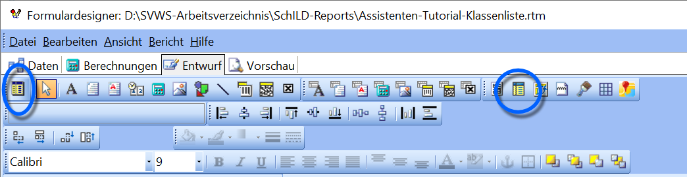
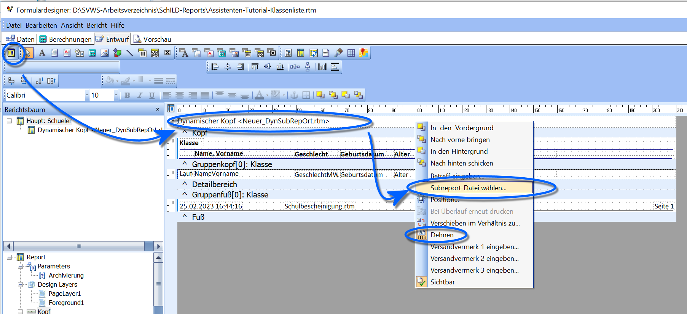
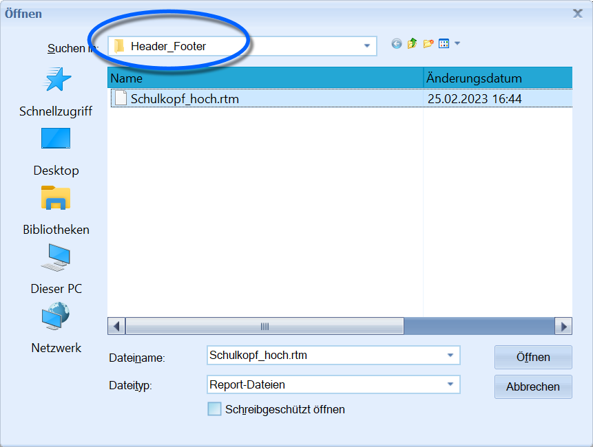
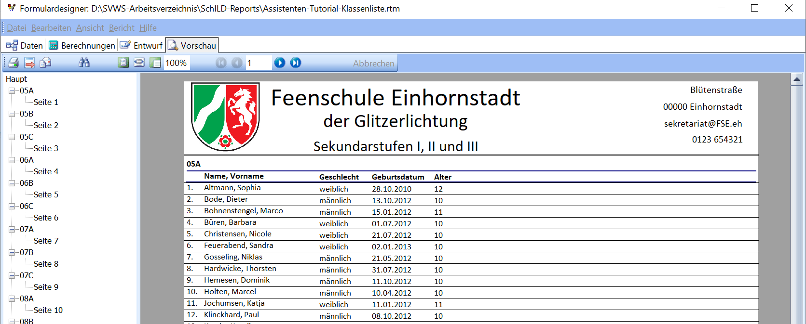

# Einen Subreport dynamisch in einen Report einbinden

In diesem vertiefenden Beispiel wird ein **Schulkopf** in einen
bestehenden Report eingebunden. Hierzu wird ein **Subreport** verwendet,
der sich im Ordner **Header_Footer** befindet.Ein **Subreport** ist ein eigener Report, der in einen anderen Report
eingebunden wird. Dies ermöglicht es, wiederkehrende Elemente wie
Briefköpfe, Schulköpfe oder Fußzeilen zentral zu pflegen.

## Arten von Subreports

Es gibt zwei Arten von Subreports:-   **Statischer Subreport**` Ein statischer Subreport wird einmalig in den Hauptreport eingefügt und dort gespeichert.  `  
` Änderungen am Subreport wirken sich auf den Hauptreport nur aus, wenn dieser manuell angepasst wird.  `  
` (Im Bild links.)`-   **Dynamisch ladbarer Subreport**` Ein dynamischer Subreport wird nicht eingebettet, sondern verknüpft.  `  
` Beim Erzeugen des Hauptreports wird der Subreport jedes Mal neu geladen.  `  
` Änderungen im Subreport wirken daher automatisch in allen Reports, die ihn verwenden.  `  
` 

Dies eignet sich besonders für einheitliche oder institutionell gepflegte Elemente wie Schulköpfe.  `  
` (Im Bild rechts.)`  

 Im Beispiel wird ein **dynamischer Subreport** im **Kopf**
des aktuellen Reports platziert.Dazu wird das entsprechende Werkzeug aus der Werkzeugleiste gewählt und
an die gewünschte Stelle gesetzt. Über einen Rechtsklick wird
anschließend das Kontextmenü geöffnet und die Option **Subreport-Datei
wählen…** aufgerufen.

Im Ordner **Header_Footer** wird nun der passende Kopf gewählt.  

Der Schulkopf erscheint nun über dem aktuellen Report. Da er als
**dynamischer Subreport** eingebunden ist, werden zukünftige Änderungen
automatisch übernommen. So lassen sich Layout- oder
Informationsanpassungen zentral pflegen, ohne jeden Report einzeln
ändern zu müssen.

Dies ist insbesondere bei einheitlich zu haltenden Reports (z. B.
Listen, Serienbriefe, Zeugnisse) sinnvoll.