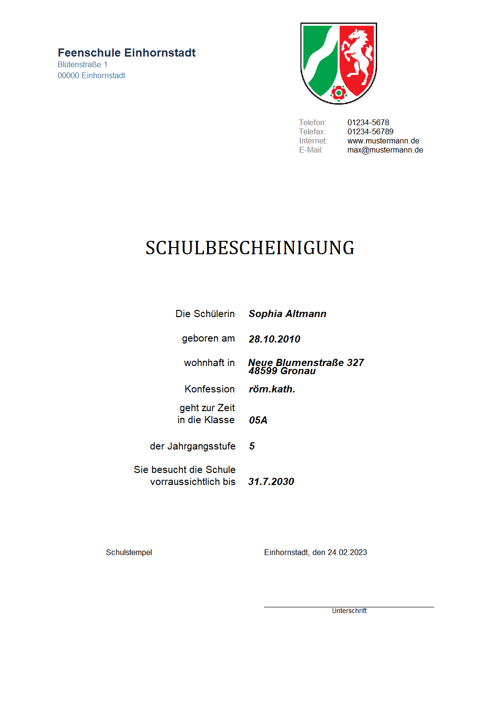
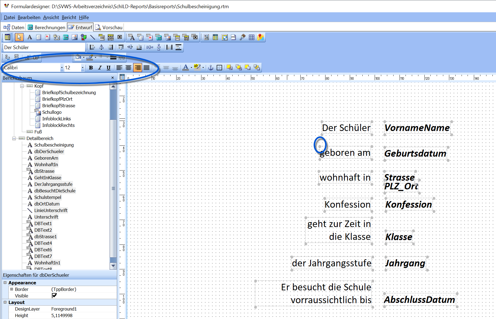
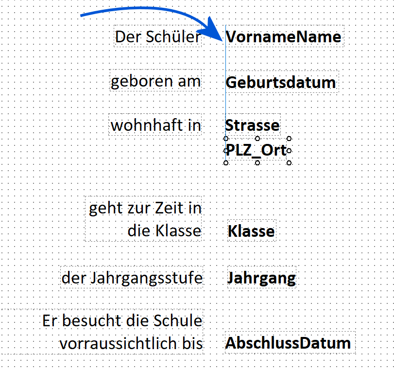
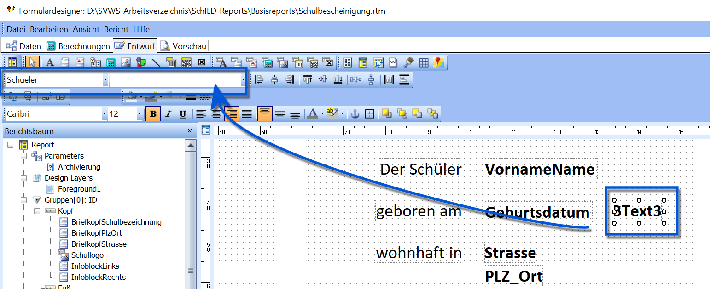
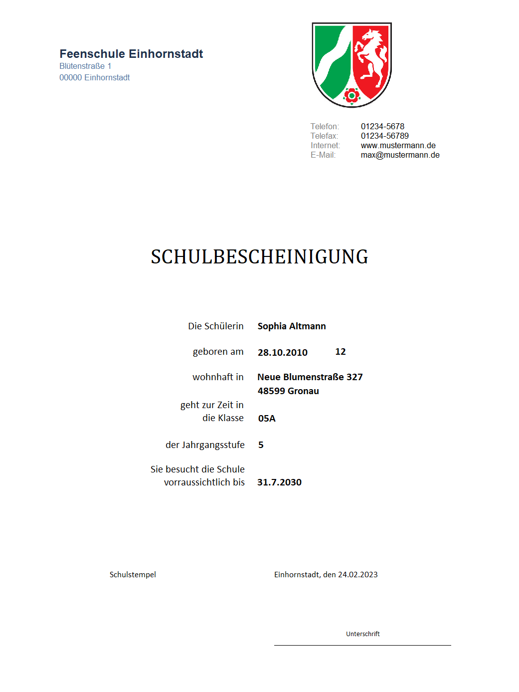

# Einen vorhandenen Report anpassen

Reports müssen nicht immer komplett neu erstellt werden. Auf der
Webseite **Schulverwaltungssoftware des MSB** stehen bereits
umfangreiche Reportsammlungen zur Verfügung. Oft ist es sinnvoll,
zunächst zu prüfen, ob ein benötigter Report bereits existiert.
Gefundene Reports lassen sich anschließend an die eigenen Bedürfnisse
anpassen.

## Beispiel Schulbescheinigung anpassen

Im folgenden Beispiel wird eine Schulbescheinigung aus einer
Reportsammlung angepasst. Der Ausgangsreport könnte wie rechts
dargestellt aussehen.Es sollen folgende Veränderungen vorgenommen werden:-   Schriftart **Arial** → **Calibri**
-   Datenfelder nicht mehr kursiv
-   **PLZ** soll etwas nach unten verschoben werden
-   **Konfession** soll nicht erscheinen
-   dafür soll das **Alter** ausgegeben werden  

## Schriftgröße und Schriftart anpassen

Im Modus **Entwurf** können Textfelder bearbeitet werden. Dazu wird ein
Feld angeklickt. Nun erscheinen im oberen Werkzeugbereich Auswahlfelder
für:-   **Schriftart**
-   **Schriftgröße**
-   Schriftstil (fett, kursiv, unterstrichen)
-   Ausrichtung innerhalb des FeldesAuch Datenbankfelder (**DBText**) besitzen diese Eigenschaften, da sie
ebenfalls Text enthalten.Auf diese Weise lassen sich Schriftart und Schriftstil aller
betreffenden Felder in einem Schritt ändern.Im Beispiel wird zusätzlich bei den Datenbankfeldern der Kursivstil
deaktiviert (Schalter **I**).  
=== Daten hinzufügen und entfernen ===

Nun wird das Feld **Konfession** entfernt. Dazu wird das Feld ausgewählt
und mit **Entf** gelöscht (Label und Datenfeld).

Die nun entstehende Lücke wird genutzt, um das Datenfeld **PLZ_Ort**
leicht nach unten zu verschieben.Der darunterliegende Datenblock wird per Lasso markiert und nach oben
geschoben, bis das Layout wieder geschlossen wirkt.  

Nun soll das **Alter** ausgegeben werden. Dazu wird ein Feld vom Typ
**DBText** im Report platziert. Wichtig: Es sollte nicht unmittelbar
neben dem Geburtsdatum liegen, damit sich die Felder bei langen Angaben
nicht überlappen.

Das neue Feld wird angepasst, im Beispiel auf **Linksbündig** gestellt.Als **Datenquelle** wird **Schueler** gewählt. Das **Datenfeld** wird
per Dropdown auf **Alter** gesetzt.  

In der **Vorschau** erscheint nun die angepasste Schulbescheinigung.Ob das Ergebnis bereits zufriedenstellt oder weiter verfeinert werden
soll, liegt im Ermessen des Anwenders.Beispiele für mögliche Weiterentwicklungen:-   ein zusätzliches Textfeld mit der Beschriftung »Alter«
-   weitere Datenfelder (z. B. Erziehungsberechtigte)
-   Layout-Optimierung für gleichmäßige Abstände