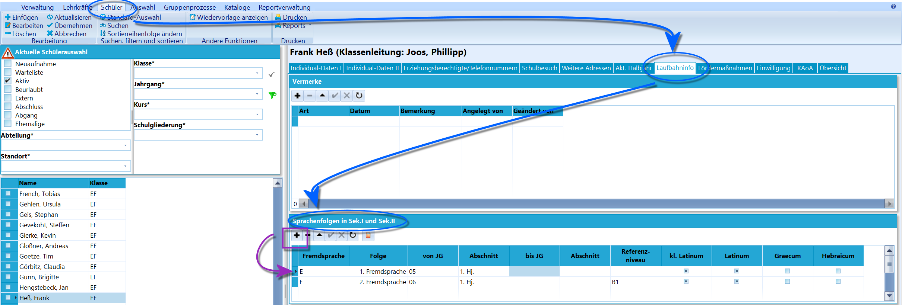
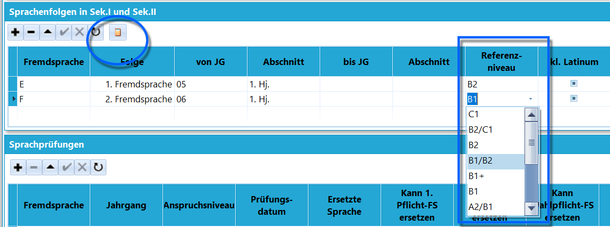
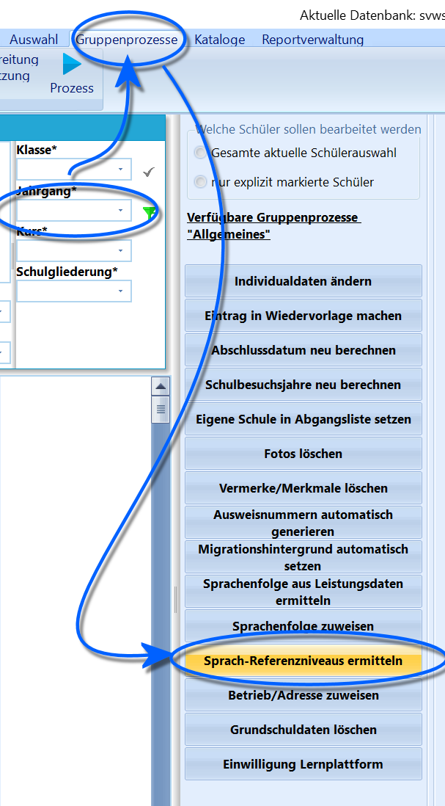

# Eingabe der GeR-Niveaus (Tutorial)

Auf der
[Webseite des Gemeinsamen EuropäischenReferenzrahmens](https://www.europaeischer-referenzrahmen.de) finden Sie
Informationen zu den Niveaus. In SchILD-NRW werden die Fremdsprachen
erfasst und die Niveaus werden dann aus der Lerndauer und den
Leistungsdaten ermittelt.

Die Vergabe des GeR-Niveaus hängt unmittelbar mit dem korrekten Eintrag
der Sprachenfolge auf der Karteikarte *Laufbahninfo* zusammen.

Das GeR-Niveau wird nicht für die Sprachen Lateinisch, Hebräisch und
Altgriechisch vergeben, sondern nur für die modernen europäischen
Fremdsprachen.Es gibt zwei Möglichkeiten der Erfassung des GeR:

## Individuelle Erfassung der Referenzniveaus

 Diese Methode wird beispielsweise dann verwendet, wenn
Seiteneinsteiger die Schule verlassen und man zu diesen
Seiteneinsteigern nicht alle Leistungshalbjahre - und damit Sprachen und
deren Noten - in SchILD-NRW erfasst hat.  Legen Sie die Sprachen unter *Schüler ➜ Laufbahninfo ➜ Sprachenfolgen in
der Sek. I und Sek. II* an. Klicken Sie auf das **+** und tragen Sie nun
bei Bedarf die passende Zeile ein. Beachten Sie hierzu auch die
Informationen über die *Sprachenfolgen*.Achten Sie darauf, dass Beginn und Ende der Sprachbelegung, *von JG* und
*bis JG* mit dem jeweils passenden *Abschnitt*, korrekt ausgefüllt
sind.  

 Wählen Sie für eine existierende Zeile das
**Referenzniveau** über das Dropdown-Menü.Sollten Leistungsdaten unter *Akt. Halbjahr* vorhanden sein, kann das
Niveau mit einem Klick auf das **Rechnersymbol** automatisch ausgefüllt
werden.

Dies wird etwa benutzt, wenn die Sprachenfolgen für einen Jahrgang schon
automatisch berechnet wurden und dann im Nachgang bei einzelnen Schülern
Fehler korrigiert werden.    

## Gruppenweise Erfassung der Referenzniveaus

 Dieses Verfahren funktioniert natürlich nur dann, wenn die
Sprachenfolgen korrekt und vollständig erfasst und die Noten aller
Abschnitte in diesen Sprachen auf der Karteikarte *Akt. Halbjahr*
vorliegen.Filtern Sie zuerst auf die zu bearbeitenden Schülermenge, also
typischerweise den zu bearbeitenden Abschlussjahrgang.Starten Sie die Berechnung der Referenzniveaus über *Gruppenprozesse ➜
Allgemein* ➜ **Sprach-Referenzniveaus ermitteln**.

Diese wurde nun in *Laufbahninfo ➜ Sprachenfolgen* erzeugt.