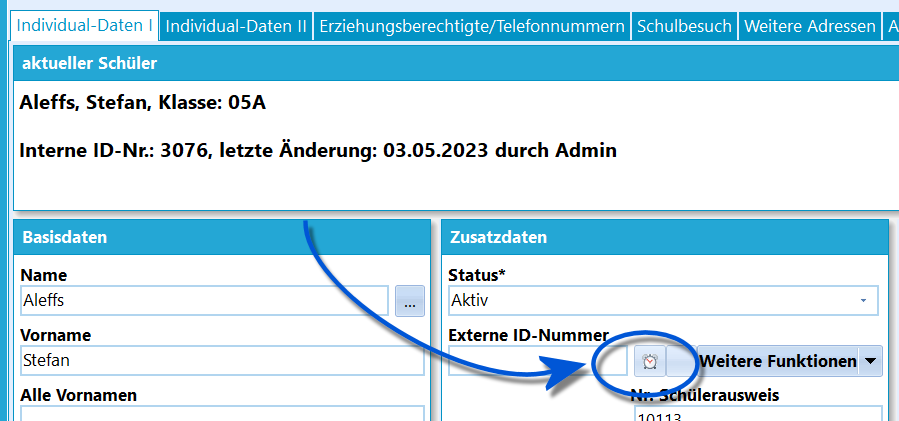
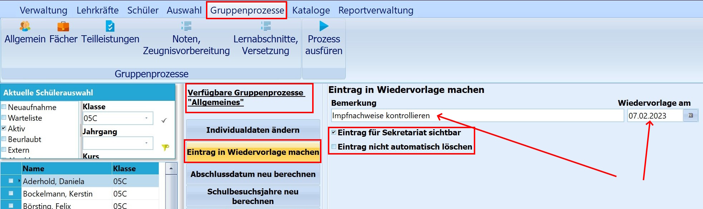
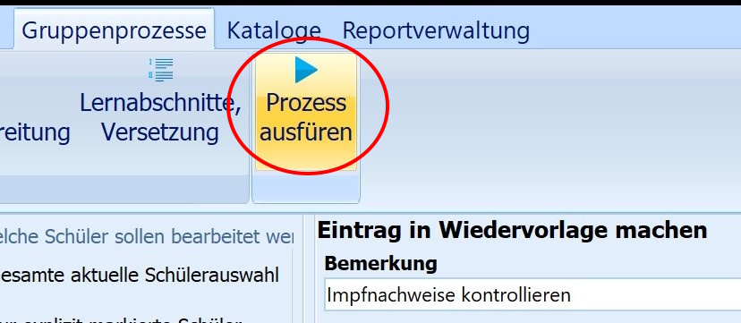
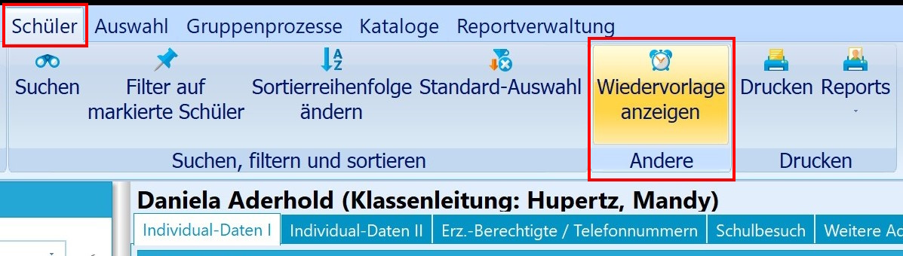
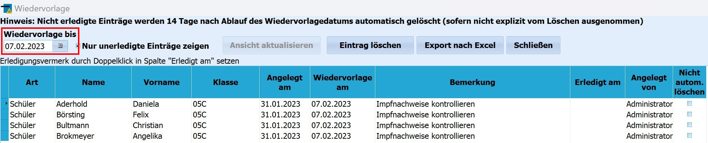

# Eintrag in die Wiedervorlage machen (Gruppenprozesse Allgemein) 

 Einträge zur Wiedervorlage können bei einzelnen
Schülerinnen und Schülern über einen Klick auf das **Weckersymbol** bei
den *Individualdaten I* hinzugefügt werden.  

 Einträge zur Wiedervorlage können aber auch gruppenweise
vorgenommen werden. Nach der Schülerauswahl über den Schnellfilter
(Klasse, Jahrgang, Kurs), oder die Auswahl, wird im Auswahlmenü
*Gruppenprozesse* in der Kategorie *Allgemeines* der Prozess **Eintrag
in Wiedervorlage machen** angeklickt.Im Menü, das nun rechts erscheint, kann eine *Bemerkung zur
Wiedervorlage* eingegeben und der Wiedervorlagetermin ausgewählt werden.Darüber hinaus kann durch das Setzen der entsprechenden Häkchen
festgelegt werden, ob der Eintrag auch *für das Sekretariat sichtbar*
sein soll. Andernfalls kann ihn nur die Nutzerin / der Nutzer sehen
die/der den Eintrag angelegt hat.Weiterhin ist anzugeben, ob die Wiedervorlage nach dem Ablaufdatum
gelöscht werden oder erhalten bleiben soll.  

 Über "Prozess ausführen" wird der Vorgang angestoßen und
die jeweiligen Eintragungen werden vorgenommen.  

 Die neuen Einträge können dann im Auswahlmenü *Schüler*
über **Wiedervorlage ansehen** eingesehen werden.  

 Einträge zur Wiedervorlage erscheinen nur, wenn ein Datum
nach dem gesetzten Wiedervorlagedatum ausgewählt wurde.  

### Videotutorial
<youtube>8hKaUTORfpU</youtube>
