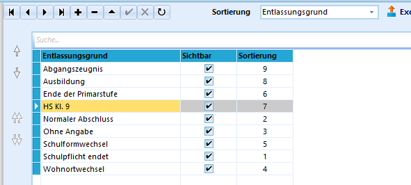

# Entlassungs-Bemerkungen (Allgemeine Kataloge)

Die in diesem Katalog zur Verfügung stehenden Einträge können auf der
Registerkarte *Schüler ➜ Schulbesuch* im Bereich *Entlassung von eigener
Schule* im Feld **Bemerkung/Entlassgrund** angewendet werden.Sollten sie weitere Einträge ergänzen wollen - wie zum Beispiel
*"Bildungsabbruch"* an den BKs, ... - erreichen Sie dies durch Anklicken
des Plus **+**.Eine benutzerdefinierte Sortierreihenfolge kann durch Wechsel auf
*Benutzerdefiniert* in der Schaltfläche *Sortierung* erfolgen.Verschieben Sie hierzu mit Hilfe der Pfeile am linken Rand Ihre
Favoriten nach oben.