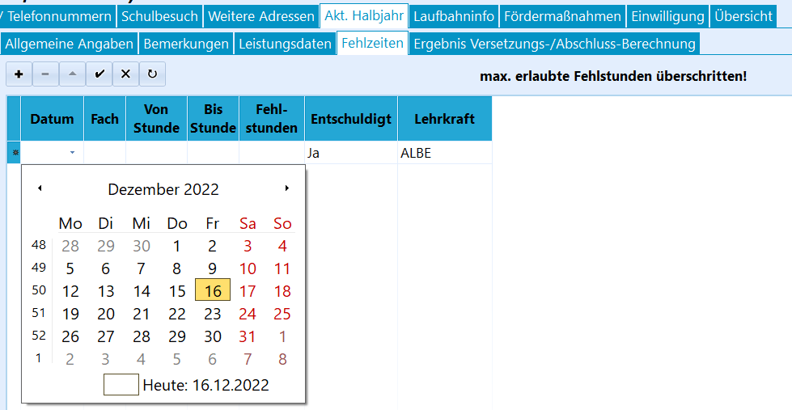
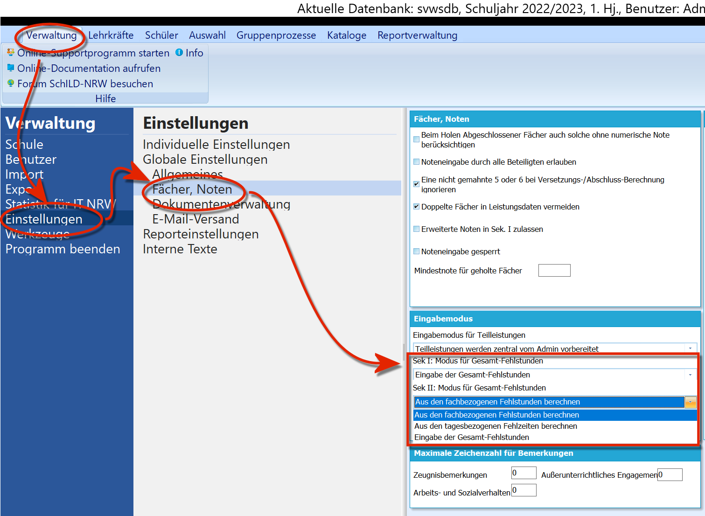
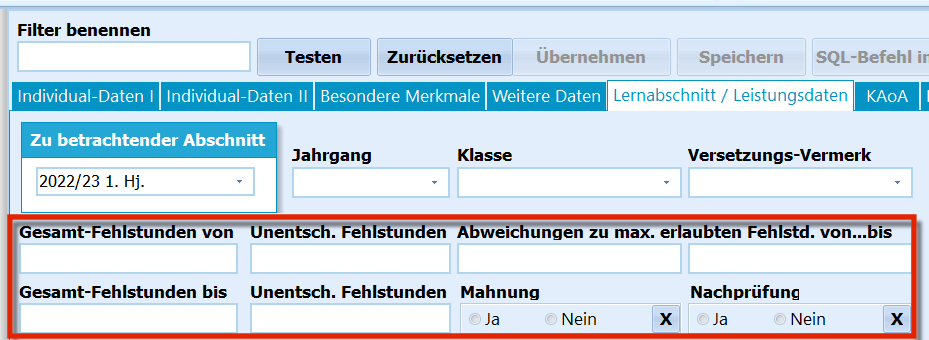

# Fehlzeiten (Aktuelles Halbjahr / Aktueller Abschnitt

## Fehlzeiten tagesbezogen verwalten

Im Reiter *Fehlzeiten* können beliebige Fehlzeiten, die Option hier ist
*"tagesbezogen"*, erfasst werden. Die Erfassung erfolgt aufgrund der
entsprechenden Daten auch konkreten Stunden, Fächern und Lehrkräften
zugeordnet.

 Eine neue Zeile wird über das **+** angelegt und mit dem
Haken bestätigt.In jeder Zeile werden ein **Datum**, ein **Fach** und eine
**Lehrkraft**. Um die konkrete Fehlzeit festzuhalten, wird ein Intervall
**Von Stunde** bis **Bis Stunde** angelegt, dann wird eingetragen, wie
viele konkrete **Fehlstunden** dieser Eintrag beinhaltet.Weiterhin wird erfasst, ob diese Fehlzeit als **Entschuldigt** gilt
(*"Ja"*) oder nicht (*"Nein"*).  

## Einstellen der Fehlzeitenverwaltungsart

 Wie Fehlzeiten erfasst werden, lässt sich über
*"Verwaltung"* ➜ *"Einstellungen"* ➜ *"Fächer, Noten"* im Feld
*"Eingabemodus"* jeweils für die Sekundarstufe I und II getrennt
einstellen.Jeder der beiden Einträge lässt zwischen folgenden Arten wählen:-   **Aus den fachbezogenen Fehlstunden berechnen**: Die Fehlstunden
    werden in den Leistungsdaten in der Zeile für jedes Fach
    beziehungsweise jeden Kurs erfasst. Diese Fehlstunden können über
    die Fachlehrkräfte auch über das *externe Notenmodul* eingesammelt
    werden.
-   **Aus den tagesbezogenen Fehlzeiten berechnen**: Die Fehlstunden
    werden im *"Akt. Halbjahr"* über *"Fehlzeiten"* erfasst.
-   **Eingabe der Gesamt-Fehlzeiten**: Die Fehlzeiten werden in ihrer
    Gesamtheit im *"Akt. Halbjahr"* in den *"Allgemeinen Angaben"*
    direkt eingetragen. Über das *"externe Notenmodul"* können die
    Fehlzeiten durch etwa eine Klassenleitung in dem Modul eingetragen
    werden.  

## Auswerten von Fehlzeiten

In den *Allgemeinen Angaben* lässt sich auch das Feld "**Max.Fehlstd.**"
mit einem Wert für maximale Fehlstunden befüllen. Überschreiten die
**Fehlstunden** den hier gesetzten Wert, wird er fett gedruckt.

### Der Schülerfilter

 Mit dem *Filter I* kann auf die Fehlstunden beziehungsweise
die unentschuldigten Fehlstunden gefiltert werden, um die Funde dann
entsprechend weiter zu nutzen. Der Filter I erlaubt auch eine Angabe von
positiven ("Überschreitung") oder negativen Werten ("nahe dran"), um auf
eine *Abweichung vom Grenzwert* zu filtern.  

## Datenquellen im Reportbaukasten

Auf Fehlzeiten kann im Reportbaukasten mit den entsprechenden
Datenquellen zugegriffen werden.-   *SchuelerFehlzeiten*: Diese *schüler*bezogene Datenquelle gibt für
    den Schüler die im jeweiligen Lernabschnitt angefallenen Fehlzeiten
    aus. Der Report muss hierzu also ein Element der Datenquelle
    *"Lernabschnitte"* enthalten.
-   *FehlzeitenUebersicht*: Hiermit kann eine Übersicht für die
    Fehlzeiten, bezogen auf die ausgewählte *Schülergruppe* ausgegeben,
    werden. Man kann so z.B. eine "Tagesmeldung" oder alle Fehlzeiten
    des Schülers ab Monatsbeginn usw. ausgeben lassen.