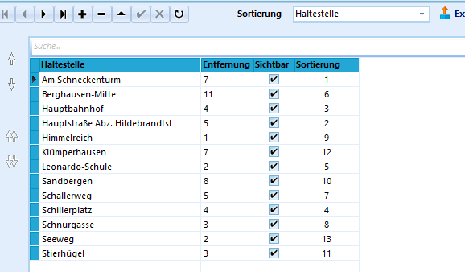

# Haltestellen (Allgemeine Kataloge)`

`Der Katalog der Haltestellen ist bei der Grundinstallation leer.

Dieser Katalog wird von Schulen verwendet, wenn Schulbusse oder andere
Transportmittel verwendet werden und z.B. nachgehalten werden muss, wo
die Schüler abgeholt werden sollen.Um diese Information zu den Schülern mit Hilfe von SchILD-NRW
abzubilden, müssen alle, bei Ihren Schülern vorkommenden Haltestellen im
Katalog zuerst eingegeben werden.Anschließend kann unter *Schüler ➜ Individual-Daten I ➜ Haltestelle* auf
die einzelnen Möglichkeiten zugegriffen werden.Durch das Plus **+** ist auch an dieser Stelle ein Eingeben von neuen
Haltestellen möglich. Dies funktioniert zusätzlich zu der Möglichkeit
über den Katalog.Neben den üblichen Sortiermöglichkeiten kann hier auch nach der
Entfernung sortiert werden. Darüber hinaus kann auch die Sichtbarkeit
an- und ausgeschaltet werden.