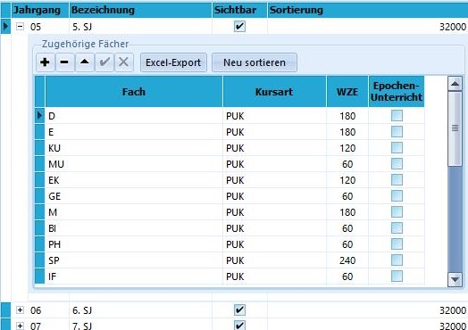
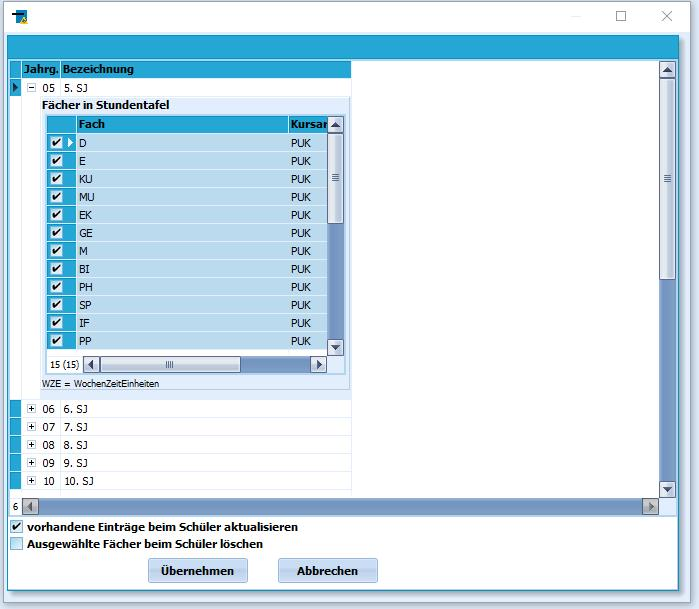
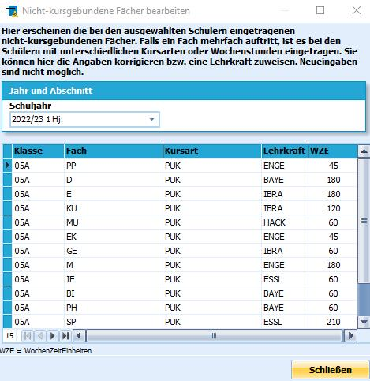

# Klassenunterrichte anlegen (Tutorial)

## Definieren der Unterrichte über Stundentafeln

 Unter *Klassenunterricht* versteht man die
Unterrichtszeiten, die die Schülerinnen und Schüler gemeinsam im
gesamten Klassenverband haben.

Dieser wird in SchILD-NRW mit der *Kursart* PUK, also "Pflichtunterricht
im Klassenverband", bezeichnet. Jeglicher anderer Unterricht ist
*Kursunterricht*, das heißt, es werden nur Teile der Klasse, nicht alle
Schülerinnen und Schüler der Klasse gemeinsam, unterrichtet.Unter dem Reiter *Kataloge* findet man den Unterpunkt **Stundentafel**.Über diesen Katalog können für jeden Jahrgang und gegebenenfalls auch
für einzelne Klassen eine Stundentafel angelegt werden, die den
Unterricht des jeweiligen Jahrgangs oder in der Klasse zumindest zum
größten Teil abbildet.Geben Sie einer Stundentafel einen sprechenden Namen, etwa nach dem
Jahrgang, dem sie zugeordnet werden soll.Für eine Stundentafel werden das **Fach** und die **WZE**, die
Wochenzeitzeiteinheiten angegeben. Hier werden die Schulstunden im
Zeitraster der Schule beziehungsweise die Minuten im Minutenmodell
eingegeben.

Die **Kursart** ist natürlich PUK.Schlussendlich ist noch anzuhaken, ob es sich bei dem Fach um
**Epochenunterricht** handelt.

Diese Stundentafel ist eine Auflistung aller PUK-Unterrichte, welche die
Klasse gemeinsam erhält.Kursunterrichte werden gesondert eingeteilt.  
Diese Stundentafeln bleiben bestehen, solange sich der Unterricht bzw.
die Fächer im Jahrgang nicht ändern. Eventuell müssen hier immer wieder
Anpassungen erfolgen.  

## Zuweisung der Stundentafeln

 Um die Klassenunterrichte den Schülern zuzuweisen wird der
*Gruppenprozesse ➜ Fächer* ➜ **Stundentafeln zuweisen** verwendet.Man filtert in der Schülerauswahl auf den zu bearbeitenden Jahrgang oder
eventuell auch auf einzelne Klassen.Im Fenster des Gruppenprozesses wird nun der die passende Stundentafel
ausgewählt, etwa die für den Jahrgang angelegte. Mit `Übernehmen` wird
diese Stundentafel mit den PUK-Fächern nun den ausgewählten Schülern
zugewiesen.Durch das Entfernen von Häkchen kann man an dieser Stelle Fächer
entfernen. Darüber hinaus besteht auch die Möglichkeit, durch Belassen
einzelner Haken ein oder mehrere Fächer bei Schülerinnen und Schülern zu
löschen.Dafür müssen dann die zu löschenden Fächer angehakt bleiben und unten
dem Haken bei *Ausgewählte Fächer beim Schüler löschen* angehakt sein.  

## Vervollständigen der Fächer

 Es folgt nun das Eintragen der jeweiligen Fachlehrkraft zu
den Fächern.

Dies erfolgt über den Gruppenprozess **Klassenunterrichte bearbeiten**.An dieser Stelle kann gegebenenfalls auch noch einmal die
Unterrichtszeit verändert werden, etwa wenn sich im Halbjahr die
Stundenzahl in Geschichte von zwei auf eine Stunde, dafür aber in
Erdkunde von eine auf zwei ändert.