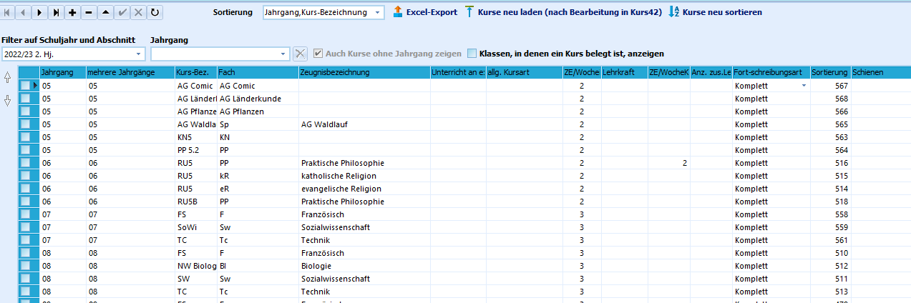
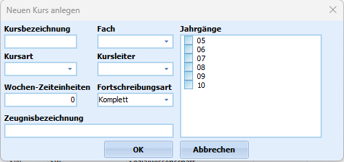

# Kursunterrichte anlegen (Tutorial)

 Unter *Kursunterricht* versteht man die Unterrichtszeiten,
die nur für Teile der Klasse sind. Es werden also nicht alle
Schülerinnen und Schüler gemeinsam unterrichtet.

Dieser Unterricht wird in SchILD-NRW mit der *Kursart* PUT
(Pflichtunterricht für Teile von Klassen) bezeichnet. Daneben gibt es
noch weitere Bezeichnungen wie zum Beispiel AG, DFG, FUT, LRS.Unter dem Reiter *Kataloge* befindet sich den Unterpunkt **Kurse**. Hier
gibt es die Möglichkeit für jeden Jahrgang und gegebenenfalls auch für
einzelne Klassen Kurse anzulegen.  Die Schüler werden dann über die Gruppenprozesse oder individuell durch
Hinzufügen im aktuellen Abschnitt zu den Kursen zugewiesen.Um die Anzeige der Kurse einzuschränken oder Kurse aus anderen
Halbjahren anzuzeigen, benutzen Sie bitte die *Schnellfilter* im oberen
Bereich.Es stehen Ihnen ein Excel-Export dieser Tabelle und einige
Aktualisierungsmöglichkeiten zur Verfügung. Zusätzliche Jahrgänge bei
jahrgangsübergreifenden Kursen (Spalte "Mehrere Jahrgänge") können auf
Knopfdruck ermittelt werden.  

 Neue Kurse werden über das Pluszeichen im oberen Bereich angelegt:
 
-   **Kurs-Bez.:** Die Kursbezeichnung kann frei gewählt werden: Zu
    beachten ist dabei, dass diese im jeweiligen Abschnitt eindeutig
    sein muss.
-   **Fach:** Hier stehen alle Fächer zur Verfügung, die unter Kataloge
    -\> Unterrichtsfächer angelegt wurden. In manchen Fällen kann es
    sinnvoll sein, für Kurse eigene Fächer einzurichten.
-   **Jahrgänge:** Ist ein Kurs nur für einen bestimmten Jahrgang, so
    wählen Sie diesen durch Setzen des Kreuzchens. Falls der Kurs in
    mehreren Jahrgängen stattfindet, setzen Sie die Kreuze bei mehreren
    Jahrgängen (z.B. 05 und 06).
-   **Kursart:** Hier wird die Kursart des Kurses festgelegt. Diese
    allgemeine Kursart kann sich von den beim Schüler eingetragenen
    Kursarten unterscheiden. Z.B. wäre ein Grundkurs (GK) beim Schüler
    dann mit Grundkurs schriftl. (GKS) eingetragen. Auch sog.
    Differenzierungkurse (DK) an den Schulformen GE und SK würden bei
    den Schülern dann mit E-Kurs oder G-Kurs eingetragen.
-   **Kursleiter:** Erster Kurslehrer, der den Kurs unterrichtet.
-   **Wochen-Zeiteinheiten:** Zeiteinheit der Wochenstunden bei den
    Schülern.
-   **Fortschreibungsart:** Die Fortschreibungsart bestimmt, wie bei der
    Versetzung mit dem Kurs umgegangen wird. Bitte beachten Sie, dass
    die Fortschreibungsart bei jedem Abschnittswechsel berücksichtigt
    wird!
    -   **keine:** Der Kurs wird bei der Versetzung in den neuen
        Abschnitt gelöscht!
    -   **Nur Definition, Jg. beibehalten:** Alle Schüler werden aus dem
        Kurs gelöscht, der Kurs bleibt in seinem Jahrgang bestehen.
    -   **Nur Definition, Jg. hochschreiben:** Alle Schüler werden aus
        dem Kurs gelöscht, der Kurs wird einen Jahrgang hochgeschrieben.
    -   **Komplett:** Der Kurs wird mit allen Schülern in den nächsten
        Abschnitt geführt. Beim Schuljahreswechsel wird der Jahrgang
        erhöht.
-   **Zeugnisbezeichnung:** Geben Sie hier eine Zeugnisbezeichnung ein,
    wenn das Kursfach eine andere Bezeichnung als das "normale" Fach
    haben soll.