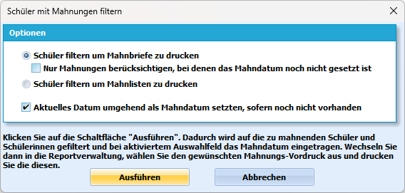
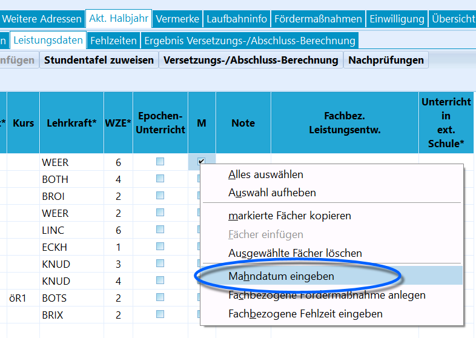

# Mahnbriefe drucken (Tutorial)

## Einleitung

Dieses Tutorial dient der komfortablen Erstellung von Mahnschreiben an
die Erziehungsberechtigten über den Gruppenprozess *Gruppenprozesse ➜
Noten/Zeugnisvorbereitungen* ➜ ***Mahnungsdruck einleiten***Im Lauf der Zeit hat sich der Prozess der Erstellung von Mahnschreiben
weiterentwickelt. Der Gruppenprozess ***Mahnungsdruck einleiten**'' und
der***Serienbrief Mahnung gefährdete Versetzung @Erzieher.rtm**'' und
zwei weitere Übersichten für die Klassenleitungen und Stufenleitungen
wurden aufeinander abgestimmt.

Die Reports für die Mahnungen finden Sie in der
***Basisreportsammlung***.

## Mahnhäkchen setzen

Im ersten Schulhalbjahr werden Mahnhäkchen schülerindividuell bei zu
mahnenden Epochalfächern gesetzt. Dies kann auf dem Reiter *Schüler ➜
Akt. Halbjahr ➜* ***Leistungsdaten***manuell vorgenommen werden. Dies
kann auch mit Hilfe von Notendateien und dem*Externen Notenmodul*oder
über*Gruppenprozesse ➜ Noten/Zeugnisvorbereitungen ➜''***Noten,
Mahnungen und Fehlstunden eingeben**'' erfolgen. Zu jedem Mahnhäkchen
kann ein Datum hinterlegt werden. Dies geschieht später durch den
zugehörigen Gruppenprozess automatisch.Im zweiten Schulhalbjahr gelten alle Fächer, welche im ersten
Schulhalbjahr eine defizitäre Zeugnisnote hatten, als bereits gemahnt.
Dies wird beim versetzungsprozess bereits berücksichtigt, sofern Fächer
in das zweite Halbjahr übertragen werden.Sollten die Fächer beim Versetzungsprozess nicht übertragen worden sein,
weil z.B. über die Stundentafel alle Fächer neu ausgerollt werden, so
muss die Auswertung der Zeugnisnoten des ersten Halbjahres über den
Gruppenprozess *Noten/Zeugnisvorbereitungen ➜ **Mahnungen automatisch
setzen*** manuell angestoßen werden. Dieser Prozess markiert die Fächer,
welche im ersten Halbjahr defizitär waren, mit Mahnhäkchen und
hinterlegt als Mahndatum das Datum der Zeugnisausgabe.Im späteren Verlauf des zweiten Halbjahres kommen gegebenenfalls
***weitere zu mahnende Fächer*** hinzu. Diese können auf die gleiche Art
und Weise markiert werden, wie im ersten Halbjahr. Diese Mahnhäkchen
haben noch kein Mahndatum.

## Der Gruppenprozess Mahnungsdruck einleiten

Streng genommen ist der Gruppenprozess primär ein Filter, welcher auf
die zu mahnende Schülergruppe filtert. Der eigentliche Gruppenprozess
ist das Setzen des Mahndatums.

Sind alle Mahnhäkchen gesetzt, wechseln Sie auf den Reiter
*Gruppenprozesse ➜ Noten/Zeugnisvorbereitungen ➜* **Mahnungsdruck
einleiten***.* Es öffnet sich ein weiteres Fenster mit ausführlicher
Beschreibung, um die zu mahnenden Schüler zu filtern und auf Wunsch
sofort ein Mahndatum zu setzen.

## Schüler filtern, um Mahnbriefe zu drucken

Wenn Sie die Schaltfläche ***Schüler filtern, um Mahnbriefe zu
drucken**'' aktivieren und dann den Filter auslösen, so werden
im***ersten Halbjahr**'' alle minderjährigen Schülerinnen und Schüler
gefiltert, bei denen ein gemahntes Fach gefunden wird.Im ***zweiten Schulhalbjahr*** werden alle minderjährigen Schülerinnen
und Schüler gefiltert, bei denen ein gemahntes Fach gefunden wird,
dessen Mahndatum nicht dem Datum der Zeugnisausgabe des ersten
Schulhalbjahres entspricht. Auf diese Weise werden nur diejenigen
Schülerinnen und Schüler gefiltert, bei denen abweichend von defizitären
Noten im ersten Halbjahreszeugnis zu mahnende Fächer hinzugekommen sind.

Die gefilterte Schülermenge sehen Sie im Schülercontainer. Sie können
nun die Einträge bei den Schülern kontrollieren und in der
Reportverwaltung den ***Serienbrief Mahnung gefährdete Versetzung
@Erzieher.rtm ausdrucken.*** Hinweise zur Funktionsweise des
Serienbriefs finden Sie weiter unten.

## Schüler filtern, um Mahnlisten zu drucken

Sie können die zu filternde Schülergruppe einschränken, indem Sie die
Schaltfläche ***Nur Mahnungen berücksichtigen, bei denen das Mahndatum
noch nicht gesetzt ist***. Es wird nicht empfohlen, dieses Häkchen zu
setzen, da es die ordnungsgemäße Funktion der Serienbriefe und
Mahnreports unterwandert.Wenn Sie die Schaltfläche ***Schüler filtern, um Mahnlisten zu
drucken*** aktivieren und dann den Filter auslösen, so werden sowohl im
ersten als auch im zweiten Halbjahr alle Schülerinnen und Schüler
gefiltert, bei denen ein gemahntes Fach gefunden wird. Hierbei wird auch
nicht unterschieden, ob ein Mahndatum hinterlegt wurde, oder nicht.

Die gefilterte Schülermenge sehen Sie im Schülercontainer. Sie können
nun die Einträge bei den Schülern kontrollieren und in der
Reportverwaltung eine Mahnliste drucken. Diese finden Sie in der
Basisreportsammlung im Ordner ***Reports Allgemein***. Der Report
***Schülerliste - Klasse Gemahnte Schüler.rtm**'' ist für die Stufen-
und Schulleitung konzipiert. Der Report***Klassenliste - Gemahnte
Schüler @KL.rtm**'' ist für die Klassenleitung konzipiert. Beide Reports
listen alle gemahnten Fächer mit Mahndatum auf. Sie enthalten somit alle
Fächer, welche bereits auf dem Zeugnis des ersten Halbjahres defizitär
waren, als auch die neu gemahnten Fächer.

## Mahndatum hinterlegen

Wenn Sie das Auswahlfeld ***Aktuelles Datum umgehend als Mahndatum
setzen, sofern noch nicht vorhanden*** aktivieren, so wird beim Auslösen
des Filters bei allen gefilterten Schülerinnen und Schülern ein
Mahndatum bei jedem gemahnten Fach hinterlegt, sofern noch keines
vorhanden ist. Es wird empfohlen, dieses Häkchen zu setzen, wenn
Mahnbriefe gedruckt werden sollen. Die ordnungsgemäße Funktion des
Mahnbriefes hängt nicht davon ab, ob ein Mahndatum hinterlegt wurde,
oder nicht. Es hat informativen Charakter und wird nur im zweiten
Halbjahr vom Gruppenprozess für die Filterung ausgewertet.

Die Mahnhäkchen werden in *Schüler ➜ Akt. Halbjahr* ➜ **Leistungsdaten**
mit zwei Farben hinterlegt:-   Bei *roten* Mahnhäkchen wurde noch kein **Mahndatum** hinterlegt.
-   Bei *grünen* Mahnhäkchen existiert bereits ein Mahndatum.

Das Mahndatum hat informativen Charakter und wird vom Gruppenprozess für
die Filterung ausgewertet. Sie können für jedes Mahnhäkchen das
Mahndatum über das Kontextmenü (rechte Maustaste) setzen, korrigieren
oder löschen.

Sie können das Mahndatum auch später setzen, wenn der
Ausdruck der Mahnschreiben abgeschlossen ist. Sie können z.B. im
Mahnbrief ein zukünftiges Datum angeben, um die Briefe etwas später zu
verschicken. Hier bietet es sich dann an, erst zum Versanddatum das
Mahndatum zu setzen.

## Serienbrief Mahnung gefährdete Versetzung

## Der Report

Das Mahnschreiben *Serienbrief Mahnung gefährdete Versetzung
@Eltern.rtf* befindet sich in der Basis-Reportsammlung, welche bei der
Installation von SchILD-NRW 3 mitgeliefert wird.Eine eventuell aktualisierte Version können Sie auf der [Release-Seitefür Schulverwalungssoftware inGitHub](https://github.com/SVWS-NRW/Schild-NRW-3-Reports/releases)
herunterladen.Der Report kann an Grundschulen, weiterführenden Schulen und
Berufskollegs genutzt werden.

## Vorgaben Schulgesetz und Ausbildungs- und Prüfungsordnung

Prinzipiell sind die Mahnbriefe Serienbriefe mit erweiterten Funktionen
und Rückantwortabschnitt an die Erziehungsberechtigten.

Das Aussehen des Mahnschreibens wird in der APO-S I definiert. Dort
findet sich auch der Hinweis, dass das Schreiben gemäß Anlage *"zu
verwenden"* ist. Dies bedeutet, dass keine eigenen Texte zu verwenden
sind und dass die Anlage nicht abgeändert werden darf. Die Mahnbriefe
wurde in enger Rücksprache mit dem MSB konzipiert und können in den
Jahrgangsstufen 3 bis EF verwendet werden.Folgende Vorgaben wurden vom MSB gemacht:
1.  der Mahnbrief hat dem Muster aus der APO-SI zu entsprechen
2.  ein dezidierter Abschluss muss bei einer Abschlussgefährdung nicht
    ausgesprochen werden
3.  es unterschreibt immer die Klassenleitung
4.  eine gesonderte Warnung auf die Note 6 gibt es nicht
5.  es werden im 2. Halbjahr nur diejenigen Noten aufgelistet, welche
    abweichend vom ersten Halbjahr defizitär sind. Das Wort -auch- weist
    darauf hin, dass es vorab Defizite gab.
6.  Der Mahnbrief wird nur an minderjährige Schulkinder versendet.

## Ausdruck im ersten Schulhalbjahr

Im ersten Schulhalbjahr werden alle gemahnten Fächer im Serienbrief
aufgelistet. Anhand der Schulform, des Jahrgangs, der Prüfung auf
Wiederholer und Verweildauer überprüft der Serienbrief zudem, ob ein
Hinweis auf gefährdete Versetzung, gefährdeten Abschluss oder
Schulformwechsel gegeben werden muss.

## Ausdruck im zweiten Schulhalbjahr

Im zweiten Schulhalbjahr analysiert der Serienbrief das Mahndatum der
gemahnten Fächer. Wird ein gemahntes Fach gefunden, welches aus einem
Defizit des ersten Halbjahres stammt, so erscheint im Serienbrief das
Wort -auch-. Dieses weist darauf hin, dass neben den aufgeführten
defizitären Fächern bereits defizitäre Fächer auf dem Halbjahreszeugnis
vorhanden waren. Wird ein Fach gefunden, dessen Mahndatum leer ist oder
im zweiten Halbjahr neu hinzugekommen ist, so wird dieses Fach im
Serienbrief aufgelistet.Anhand der Schulform, des Jahrgangs, der Prüfung auf Wiederholer und
Verweildauer überprüft der Serienbrief zudem wiederum, ob ein Hinweis
auf gefährdete Versetzung, gefährdeten Abschluss oder Schulformwechsel
gegeben werden muss.