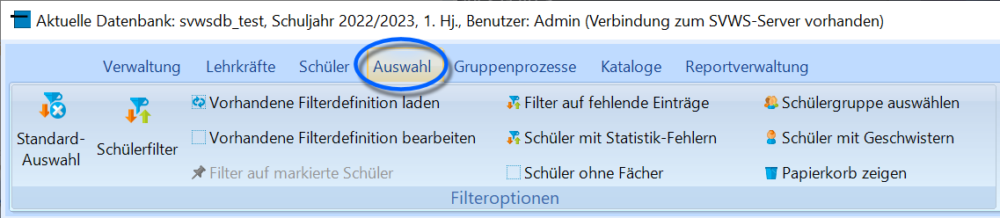
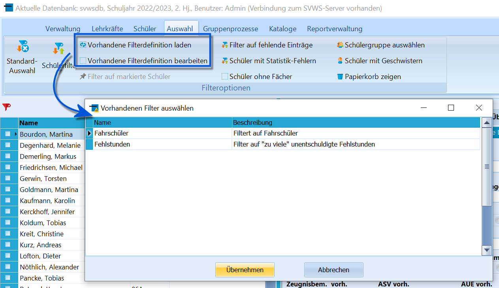
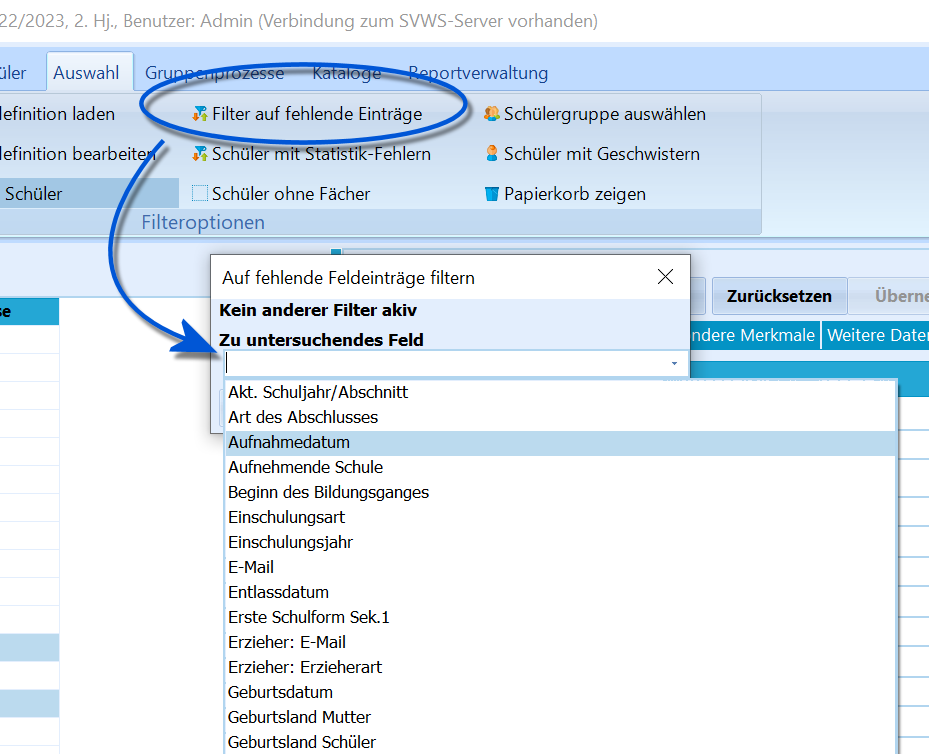
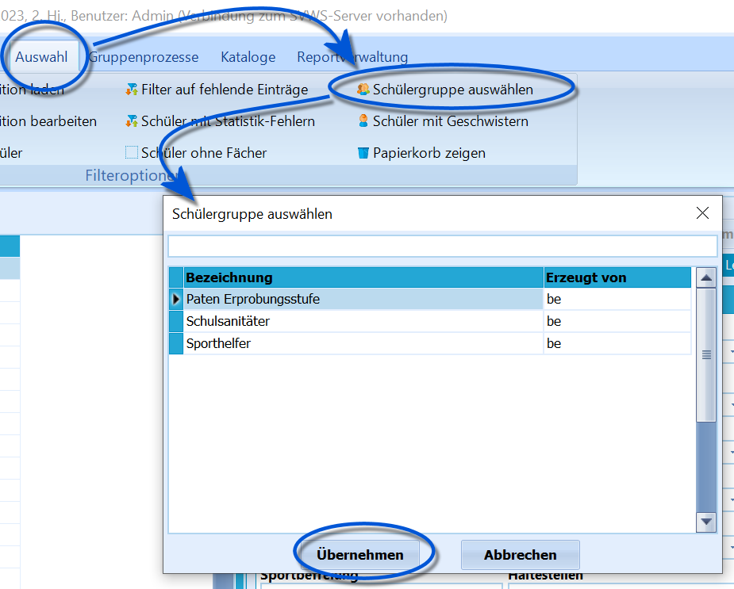

# Menüband (Auswahl)

 Über das Menüband im Bereich *Auswahl* stehen mehrere
Optionen für Schnellzugriffe zur Verfügung.-   Oben links findet sich der Knopf **Standardauswahl**. Hiermit werden
    alle vorgenommenen Änderungen zurückgesetzt und der Schülercontainer
    enthält wieder alle Schüler, die per Standard angezeigt werden. Die
    Grundeinstellung ist *die ganze Schule, nach Klassen sortiert*.<!-- -->-   Der Knopf **Schülerfilter** ruft einen sehr mächtigen Filter auf,
    mit dem auf nahezu alle Datenbankfelder in vielen Kombinationen
    gefiltert werden kann. Lesen Sie hierzu bitte den Artikel zum
    *Schülerfilter*.

-   Im *Schülerfilter* können *Filterdefinitionen* gespeichert werden,
    damit die Bedingungen bei öfters verwendeten Filtern nicht immer neu
    erstellt werden müssen.
    -   Diese können mit *Vorhandene Filterdefinitionen laden* aus einer
        Liste ausgewählt und mit **Übernehmen** direkt angewendet
        werden.
    -   Mit **Vorhandene Filterdefinitionen bearbeiten**: Es öffnet sich
        ein Fenster mit den definierten Filtern, so dass Einträge zum
        *Löschen* ausgewählt werden können. Soll ein bestehender Filter
        verändert werden, ist er zuerst über diese Funktion zu löschen
        und dann neu anzulegen.<!-- -->-   **Filter auf markierte Schüler**: Wie im Container können Schüler
    *markiert* werden und einem Klick auf dieses Feld reduziert sich die
    Auswahl im Container nur auf diese.

-   Unter **Filter auf fehlende Einträge** bietet sich ein Dropdownmenü,
    das Daten anbietet, die üblicherweise bezüglich der Statistik
    eingetragen sein müssen oder sollen. Wird im Dropdownmenü eine
    Datenart gewählt, werden alle Schüler angezeigt, bei denen dieses
    Feld bislang leer ist.<!-- -->-   **Schüler mit Statistik-Fehlern**: Wurde über *Verwaltung ➜
    Statistik für IT.NRW ➜ Gesamtprüfung der Daten* ebendiese
    Gesamtprüfung durchgeführt, lassen sich die gefundenen Schüler mit
    diesem Knopf anzeigen, so dass die gefundenen Statistikfehler
    abgearbeitet werden können.<!-- -->-   **Schüler ohne Fächer** öffnet ein Auswahlfenster, in dem ein
    Abschnitt zu wählen ist. Dann werden die Schüler angezeigt, für die
    keine Fächer eingetragen wurden.

-   **Schülergruppe auswählen**: Wurden über *Kataloge ➜ Schülergruppe
    bearbeiten* eine Gruppe angelegt, zu der dann unter *Schüler*
    markierte Schüler hinzugefügt wurden (über die *rechte Maustaste*),
    lässt sich diese Gruppe hier auswählen.<!-- -->-   **Schüler mit Geschwistern**: Hier wird eine Suche nach *Nachnamen*
    und *Adresse* ausgeführt, um Geschwisterkinder automatisch zu
    identifizieren. Beachten ist natürlich, dass somit nicht alle
    Familiensituationen abzubilden sind und damit nicht zuverlässig alle
    Geschwisterkinder identifiziert werden können.<!-- -->-   Über **Papierkorb zeigen** werden alle Schüler mit einer
    Löschmarkierung gezeigt, die in der allgemeinen Schülerauswahl nicht
    mehr abrufbar sind. Ein Klick mit der rechten Maustaste auf einen
    Schüler öffnet das Kontextmenü, in dem der Eintrag **Löschmarkierung
    aufheben** den Schüler wieder zugänglich macht. Zum Löschen
    markierte Schüler können über die Funktion zur Prüfung der
    Löschfristen unter *Verwaltung ➜ Werkzeuge* dauerhaft gelöscht
    werden.