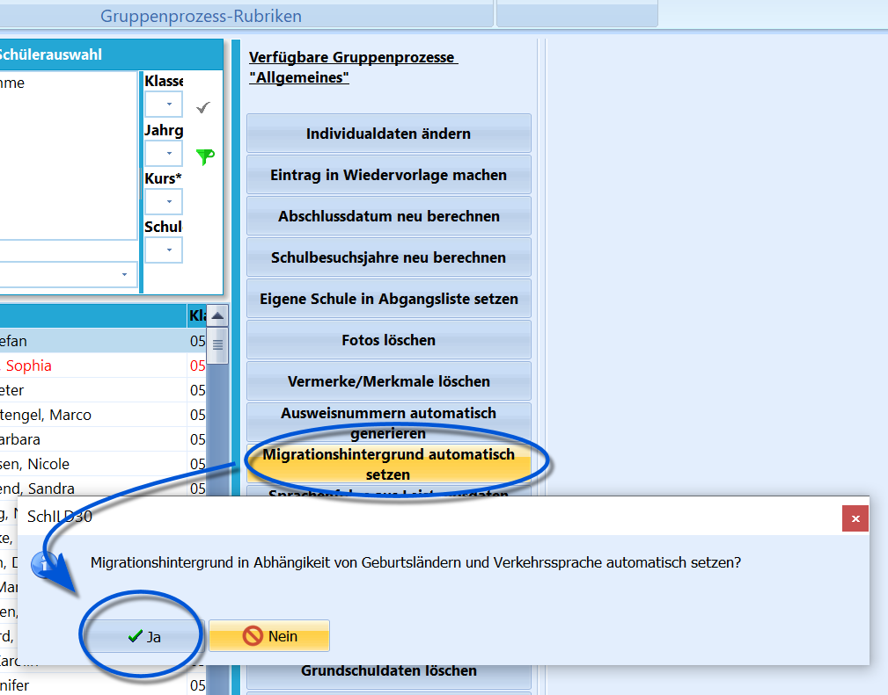

# Migrationshintergrund automatisch setzen (Gruppenprozesse Allgemein)

 Dieser Gruppenprozess dient dazu in den *Individualdaten
II*, den Haken bei **Migrationshintergrund vorhanden** richtig zu
setzen.Wenn Sie diesen Gruppenprozess anstoßen, wird bei den ausgewählten
Schülerinnen und Schülern der Haken gesetzt, sobald unter
*Individualdaten II* ein Eintrag zu den Geburtsländern oder zur
Verkehrssprache gemacht wurde. Ist der Eintrag dagegen überall
*Deutschland*, so wird der Haken entfernt.Eine Anwendung dieses Gruppenprozesses ist somit ungefährlich.  
----

### Videotutorial
<youtube>8mvm87KEehE</youtube>
