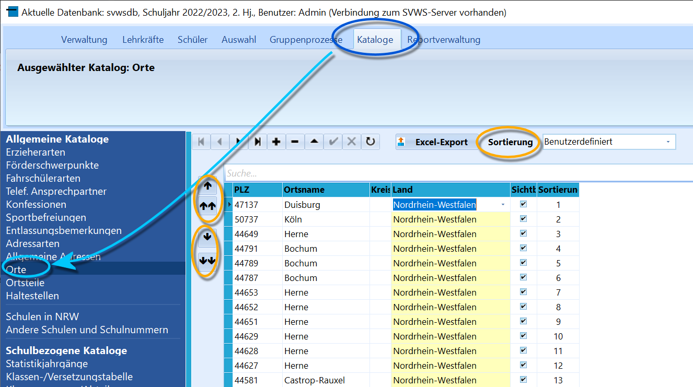

# Orte (Allgemeine Kataloge)

 Sie können die über Dropdown-Menüs verfügbaren Orte über
*Kataloge ➜ Orte* einstellen.Per Standard ist die Liste nach Postleitzahlen sortiert, stellen Sie
unter **Sortierung** auf *Ortsname* oder *Benutzerdefiniert* um.Verändern Sie bei der benutzerdefinierten Sortierung mit den Pfeilen
links oben die Reihenfolge, um oft verwendete Orte in der Liste nach
oben zu schieben.Wie in allen Katalogen lassen sich Einträge mit dem **+** und dem **-**
hinzufügen und entfernen.Ein Klick auf *Excel-Export* erzeugt eine Excel-Liste der
Katalogeinträge.