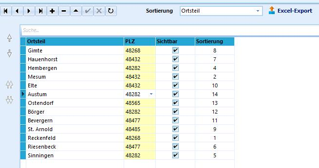

# Ortsteile (Allgemeine Kataloge)

 Gerade für ländlichere Gemeinden bietet die Möglichkeit,
Ortsteile angeben zu können, eine große Erleichterung. Oftmals sind
unter einer Postleitzahl verschiedene Ortsteile einer Kommune
zusammengefasst.Durch Eingabe der Ortsteile kann nun auch gezielt danach gefiltert
werden, was für Anfragen des Schulträgers häufig sinnvoll ist.