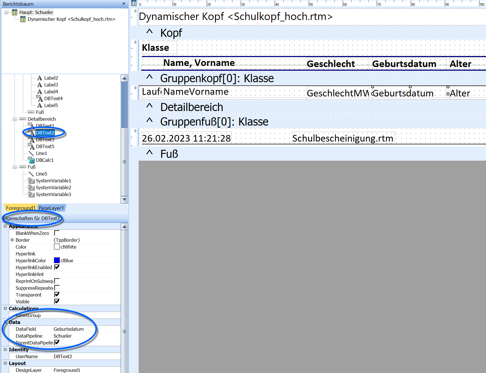
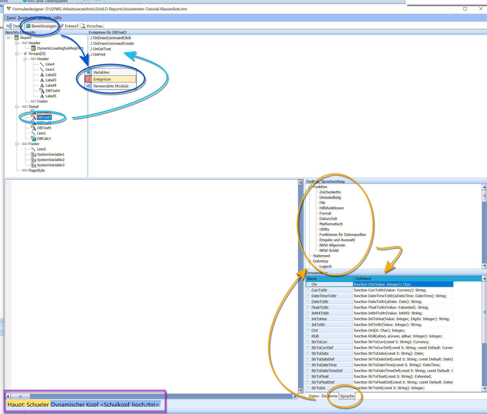
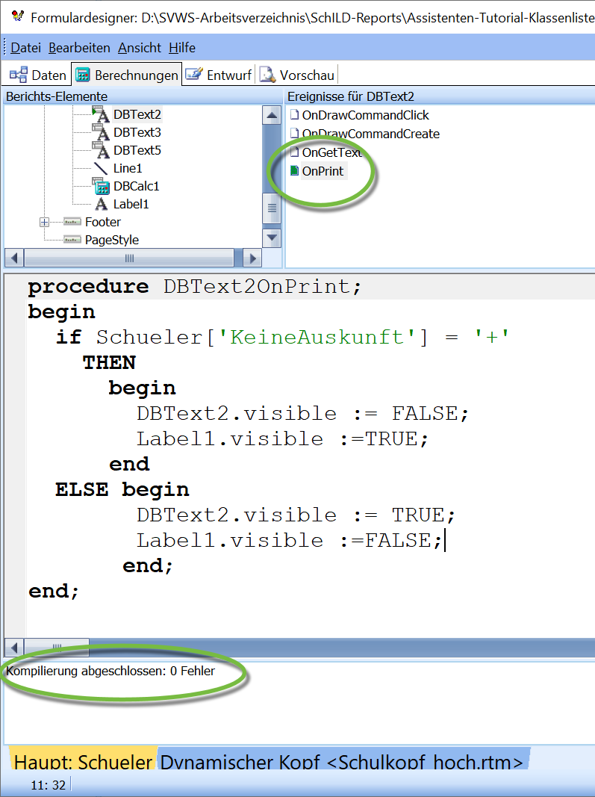
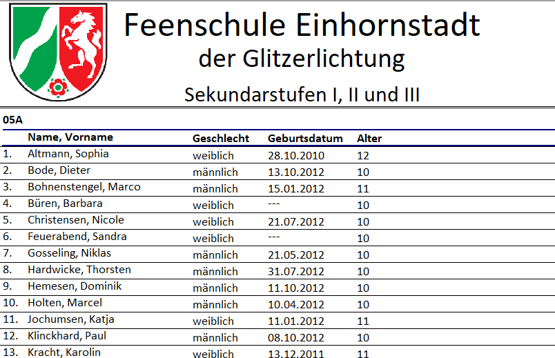

# Programmierung in Reports

## Programmierung in Reports

Der Reporteditor in **SchILD-NRW 3** unterstützt die Programmiersprache
**Object Pascal**. Dadurch können Reports um dynamisches Verhalten
erweitert werden – von einfachen Sichtbarkeitsabfragen bis hin zu
komplexen Berechnungen, Datenmanipulationen oder Benutzerinteraktionen.

Im Beispiel soll eine Klassenliste erweitert werden: Ist bei einem
Schüler die Datenweitergabe gesperrt (in SchILD markiert als **Keine
Auskunft an Dritte**), soll das **Geburtsdatum** im Report nicht
ausgegeben werden. Ein ähnliches Vorgehen wäre für Telefon- oder
Adresslisten denkbar.Zunächst werden im Reporteditor die relevanten Felder identifiziert.
Über den **Berichtsbaum** lassen sich vorhandene Elemente schnell
durchklicken. Unten links zeigt der Bereich **Eigenschaften von X** die
Attribute eines Feldes, u. a. Name, Typ, Formatierungen oder
Sichtbarkeitsstatus.Hier wird sichtbar, dass das Feld mit dem Geburtsdatum **DBText2** ist.  

## Das Hauptfenster für Berechnungen

Der Modus **Berechnungen** wird über die Moduszeile aktiviert (neben
**Entwurf** und **Vorschau**).

Die Programmierumgebung gliedert sich in mehrere Bereiche:
-   **Ereignisse** (Events)` Ereignisse sind Funktionspunkte, an denen Code ausgeführt werden kann, z. B.`**`OnGetText`**` oder `**`OnPrint`**`.`-   **Variablen**` Anzeige der im Report verfügbaren Variablen und Konstanten.`-   **Subreports**` Bei komplexen Reports kann unten durch Subreports navigiert werden.`-   **Daten / Elemente / Sprache**` 

Diese Ansicht steuert, welche Eigenschaften oder Funktionen angezeigt werden:`  
` * `**`Daten`**` – Variablen eines Elements, inkl. Typen`  
` * `**`Elemente`**` – Attribute des Felds (z. B. `**`visible`**` für Sichtbarkeit)`  
` * `**`Sprache`**` – Object-Pascal-Funktionen des Reporteditors inkl. Toolbox`Wird im Berichtsbaum ein Feld angeklickt, zeigt die Event-Liste, welche
Ereignisse vom Feld verarbeitet werden können. Für **DBText2** wären
hier besonders **OnGetText** und **OnPrint** relevant.  

## Die Programmierung

 Damit **DBText2** unterdrückt wird, muss geprüft werden, ob
der Schüler als **Keine Auskunft an Dritte** markiert ist.Im Modus **Entwurf** werden zunächst testweise die Felder **Gesperrt**
und **Keine Auskunft** ausgegeben, um das richtige Datenfeld zu finden.
Hierbei zeigt sich, dass das relevante Merkmal im Feld **KeineAuskunft**
gespeichert ist, kodiert als:-   **+** = gesetzt
-   **-** = nicht gesetzt

Diese temporären Felder werden anschließend wieder entfernt.

Das Feld soll **beim Druck** unterdrückt werden – daher wird das Event
**OnPrint** verwendet.Der Code wird in Object Pascal formuliert. Um das Verhalten sichtbar zu
machen, wird zusätzlich ein Feld **Label1** verwendet, das »---« zeigt,
wenn das Geburtsdatum unterdrückt wird.Unter dem Codefenster wird eine Zeile angezeigt, die Syntaxfehler
berichtet. Ereignisse mit Code sind durch Symbole markiert:-   **grün** → kein Fehler
-   **rot** → SyntaxfehlerBeim Durchklicken der Felder lässt sich damit schnell erkennen, wo Code
hinterlegt ist.  

