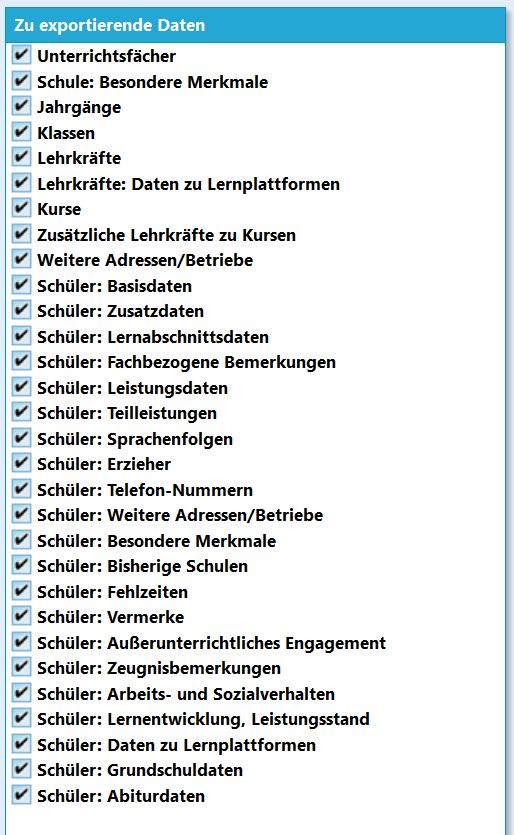
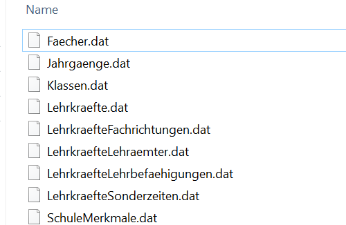

# Schnittstelle SchILD - Vorbemerkungen

Dieses Dokument beschreibt die Text-Importschnittstelle für SchILD-NRW.

## Hinweise

Die Schnittstelle SchILD-NRW wurde ursprünglich zum Import bzw. Export
der statistikrelevanten Daten eingeführt. Mittlerweile lassen sich
darüber aber die meisten (nicht alle!) Schüler- und Lehrerdaten
importieren und exportieren.

Die Schnittstelle wird durch eine Vielzahl an Textdateien mit der Endung
*\*.dat* aufgebaut. Diese enthalten ein .csv-Formnat, bei dem die
Datenfelder durch ein "\|" (Pipe) als Trennzeichen gegliedert sind.Der Import erfolgt aus mehreren Textdateien, deren Struktur nachfolgend
erläutert ist.      InternBez|StatistikBez|SonstigeBez|Jahrgang|Folgeklasse|Klassenlehrer|OrgForm|Klassenart|Gliederung|Fachklasse|Jahr|Abschnitt
    05A|05A|05A|05|06A|WEER|1|RK|***||2022|1
    05B|05B|05B|05|06B|BOTS|1|RK|***||2022|1
    05C|05C|05C|05|06C|JANS|1|RK|***||2022|1
    05D|05D||05|06D|BAUE|1|RK|***||2022|1
    06A|06A|06A|06|07A|GÜNT|1|RK|***||2022|1
    06B|06B|06B|06|07B|WEID|1|RK|***||2022|1

## Für alle Textdateien gelten folgende Bedingungen
-   SchILD-NRW erwartet, dass die Schnittstellendateien genau die in der
    **Schnittstellenbeschreibung** angegebenen Dateinamen haben.
    Beispielsweise wird *Sbasis.dat* an Stelle von
    *SchuelerBasisdaten.dat* nicht erkannt.
-   Jede Zeile muss genau einen Datensatz enthalten.
-   Als Trennzeichen zwischen einzelnen „Spalten“ (Feldern) wird das
    Pipe-Symbol „\|“ verwendet. Dies hat den Vorteil, dass z.B. in
    Bemerkungen auch ein Semikolon möglich ist.
-   Textfelder werden nicht durch (doppelte) Anführungsstriche begonnen
    und beendet.
-   Datumsfelder müssen als *TT.MM.JJJJ* vorliegen.
-   Die Spalten (Felder) müssen genau in der vorgegebenen Reihenfolge
    erscheinen.
-   Jede Datei enthält eine *Header-Zeile* mit den Bezeichnungen der
    einzelnen „Spalten“. Diese dient aber nur zur Information und wird
    ansonsten beim Import nicht verwendet. Die einzelnen Bezeichnungen
    in der Header-Zeile müssen auch mit „\|“-Zeichen getrennt sein.
-   Bei leeren Feldern muss dennoch ein Trennzeichen „\|“ ausgegeben
    werden, d.h. jede Zeile muss exakt die Anzahl der erwarteten
    Trennzeichen enthalten

## Umgang mit leeren Feldern

Bei den einzelnen Spalten ist angegeben, **ob diese leer sein dürfen**.
Dabei treten folgende Zustände auf:-   *Nein*: Spalte darf nicht leer sein, d.h. muss einen (gültigen) Wert
    enthalten. Ein Eintrag wird aus datentechnischen Gründen benötigt.
-   *(Ja)*: Spalte darf aus datentechnischen Gründen leer sein, für die
    Statistik-Erhebung wird aber u.U. ein entsprechender Eintrag in
    SchILD-NRW benötigt. Wenn der Eintrag in der Import-Datei leer ist,
    muss er später in SchILD-NRW nachgepflegt werden.
-   *Ja*: Spalte darf leer sein

## Datentypen

Bei den einzelnen Spalten ist jeweils **der erwartete Datentyp**
angegeben:-   *Text(n)*: Text mit einer maximalen Länge von n Zeichen (Beispiel:
    Text(20) bedeutet, dass der Spalteninhalt maximal 20 Zeichen
    umfassen darf)
-   *Integer*: Ganzzahl, also zum Beispiel -753, 0, 42 oder 1066.
-   *Float*: Gleitkommazahl. Es kann entweder ein Komma oder ein Punkt
    als dezimales Trennzeichen verwendet werden. Zum Beispiel 1,141592
    oder 2.997.

## Partielle bzw. additive Importe

Es ist nicht unbedingt notwendig, dass alle der nachfolgend
beschriebenen Dateien in einem Zug importiert werden, d.h. es ist auch
möglich, einzelne Dateien nachträglich zu importieren. Voraussetzung
dafür ist aber, dass „übergeordnete“ Informationen, auf die in der
jeweiligen Importdatei verwiesen wird, bereits in der Datenbank von
SchILD-NRW existieren, z.B. durch einen vorangegangenen Import.Wenn zum Beispiel *Lernabschnitts- und Leistungsdaten* separat
importiert werden sollen, müssen die folgenden Daten bereits vorhanden
sein:-   Die Basisdaten der Schüler, deren Lernabschnitts- und Leistungsdaten
    importiert werden sollen
-   Die Lehrkräfte, die als Klassen- oder Fachlehrer eingetragen sind
-   Die Fächer, auf die in den Leistungsdaten verwiesen wird
-   Die Kurse, auf die in den Leistungsdaten verwiesen wird
-   Die Jahrgänge und Klassen, auf die in den Lernabschnittsdaten
    verwiesen wirdSchüler-Basisdaten und Schüler-Zusatzdaten können auch additiv
importiert werden, d.h. Daten, die beim Erstimport noch nicht vorhanden
waren, können in einem Zweitimport gefüllt werden.