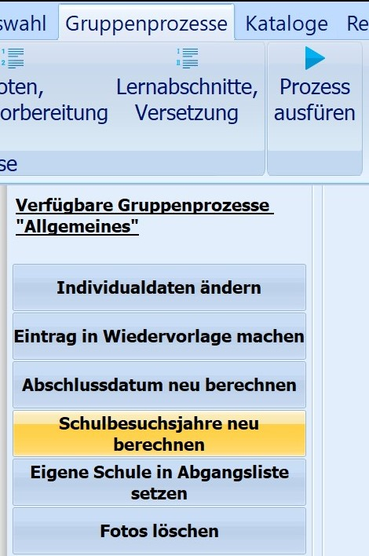
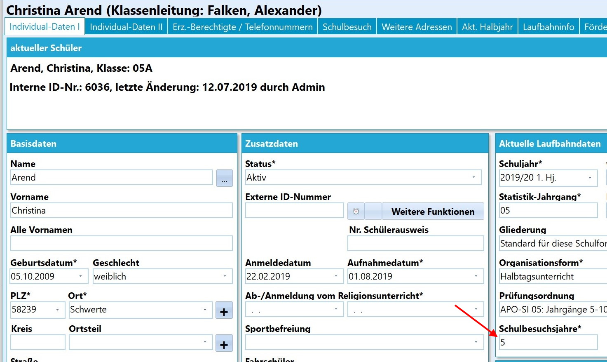
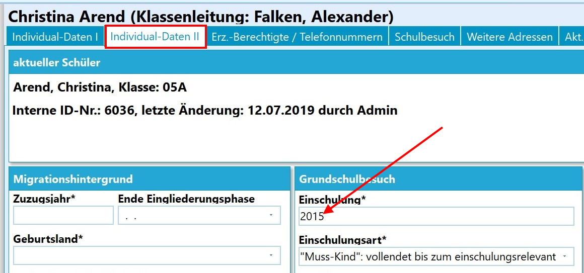
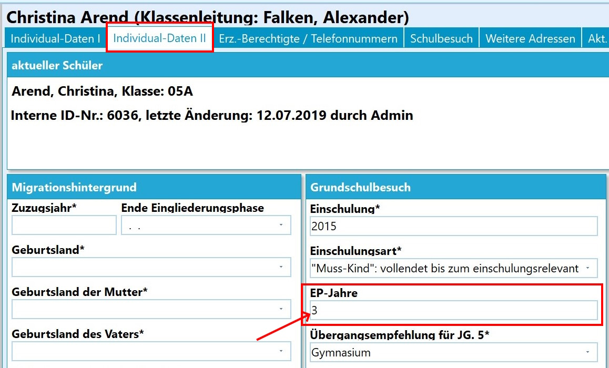

# Schulbesuchsjahre neu berechnen (Gruppenprozesse Allgemein)

 Dieser Gruppenprozess aus der Kategorie *Allgemeines*
berechnet anhand des eingetragenen Einschulungsjahres die Anzahl der
Schulbesuchsjahre.  

 Die neu berechneten Schulbesuchsjahre werden auf der
Registerkarte *Schüler ➜ Individualdaten I* eingetragen - dieses gilt
nur für Schülerinnen und Schüler mit dem Status "Aktiv" oder "Extern".  

 Das Einschulungsjahr befindet sich auf der Karteikarte
*Schüler ➜ Individualdaten II*.Im Feld Schulbesuchsjahre kann man manuell die eingetragene Zahl
verändern.Sollte dort also aus irgendeinem Grund ein anderer Wert stehen, als z.B.
in der Schulbescheinigung gewünscht, so kann dies einfach "übertippt"
werden. Eine falscher Wert deutet aber darauf hin, dass das eingetragene
Einschulungsjahr nicht korrekt ist und gegebenenfalls korrigiert werden
muss.  

 Eine Besonderheit ergibt sich bei Kindern, die drei Jahre
in der Schuleingangsphase (EP) der Grundschule verbracht haben.

Die drei EP-Jahre werden unter *Individualdaten II* vermerkt.

Das dritte EP-Jahr wird aber bei der Berechnung der Erfüllung der
Vollzeitschulpflicht nicht mitgezählt.

### Videotutorial
<youtube>2DQO0IbGqXc </youtube>
