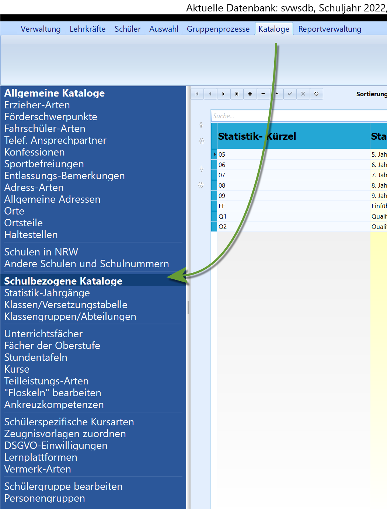

# Schulbezogene Kataloge (Kataloge) 

Die für die Schulverwaltung relevanten Kataloge finden sich unter
"Verwaltung" ➜ "Kataloge".

Die Steuerung der Kataloge, also das Festlegen der Reihenfolge der
Einträge, der Sichtbarkeit usw., ist analog zu den allgemeinen
Katalogen.