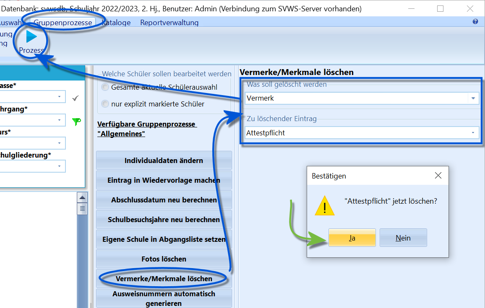

# Vermerke/Merkmale löschen (Gruppenprozesse Allgemein)

 Dieser Gruppenprozess bietet Ihnen die Möglichkeit,
bestimmte *Vermerke* oder *Merkmale* bei einer größeren Menge von
Schülerinnen und Schülern gleichzeitig zu löschen.Dazu ist zuerst auszuwählen, ob ein *Vermerk* oder ein *Merkmal*
gelöscht werden soll.Dann kann das jeweils zu löschende Element aus dem zweiten Dropdown-Menü
ausgewählt werden, hierbei bietet SchILD die in den *Katalogen*
definierten Vermerke beziehungsweise Merkmale an.Abschließend muss die Ausführung des Gruppenprozesses über den Knopf
`Prozess` angestoßen und die Sicherheitsfrage bestätigt werden.