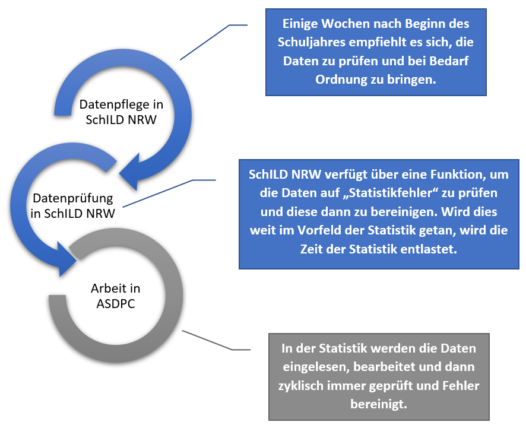
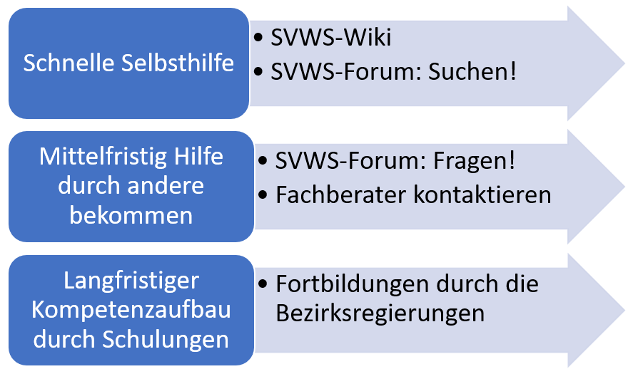
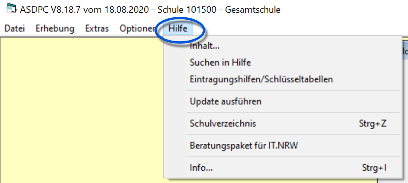
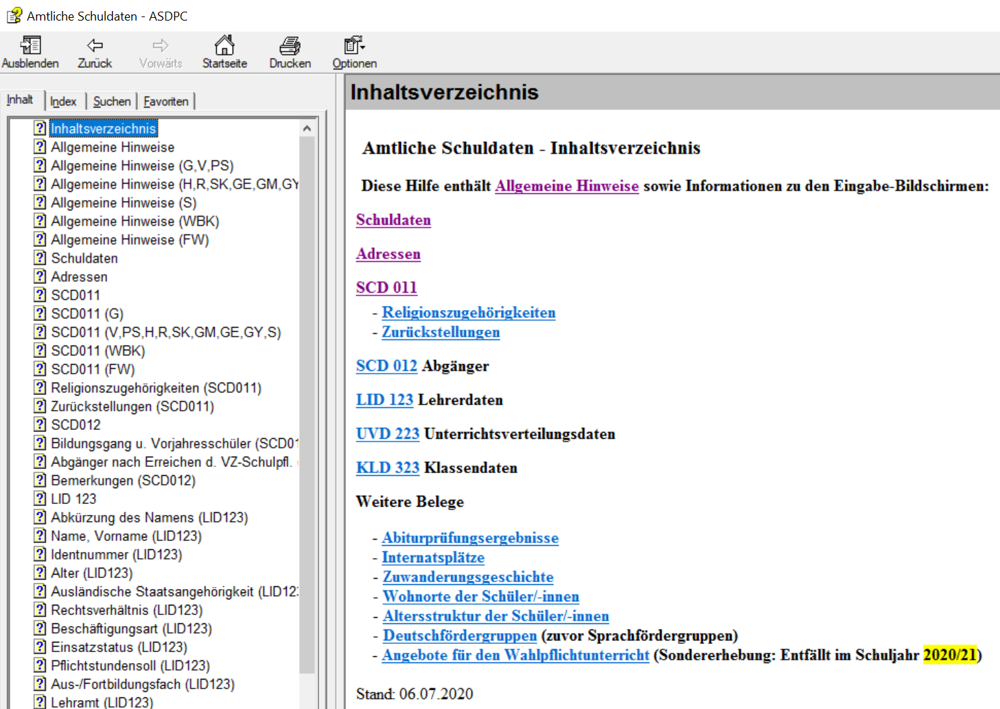
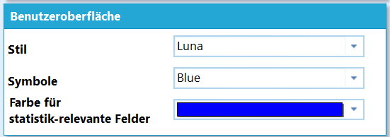
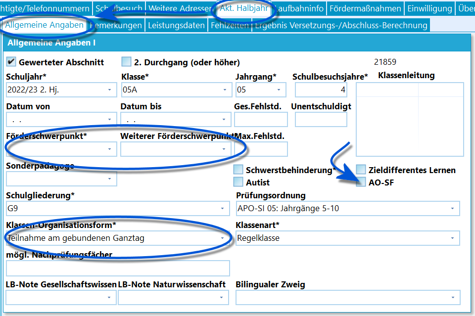
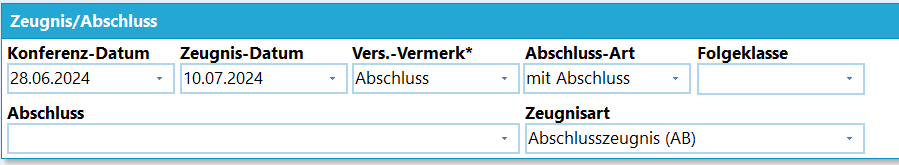
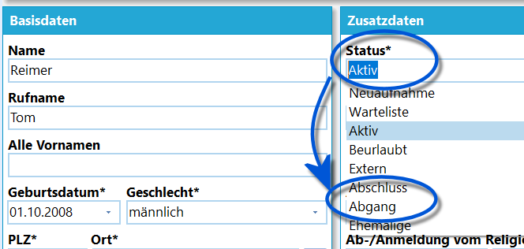
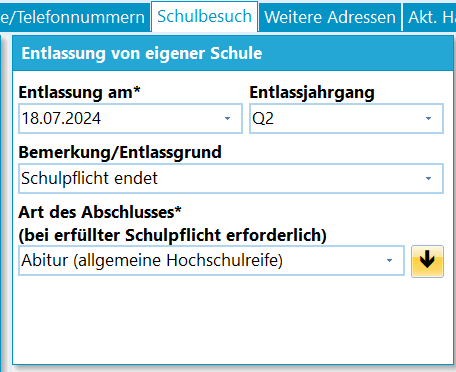

# Vorbereitende Maßnahmen zur Statistik in SchILD-NRW (Tutorial)

## Ablauf der Statistik

Die amtliche Schulstatistik wird mit dem von IT.NRW bereitgestellten
Programm ASDPC erzeugt. Da sich viele der Daten schon im
Schulverwaltungsprogramm SchILD-NRW befinden, bietet es sich an, diese
Daten soweit wie möglich vorzubereiten und dann in ASDPC zu importieren.Grundsätzlich lassen sich auch alle benötigten Daten in ASDPC von Hand
eintragen. Zur Arbeitsentlastung bietet SchILD-NRW an, Schülerdaten als
SIM.txt, Lehrerdaten als LID.txt, Daten zur Unterrichtsverteilung als
UVD.txt und zu den Abiturdaten als ABI.txt zu exportieren und im
eigentlichen Statistikprogramm einzulesen.  

### Supportangebote

## Downloadseite zu ASDPC

 Die erste Anlaufstelle sollte der Abschnitt zur Statistik
auf der [Webseite des Ministeriums fürSchulverwaltungssoftware](https://www.svws.nrw.de) sein.Hier pflegt IT.NRW jährlich die für die Statistik relevanten
Informationen ein und stellt die Downloads wie die nach Schulform
differenzierten Eintragungshilfen und die Schlüsseltabellen zur
Verfügung.Auf der Downloadseite von ASDPC finden sich Informationen zu typischen
Problemen bei der Installation, Konfiguration und Nutzung von ASDPC.
Ebenso finden sich Informationen zu Änderungen der aktuellen
Haupterhebung zum Vorjahr, die Schulmail zur Statistik und das
Anschreiben, in welchem wiederum Informationen wie die Termine usw. zu
finden sind.Ebenso finden sich Informationen zum Support wie zum
Schlüsselmanagement, zum Registrieren von für ASDPC notwendigen
Windows-Komponenten und zu diversen Problemstellungen.

Diese Seite ist eine zentrale Anlaufstelle für die Verwendung von ASDPC.Kontaktieren Sie bei technischen Problemen mit ASDPC bitte den Support
von IT.NRW.Weiterhin finden sich hier auch die Updates und die Updateanleitung für
ASDPC.

## Weitere Supportangebote zur inhaltlichen Arbeit

Bei inhaltlichen Problemen wenden sie sich an die Supportangebote der
Fachberatung.Zur Selbsthilfe zur Verwendung von SchILD-NRW dieses **Wiki** zur
Verfügung.Zu SchILD-NRW und der jährlichen Statistik finden sich weiterhin
passende Bereiche im **Forum**, die für ASDPC relevanten Unterforen
werden auch von Mitarbeitern von IT.NRW überwacht. Im Forum kann die
Suchfunktion zu bestehenden Themen verwendet werden und es können neue
Fragen gepostet werden, die in der Regel auch relativ schnell
beantwortet werden.Kontaktieren Sie bei weiteren Problemen den Ihrer Schule zugeordneten
Fachberater (m/w/d). Sie finden die Kontaktdaten über die
**Fachberatersuche** im **Service**bereich der Webseite für
Schulverwaltungssoftware des Ministeriums.Bauen Sie längerfristig Kompetenz durch den Besuch eventuell angebotener
**Statistikschulungen Ihrer Bezirksregierung** auf.

## Hilfen in ASDPC

 

 ASDPC selbst bietet viele Hilfen an.Zum Beispiel ist über *Hilfe* ➜ **Inhalt** direkt aus der Haupterhebung
heraus der ausführliche **Index** abrufbar, über den sich vieles zur
Statistik, nützlichen Hinweisen auch - zur Statistik des aktuellen
Schuljahrs - und zu den konkreten Belegen nachschlagen lässt.Der Index beinhaltet auch eine Suchfunktion.Der Eintrag **Eintragungshilfen/Schlüsseltabellen** öffnet eine Auswahl,
mit der die *Schlüsseltabellen* oder *Eintragungshilfen* Ihrer Schulform
direkt aus ASDPC im Browser geöffnet werden.Über den Eintrag **Schulverzeichnis** wird das Verzeichnis mit allen
Schulen in NRW der aktuell verwendeten SCHULVER.MDB geöffnetAbschließend zeigt **Info** Daten zur Dateiversion von ASDPC und der
verwendeten Daten. Diese sehen Sie auch direkt im Startbildschirm. Hier
lässt sich kontrollieren, ob tatsächlich die korrekte, aktuelle Version
von ASDPC verwendet wird.  

## Vorbereitung der Statistik in SchILD-NRW

**Pflege der zur Statistik verwendeten Software:**1.  Führen Sie bitte für das von IT.NRW angebotene ASDPC und für
    SchILD-NRW die jeweils aktuellen Updates aus, da in ihnen auch die
    Grundlagen für die aktuelle Statistik ausgeliefert werden.
2.  Schauen Sie weiterhin auch während der Statistik, ob für beide
    Programme noch Hotfixes für kurzfristig gefundene Fehler zur
    Verfügung gestellt wurden.
3.  Achten Sie darauf, die Statistik mit der für dieses Jahr aktuellen
    Version von ASDPC zu erstellen.
4.  Ist SchILD-NRW in einer Netzwerkumgebung installiert, achten Sie
    darauf, wo die .dlls und .mdbs mit den aktuellen Daten abgelegt
    werden und registriert sind - auf dem lokalen Rechner oder in der
    Netzwerkinstallation?

## Statistikrelevante Felder in SchILD-NRW

 SchILD-NRW kennzeichnet Felder, die für die Statistik
relevant sind. Per Standard werden **statistikrelevante Felder\*** durch
Fettdruck und ein Sternchen "**\***" gekennzeichnet.

Über *Verwaltung ➜ Einstellungen ➜ Individuelle
Einstellungen ➜ Benutzeroberfläche* ➜ **Farbe für statistikrelevante
Felder** lassen sich diese Überschriften zusätzlich noch
einfärben.

Nicht alle statistikrelevanten Felder müssen auch ausgefüllt werden,

auch ein Nicht-Eintrag kann korrekt sein.Alle statistikrelevanten Felder sind so korrekt wie möglich auszufüllen,
da diese Daten dann nach ASDPC exportiert werden können und dort
vorhanden sind und genutzt werden können, um miteinander in Bezug
gesetzt zu werden.Felder, die korrekt ausgefüllt sind, sparen bei der Statistik Arbeit -
und stehen auch im nächsten Jahr wieder zum korrekten Export zur
Verfügung.

Hierbei empfiehlt es sich, dass sich die mit der
Dateneingabe und -pflege in SchILD befassten Personen mit der mit der
Statistik beauftragten Person koordinieren.

## Haupt- und weitere Förderschwerpunkte

 Setzen Sie im *aktuellen Halbjahr* alle
**Förderschwerpunkte**. Diese sind im Screenshot rechts ebenfalls
hervorgehoben.Beachten Sie hierbei die Schlüsseltabellen von IT.NRW, damit im
**Förderschwerpunkt** nur zugelassene Hauptförderschwerpunkte und nur
zugelassene Kombinationen aus **Förderschwerpunkt** und **Weiterer
Förderschwerpunkt** gesetzt werden.

Die hier gesetzten und zum aktuellen Lernabschnitt gehörenden Daten
werden unter *Individualdaten II* im Nur-Lesemodus angezeigt.Nehmen Sie hierzu das Tutorial zu den
[Förderschwerpunkten](Förderschwerpunkte_(Allgemeine_Kataloge).md)
zu Kenntnis.  

### Schulformspezifische Aspekte

## Grundschulen: OGS und andere Betreuungsformen

Für die Grundschulen sind die **Organisationsform** *"offener Ganztag"*
in den aktuellen Lernabschnitt unter *"Akt. Halbjahr"* einzutragen.Besondere Merkmale, wie etwa die *Schule von acht bis eins* oder
*Dreizehn plus* werden als **Merkmale** unter *Verwaltung ➜ Schule ➜
Weitere Angaben* einmalig angelegt und dann in den *Individualdaten II*
aufgenommen.

Die zu den aktuellen Laufbahndaten gehörenden *Individualdaten I* und
die zur Förderung zum aktuellen Lernabschnitt gehörenden unter den
*Individualdaten II* im Nur-Lesenmodus aufgeführt.

Beachten Sie hierzu den Screenshot zu den
*Förderschwerpunkten* oben.

Konsultieren Sie hierzu das Tutorial zu 

WIKILINK: Eintragung_der_Schüler_im_offenen_Ganztag_(Tutorial).

## Grund- und Förderschulen: Klassenversetzungstabelle bei jahrgangsgemischten Lerngruppen

Wird in der Schuleingangsphase oder auch in höheren Jahrgängen
*jahrgangsgemischt* unterrichtet, sind bei den entsprechenden Klassen
der jeweilige **Jahrgang** auf *JU* zu setzen.Entsprechend werden in der Regel auch Klassenbezeichnungen gesetzt, der
Jahrgangsmischung Rechnung tragen, d.h. die Klassen werden keine
Jahrgangsbezeichnung ("1a", "6.2" oder vergleichbar) enthalten.Beachten Sie hierzu das Tutorial zum 

WIKILINK: Versetzungstabelle_bei_jahrgangsgemischten_Klassen_(Tutorial).

## Abschlussjahrgänge: Abschluss/Abgänger

 Sowohl für die Schule aber noch mehr ist es für ASDPC
wichtig, die Abschlüsse und Abgänger sauber zu erfassen. ASDPC rechnet
basierend auf der Vorjahresstatstik, wie viele Schüler dieses Jahr von
der Schule abgehen müssten und erwartet entsprechend konsistente
Angaben.Tragen Sie bei den Schülern, die einen Abschluss erreicht haben diesen
im *Akt. Halbjahr* ein. Tragen Sie unter **Abschluss-Art** den Eintrag
*mit Abschluss* ein, dann wählen Sie den passenden **Abschluss** aus der
Dropdown-Liste.Schüler, die keinen *Abschluss* erreichen, erhalten als
**Abschluss-Art** den "Abschluss" *ohne Abschuss* oder *ohne Abschluss
mit Nachprüf.* ein.  

 Im Zuge oder Nachgang des Zeugnisdrucks werden die Schüler
ausgeschult, hierbei wird der **Status** auf *Abschluss* gesetzt.Schüler, die sich abmelden, sind auf den **Status** auf *Abgang* zu
setzen. Der Status wird in den *Individualdaten I* gesetzt, gruppenweise
wäre entsprechend der Gruppenprozess *Individualdaten ändern*
beziehungsweise der Prozess *Zeugnisse drucken und Schüler ausschulen*
zu wählen.Wird der Gruppenprozess *Zeugnisse drucken und Schüler ausschulen*
ausgeführt, werden die entsprechenden Werte wie die Statusänderung oder
das Abgangsdatum automatisch gesetzt.

 Tragen Sie bei Gelegenheit auch unter *Schüler ➜
Schulbesuch* die zutreffenden Daten bei **Entlassung von eigener
Schule** und **Wechsel zu aufnehmender Schule** ein.Beachten Sie zum *Abitur* den Gruppenprozess *Abitur-Jahr setzen*.

Auch hier sind passende Gruppenprozesse hilfreich.In ASDPC müssen alle Schüler des Vorjahres in Jahrgängen mit möglichen
Abschlüssen korrekt verbucht sein. Es empfiehlt sich, die Daten schon in
SchILD-NRW vollständig aufzubereiten.

Beachten Sie, dass die Felder **Entlassung am** und **Art des

Abschlusses (bei erfüllter Schulpflicht erforderlich)**
statistikrelevant sind.

Für **alle Schulformen** gilt: Schüler mit dem Status
*Abgang*, die sich zum Ende des laufenden Schuljahres abmelden, sollten
vor der Versetzung ausgeschult werden, da sie ansonsten mit versetzt
werden und damit einen neu erzeugten Lernabschnitt bekommen, den sie an
Ihrer Schule nie wahrnehmen.In **Grundschulen** haben Schüler nach der 4. Klasse den Eintrag
*Abschluss* in der **Abschluss-Art**. Denken Sie bei Viertklässlern
daran, in *Schüler ➜ Individualdaten II* die **Übergangsempfehlung für
Jg. 5** zu setzen.

Beachten Sie zu dieser Thematik den umfangreichen Artikel zu

WIKILINK: Zeugnisvorbereitungen_und_Zeugnisdruck_(Einführung_in_SchILD-NRW).Weiterhin sind die Gruppenprozesse zur Versetzungs- und
Abschlussberechnung zu beachten. Da dieses Thema aufgrund von ZP 10/ZK
beziehungsweise der Fachhochschulreife, ESA, MSA, Abitur usw. komplexer
ist und es mehrere Wege gibt, die je nach Jahrgang, Schule und Schulform
zum Ziel führen, wird auf eine einzelne Verlinkung aller möglicherweise
relevanten Artikel an dieser Stelle verzichtet.Nutzen Sie je nach Aufgabe die Übersichtsartikel hier im Wiki
beziehungsweise die Reihenfolge der Gruppenprozesse und deren Übersicht
hier im Wiki zur Orientierung.

## Übergabe der Daten an ASDPC

## Gesamtprüfung der Daten & Abarbeiten von Statistikfehlern

Führen Sie über *Verwaltung ➜ Statistik für IT.NRW* die **Gesamtprüfung
der Daten** aus.Lösen Sie die Statistikfehler auf und wiederholen Sie die
Statistikprüfung, bis ein zumindest ausreichender Status erreicht wurde.Hier sind die Artikel zur Statistik im 

WIKILINK: SchILD-NRW_3#Karteireiter_Verwaltung
hilfereich.Nehmen Sie besonders den Artikel 

WIKILINK: Gesamtprüfung_der_Daten_(Verwaltung_Statistik_für_IT-NRW)
zur Kenntnis, hier wird auch die Bearbeitung der gefundenen
Statistikfehler innerhalb von SchILD-NRW über die *Auswahl* der *Schüler
mit Statikstfehlern* erläutert.

## Export der txt-DateienSchlussendlich werden die zu exportierenden Daten über *Verwaltung
Statistik für IT.NRW* **Daten exportieren** ausgewählt.Es können vier unterschiedliche Dateien erzeugt werden, die je nach
Schulform und Arbeitsweise sehr hilfreich sind oder nicht benötigt
werden könnten.-   Die Schülerdaten werden in die *SIM.txt* geschrieben.
-   Die Lehrerdaten werden in die *LID.txt* geschrieben.
-   Die Unterrichtsverteilung in die *UVD.txt* geschrieben.
-   Eventuelle Abiturdaten werden in die *ABI.txt* geschrieben.

#Obwohl SchILD-NRW beim Export ein umbenennen der
Dateien zulässt, müssen die Standardnamen beibehalten werden, da ASDPC
die Dateien ansonsten nicht einlesen kann.1.  Stellen Sie beim Einlesen in ASDPC unbedingt sicher, dass die
    korrekten, gerade exportierten Dateien eingelesen werden und nicht
    etwa welche von einem vorherigen Export oder aus einem früheren
    Jahr.

Beachten Sie den Artikel 

WIKILINK: Daten_Exportieren_(Verwaltung_Statistik_für_IT-NRW)
für den detaillierten Vorgang.