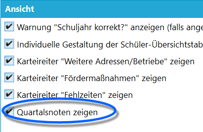
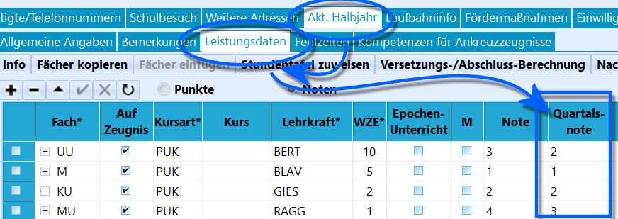
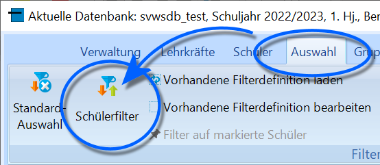
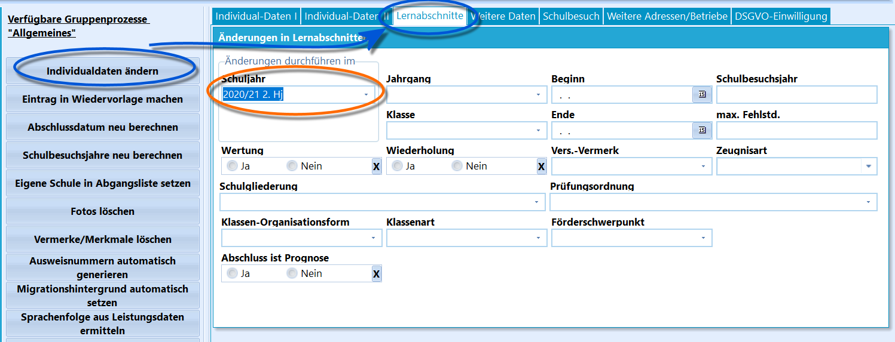
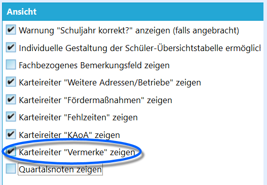

# Wesentliche Unterschiede zu SchILD-NRW 2

SchILD-NRW 3 unterscheidet sich trotz des neues Aussehens in vielen
Aspekten nicht bis kaum von den aus SchILD-NRW 2 gewohnten Abläufen.In Bezug auf andere Aspekte kann es im Detail teils wichtige
Unterschiede geben. Dieser Artikel soll nicht alle kleinen Änderungen
auflisten, sondern auf einen schnellen Blick auf wichtige Veränderungen
im Verhalten und Arbeitsablauf hinweisen.Nehmen Sie auch die FAQ in diesem Wiki zur Kenntnis. 

## Technische Änderungen

## Datenbankserver statt MS Access Datenbank

SchILD-NRW 3 nutzt einen Datenbankserver statt einer veralteten
MS-Access-Datei. Damit ist es im Rahmen moderner Zugriffsbeschränkungen
und Datensicherheit nicht mehr allen SchILD-Nutzern möglich, die
Datenbank-Datei mit allen enthaltenen Daten (!) zu kopieren und selbst
in andere Installationen zu bringen.Nutzen Sie für interne Arbeitsbackups die Funktionen in *Verwaltung ➜
Datenbank*. Hier werden SchILD-Administrationsrechte benötigt.

Die großen Vorteile des Datenbankservers sind eine modernden Standards
entsprechende Datensicherheit und Performance, letzteres gilt besonders
im Mehrnutzer- und Netzwerkbetrieb.Es wird in SchILD-NRW 3 exklusiv die Datenbank *MariaDB* unterstützt.

## Nutzung der SVWS-Datenbank

Hierbei ist zu beachten, dass SchILD-NRW-3 selbst nur noch ein
Clientprogramm ist und nicht mehr die eigene Datenbankverwaltung
mitbringt, sondern die SVWS-Datenbank mit nutzt.

## SchILD-NRW und der SVWS-Server

Zusätzlich zu SchILD-NRW sind auch Updates zum SVWS-Server zu
installieren. SchILD-NRW benötigt den aktuellen, zur verwendeten Version
passenden SVWS-Server.

## Ordnerstrukturen

Für SchILD-NRW 3 und den SVWS-Server gibt es vier Ordner:-   Im **Installationsordner von SchILD-NRW 3** haben Nutzer selbst nur
    Leserechte. SchILD-NRW-3 kann nur gestartet werden. Hier liegen
    keinerlei Nutzerdaten.
-   Im **Installationsordner des SVWS-Servers** und im **Ordner mit den
    Daten des SVWS-Servers** haben Nutzer keinerlei Rechte und sie sehen
    diese gar nicht.
-   Alle Nutzerdaten und Daten zur Arbeit mit SchILD-NRW 3 und dem
    SVWS-Server liegen im **SVWS-Arbeitsverzeichnis**.

## Backups lassen sich durch SchILD-Nutzer managen

Im Gegensatz zu bisherigen Datenbank-Lösungen lassen sich Backups -
entsprechende Berechtigungen des Nutzers vorausgesetzt - nun von
SchILD-NRW aus erzeugen und wieder einlesen.

Die Backups lassen sich auch in anderen SchILD-NRW-Installationen
einlesen.

Technisch gesehen handelt es sich hierbei um
Datenbank-Migrationen.

## Kein Master-Zugang

Es gibt in SchILD-NRW 3 keinen Master-Zugang, eine sogenannte
"Backdoor", zu Datenbanken oder zu SchILD-NRW. Dieses Konzept ist nicht
mehr zeitgemäß.

Achten Sie daher bitte auf Ihre Kennwörter. Nehmen Sie
hierzu den Bereich zu den Nutzerarten in den FAQ zur
Kenntnis.

## Klare Trennung der Ordner

Im SchILD-NRW3-Installationsverzeichnis ist keinerlei Nutzertätigkeit
mehr vorgesehen. In diesem Verzeichnis schreibt einzig der
SchILD-Installer. Nutzer benötigen nur Lesezugriff, um SchILD-NRW3
starten zu können.Alle Nutzerdaten für SchILD-NRW - Reporting, Im- und Export usw. -
liegen im *SVWS-Arbeitsverzeichnis*.Auf die beiden Verzeichnisse des SVWS-Servers, einmal das
Installationsverzeichnis und dann das Datenverzeichnis, haben Nutzer
keinerlei Zugriff.

## Keine Pop Up- und schwebenden Fenster

In SchILD-NRW 3 wurde darauf verzichtet, Pop-Up-Fenster und schwebende
Fenster zur Eingabe zu verwenden.

### JSON-Dateiformat

An einigen Stellen, etwa beim Austausch mit dem externen Notenmodul,
wird nun das morderne JSON-Dateiformat eingesetzt.Konsultieren Sie hierzu auch die kurze Einführung zu diesen Format unter
den Tutorials.

## Speicherort der ASDTABS.MDB und schulver.mdb

Für technisch versierte Nutzer: Die Dateien ASDTABS.mdb und schulver.mdb
zur Statistik ist nun nicht mehr im Unterordner *\keytabs\\*
gespeichert, sondern in *\IT-NRW\\*.Entsprechend gibt es das Verzeichnis *\LDS\\* nicht mehr, da die
Statistik nicht über ein *"Landesamt für Datenverarbeitung und
Statistik"*, sondern über IT-NRW läuft.

## Reports in SchILD-NRW 3 und SchILD-NRW 2

Beim Öffnen von hochgradig individuell gestaltenten SchILD-NRW 2-Reports
kann es zu Problemen mit SchILD-NRW3 führen. Dies gilt besonders, wenn
eigene Datenquellen definiert wurden.Grundsätzlich sind die Reports von SchILD-NRW 2 mit SchILD-NRW3
kompatibel und können verwendet werden.

**Kompatibilität von SchILD-NRW 2 und SchILD-NRW 3:**1.  Wenn Sie einen Report aus SchILD-NRW 2 weiterverwenden möchten, ist
    dies grundsätzlich möglich. Es kann in manchen Fällen aus
    technischen Gründen notwendig sein, den Report einmal in SchILD-NRW
    3 zu öffnen und ohne weitere Veränderungen direkt zu `speichern`.
    Obwohl der Report gleich bleibt, speichert die neuere Version des
    Reporteditors einige technische Aspekte entsprechend modernerer
    Grundsätze.
2.  Obwohl die Reports grundsätzlich kompatibel sind, gibt es viele
    SchILD2-Reports in denen über die letzten Jahrzehnte auf mitunter
    sehr kreative Weise gebastelt wurde. Hier können durchaus Fehler
    auftreten.
3.  Einige veraltete Komponenten aus dem SchILD2-Report-Baukausten sind
    in SchILD3 nicht mehr vorhanden: Dies bezieht sich hauptsächlich auf
    die Grid-Komponenten, auch die alten Kreuztabellen existieren so
    nicht mehr in den neuen Versionen des Reportbaukastens. Reports, die
    diese nutzen, werden nicht mehr funktionieren. Die Funktionalitäten
    der alten sind in SchILD3 weiterhin über andere Wege - leichter -
    umsetzen.
4.  Beachten Sie hier den folgenden Tipp.

Für SchILD-NRW 3 wurde die Basisreportsammlung und die
Reports für unterschiedliche Schulformen/Abteilungen vollständig
überarbeitet. Reports sollen gut und einheitlich aussehen, Fehler wurden
behoben und Reports sollen möglichst vielseitig einsetzbar sein. Es
lohnt sich zu überlegen, im Zuge der Umstellung von SchILD-NRW 2 auf
SchILD-NRW 3 sich auch so viel wie möglich in der neuen Reportsammlung
zu orientieren und gegebenenfalls Arbeitsprozesse umzustellen.Beachten Sie bei neuen Downloads der Basisreportsammlung, dass
mittlerweile eine Version für SchILD-NRW-3 angeboten wird.

## Datenquellen im Reporting
Grundsätzlich funktionieren die Datenquellen im Reporting wie in
SchILD-NRW-2. Es gibt unter Umständen an einigen Stellen leichte
Neuerungen, zum Beispiele neue Felder in Datenquelle *SchildUmgebung*
für verschiedene Formate von Schuljahr/Abschnitt.

## Änderungen im Workflow

## Daten zum Aktuellen Halbjahr

Die Daten zum aktuellen Halbjahr der Schüler werden nicht mehr doppelt
im *aktuellen Halbjahr* (Lernabschnitt) und in den *Individualdaten I*
gespeichert, sondern nur noch im aktuellen Halbjahr.

Wenn also das aktuelle Halbjahr bei einem Schüler
gelöscht wird, sind die aktuellen Informationen zu Klasse, Jahrgang,
Prüfungsordnung usw. beim Schüler nicht mehr vorhanden und müssen
anderweitig neu eingetragen beziehungsweise wiederhergestellt
werden.

Entsprechend sind die Anzeigen in den Individualdaten I und II der Daten

zu Förderschwerpunkt oder Merkmalen und so weiter im Nur-Lesemodus zur
Ansicht.

## Klassen werden für Lernabschnitte angelegt

Im Katalog "Klassen- und Versetzungstabelle" werden die Klassen für
jeden Lernabschnitt angelegt. Der Schalter "sichtbar" und dann das
Filtern auf "nur sichtbare Klassen" entfällt somit. Im Kopf der
Klassenliste wird nun der jeweilige Lernabschnitt gewählt.Weiterhin lassen sich Klassenleitungen für die Lernabschnitte setzen und
damit auch archivieren.

## Keine Aufteilung mehr in Klassenlehrer und Stv. Klassenelehrer

Statt einen Klassenlehrkraft und eine stellvertretende Lehrkraft zu
setzen, kann nun eine Liste mit Lehrkräften als Klassenleitung angelegt
werden.Somit findet keine auf diesen beiden Rollen basierende Hierarchisierung
mehr statt und es können mehr als zwei Personen erfasst werden.

## Geänderte Erfassung der *Quartale*

 *Quartale als Lernabschnitte* werden nicht mehr
unterstützt.

Die Halbjahre - und ihre Abkürzungen - können nach wie vor in
"Semester", "Abschnitt", "Halbjahr" oder eine freie Bezeichnung
umbenannt werden.Entsprechend sind nur für Quartale relevante Funktionen aus dem
Reporting entfernt worden.  

 Sie können unter *Verwaltung ➜ Einstellungen ➜ Globale
Einstellungen* im Bereich *Ansicht* den Haken bei **Quartalsnoten
zeigen** setzen.Dann wird in den Schüler-Leistungsdaten des *Aktuellen Lernabschnitts*
einen weitere Spalte für *Quartalsnoten* anzeigt.

Nutzen Sie alternativ oder zusätzlich *Teilleistungen*,
um Elternsprechtagsnoten, Aufschlüssellungen in mündlich/schriftlich
usw. zu erfassen.

Bei der Migration einer Schule im Quartalsbetrieb werden
die Noten der Quartale automatisch in die Spalte des zugehörigen
Halbjahres eingetragen.

Die Migration einer Datenbank mit Quartalen dauert einige (!) Zeit
länger als eine normale Migration.

## Ergebnisse der Versetzungs- und Abschlussberechnungen

Die Ergebnisse der Versetzungs- und Abschlussberechnungen werden für
jeden Lernabschnitt getrennt gespeichert.Damit ist auch die erneute Berechnung für vorherige Lernabschnitte
möglich.

## Fächer der Oberstufe im SVWS-Webclient

Die **Fächer der Oberstufe** werden nun über den SVWS-Webclient
verwaltet. Nutzen Sie hier die Dokumentation des SVWS-Webclients
[1](https://doku.svws-nrw.de).

## Nur noch eine Erfassung der Zuwanderungsgeschichte

Die **Vereinfachte Erfassung der Zuwanderungsgeschichte** wird vom neuen
Datenbankserver nicht mehr unterstützt und damit bietet sich nur noch
eine Option zur Erfassung der Zuwanderungsgeschichte.Bei der Statistik wird bei einem "nicht deutschen" Eintrag korrekt
"Nicht deutsch" gemeldet, die übrige Zuwanderungsgeschichte wäre
zukünftig einzupflegen.

## "Erzieherfunktionen" sind über "Personengruppen" zu erfassen

Die Erzieherfunktionen, die unter *Schüler ➜ Erziehungsberechtigte*
gesetzt wurden, fallen weg, um das Management der unterschiedlichsten
Gruppen zu vereinheitlichen.Nutzen Sie für diese bisherige Funktion die **Personengruppen**, die
sich über das Menü **Kataloge ➜ Personengruppen** verwalten lassen.

## Wegfall des Filter II und neue Bezeichnung *"Schülerfilter"*

 Der alte *"Filter I"* heißt nun *"Schülerfilter"*,
funktioniert von der Umbenennung abgesehen aber identisch.Der *Filter II* ist in SchILD-NRW 3 nicht mehr enthalten.  

## Serienbriefdruck mit MS Word über Export

Der Druck von Serienbriefen über MS Word wird nicht mehr über eine
Druckausgabe angestoßen, sondern wird über *Verwaltung ➜ Export* ➜
**Datenexport im xlsx- oder txt-Format** durch Aktivieren des Hakens
**Nach dem Export Word-Seriendruck starten** angestoßen.Wurde keine eigene Steuerdatei definiert und diese leer gelassen, stehen
die zum Export gewählten Felder als Word-Serienbriefdruck-Felder zur
Verfügung.

Nehmen Sie an dieser Stelle bitte unbedingt die komplett
überarbeiteten **Basisreports** und die neue **Serienbriefsammlung** zur
Kenntnis! Arbeiten Sie so viel wie möglich mit den neuen
Standardreports.

## Neuer Gruppenprozess "Alle Vornamen anpassen"
Durch den Gruppenprozess Alle Vornamen anpassen kann eine Korrektur für
den Feldeintrag "Alle Vornamen" vorgenommen werden.Durch diesen Prozess wird der Rufname in das Feld "Alle Vornamen"
übertragen, sofern das Feld "Alle Vornamen" nicht leer ist und der
Rufname dort noch nicht vorhanden ist.

Dieser ist besonders vor einer Migration
interessant.

## Gruppenprozess "Lernabschnitte individuell anlegen/bearbeite" fällt weg

Der Gruppenprozess Lernabschnitte individuell anlegen/bearbeiten wird in
SchILD-NRW3 nicht mehr benötigt.*Lernabschnitte*, also die Kombination aus *Schuljahr und Halbjahr*
werden nun über die Individualdaten erfasst können damit über
*Gruppenprozesse ➜ Individualdaten ändern* im Reiter *Lernabschnitte*
bearbeitet werden. Wählen Sie das passende Schuljahr/Halbjahr über das
Feld **Schuljahr**.Damit ist der erste genannte Gruppenprozess nicht mehr notwendig.

## Gruppenprozess "Versetzungsvermerk ändern" fällt weg

Der *Versetzungsvermerk* wird nun ebenfalls über den Reiter
*Lernabschnitte* in *Gruppenprozesse ➜ Individualdaten ändern*
verwaltet. Wählen Sie das passende **Schuljahr** für den korrekten
Lernabschnitt und nutzen Sie dann das Feld **Vers.-Vermerk**.Ein gesonderter Gruppenprozess ist damit nicht notwendig.

## Gruppenprozess "Lernabschnitte mit Standardangaben anlegen" fällt weg

Wenn in SchILD-NRW 3 ein Schüler aufgenommen wird, ist automatisch ein
Lernabschnitt mit dem Abschnitt, in den die Aufnahme erfolgt, angelegt
worden. Damit fällt auch dieser Gruppenprozess weg.  

## Gruppenprozesse "Kurse zuweisen"
werden zusammengefasstStatt der zwei getrennten Gruppenprozesse *Kurse zuweisen (Einzel)* und
*Kurse zuweisen (Mehrere)* gibt es in SchILD-NRW3 nur einen *Kurse
zuweisen* benannten Gruppenprozess. Der Einzelprozess wurde entfernt, da
sich mit dem tabellarischen Verfahren auch nur ein einzelner Kurs
zuweisen lässt.

## Vermerke haben einen eigenen Reiter

 Die Vermerke finden sich nicht mehr bei *Schüler ➜
Laufbahninfo*, sondern haben einen eigenen Reiter *Schüler ➜ Vermerke*.

Dieser Reiter kann nun in den Einstellungen deaktiviert werden, falls
Ihre Schule keine Vermerke verwenden möchte.Sie finden den Haken für **Karteireiter "Vermerke" zeigen** zur
Steuerung unter *Verwaltung ➜ Einstellungen ➜ Globale Einstellungen ➜
Allgemeines ➜ Ansicht*.  

## Bemerkungen sind nun ein Vermerk

Das Feld **Bemerkungen** in den *Individualdaten I* wurde entfernt.Werden bei der Migration der Datenbank Bemerkungen in den
Individualdaten gefunden, werden diese als ein *Vermerk Bemerkungen*
abgelegt.

## Sportbefreiungen werden ein Vermerk

Die *Sportbefreiungen* aus den *Individualdaten I* gibt es in dieser
Form in SchILD-NRW 3 nicht mehr. Existierende Einträge werden bei der
Migration als Vermerk angelegt.

## Schulformspezifische Änderungen

## Grundschule

In der Grundschule fallen die Jahrgänge E1, E2 und E3 der
Schuleingangsphase weg. Es werden nur noch die reinen Jahrgänge 01, 02,
03 und 04 erfasst.Der Verbleib in der Schuleingangsphase wird in den zum Jahrgang
gehörenden *Lernabschnitt* erfasst. Hier wird neben dem *Jahrgang* auch
das Feld **EP-Jahr** befüllt, in das nun entsprechend *E1*, *E2* oder
*E3* eingetragen werden kann.Beim Export nach ASDPC im Zuge der Statistik wird der Jahrgang
automatisch korrekt auf die von ASDPC erwarteten Werte gesetzt.

## Andere Module

## Externes Notenmodul 3

Beim Externen Notenmodul 3 sind die Notendateien jetzt immer
verschlüsselt. Die "Initialkennworte" für die Notendateien werden mit
der rechten Maustaste auf "Lehrkräfte" generiert und ändert die
Lehrkraft das Kennwort, wird es beim Re-importieren der Noten mit
übernommen.Nehmen Sie hier die Dateien unter Verwaltung Import und Export des
Externen Notenmoduls zur Kenntnis.