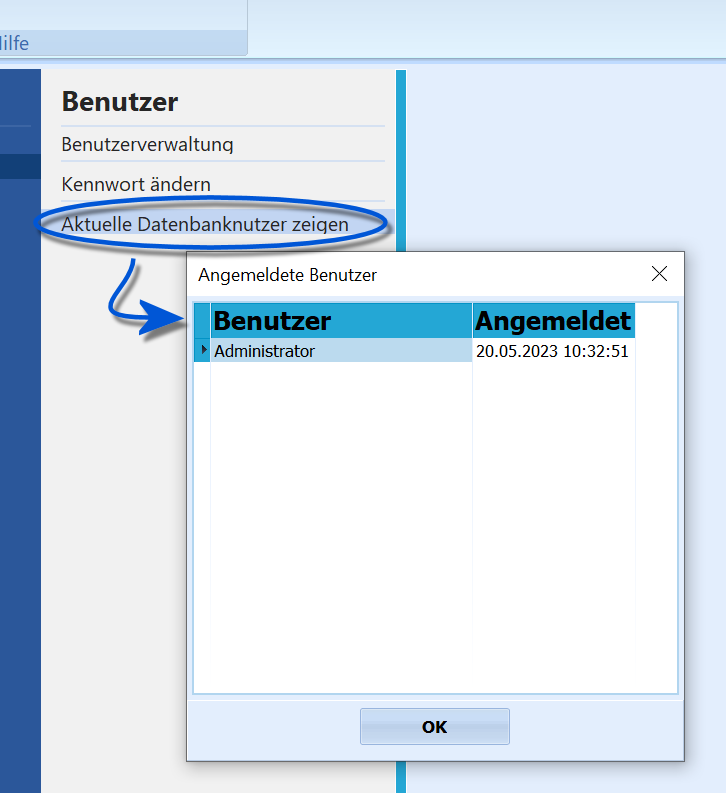

# Aktuelle Datenbankbenutzer zeigen (Verwaltung Schule)

 Über *Verwaltung ➜ Benutzer* ➜ **Aktuelle Benutzer
anzeigen** werden alle aktuell eingeloggten Benutzer mit ihrem
Login-Datum angezeigt.Schließen Sie das Fenster mit **OK**.