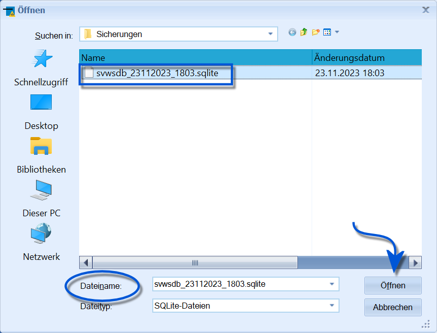
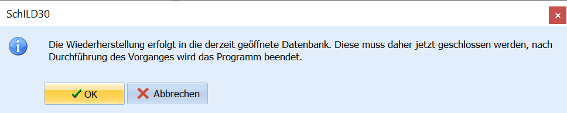

# Datenbank wiederherstellen (Verwaltung Datenbank)

Ein Klick auf *Verwaltung ➜ Datenbank* ➜ **Datenbank wiederherstellen**,
mit dem eine zuvor angelegte Sicherung der Datenbank wieder eingelesen
werden kann.

**Hierbei wird die aktuelle Datenbank überschrieben.**Beachten Sie weiterhin, dass sich alle anderen Nutzer in SchILD-NRW
abmelden müssen. Bitten Sie andere Nutzer Ihr SchILD-NRW zu schließen.
Sie finden aktuell angemeldete Benutzer über *Verwaltung ➜ Benutzer ➜
Aktuelle Datenbanknutzer zeigen*.

Um diese Funktion anzustoßen, ist lediglich in SchILD-NRW-Administrator

notwendig. Das root-Kennwort der Datenbank wird an dieser Stelle nicht
benötigt.  

Wählen Sie eine passende **Datei**. Die Sicherungsdateien liegen im
Ordner, der über *Verwaltung ➜ Einstellungen* unter *Globale
Einstellungen* bei *Sonstiges* gesetzt wurde.Der aktuelle Windows-Nutzer benötigt Zugriff auf dieses Verzeichnis.Der **Dateiname** hilft, die korrekte Datenbank auszuwählen, da diese
nach dem Schema` Datenbankname_TagMonatJahr_Uhrzeit.sqlite`angelegt werden. Nutzen Sie zur Kontrolle das **Änderungsdatum**, um
wirklich die korrekte Datenbank auszuwählen.Klicken Sie nach der Wahl der korrekten Datei auf `Öffnen`.  

 Die Sicherung wird in das aktuell geöffnete Schema/die
aktuelle Datenbank eingespielt. Es öffnet sich ein Fenster, bei dem
SchILD-NRW mit einem Klick auf `OK` geschlossen wird.  
Die Sicherung wird nun vom Datenbankserver eingelesen... bitte warten
Sie einen Moment.

**Technische Hintergrundinformation:** Bei den
Funktionen *Datenbank sichern* und *Datenbank wiederherstellen* handelt
es sich technisch um eine Migration, nicht um einen reinen
Datenbankdump. Daher kann der Prozess auch ein paar Minuten dauern,
anstatt wie bei einem reinen DB-Dump in Sekunden abzulaufen. Haben Sie
einen Moment Geduld.

