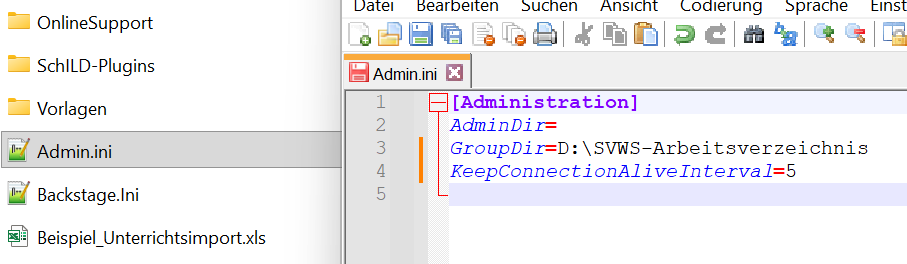

# Datenbankverbindung durch automatische Pings am Leben erhalten (Tutorial)



Um eine Datenbankverbindung am Leben zu halten, kann ein ein
Zeitintervall für einen automatische 'Ping' zum Datenbankserver
definiert werden.Dadurch wird verhindert, dass die Datenbankverbindung nach einer
gewissen Zeit der Untätigkeit vom Datenbanktreiber gekappt wird.  
Der im *SchILD-NRW-3-Installationsverzeichnis* in der Datei *Admin.ini*
zu machende Eintrag, sieht wie folgt aus:``` \[Administration\]KeepConnectionAliveInterval=5```Hierbei ist der Wert in *Minuten* zwischen den Pings angegeben.