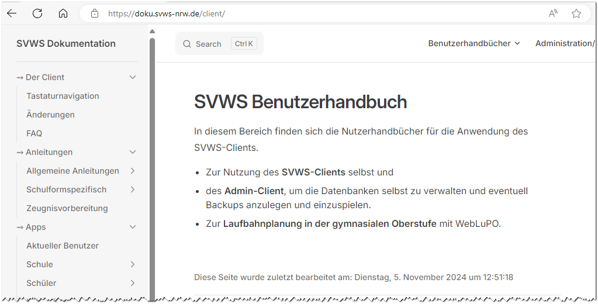

# SVWS-Client

## DokumentationSie finden die Dokumentation zum SVWS-*WebClient*, zum *AdminClient*,
zum *SVWS-Server* und zu den weiteren Projekten wie *WebLuPO* und dem
*WebNotenManager* auf der Internetseite SVWS-Dokumentation:
<https://doku.svws-nrw.de/webclient/>

Hier finden Sie auch Informationen zur Laufbahnplanung und Kursblockung
in der gymnasialen Oberstufe mit dem SVWS-WebClient.