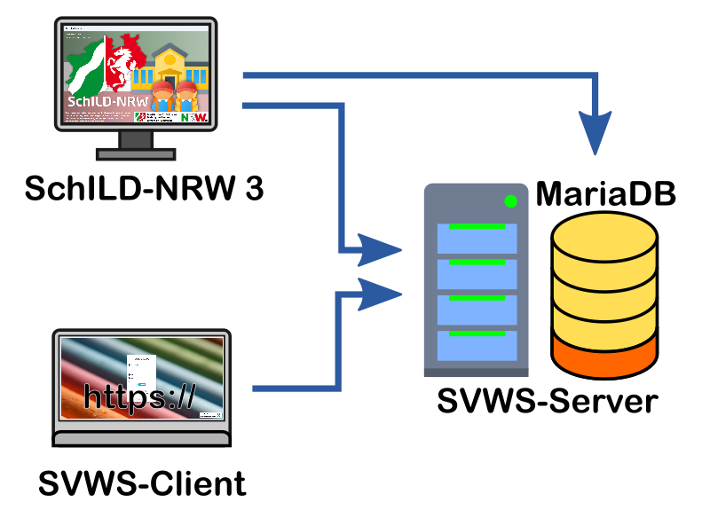
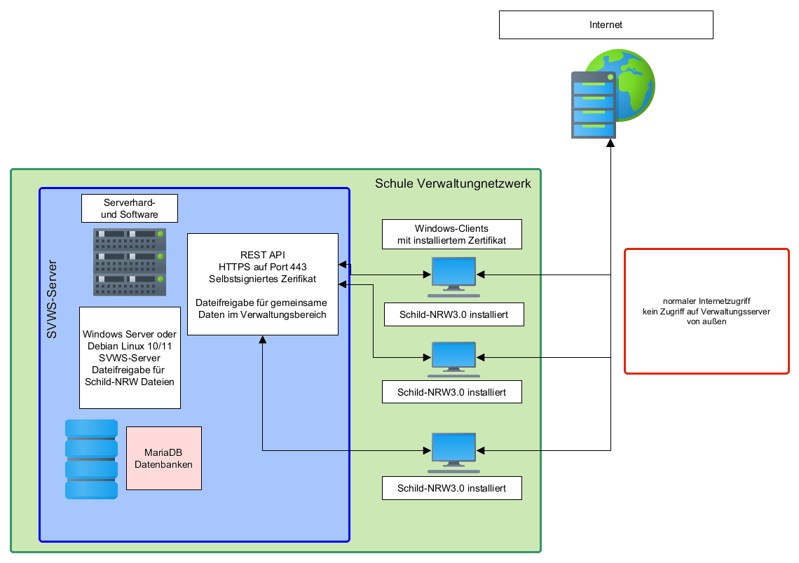
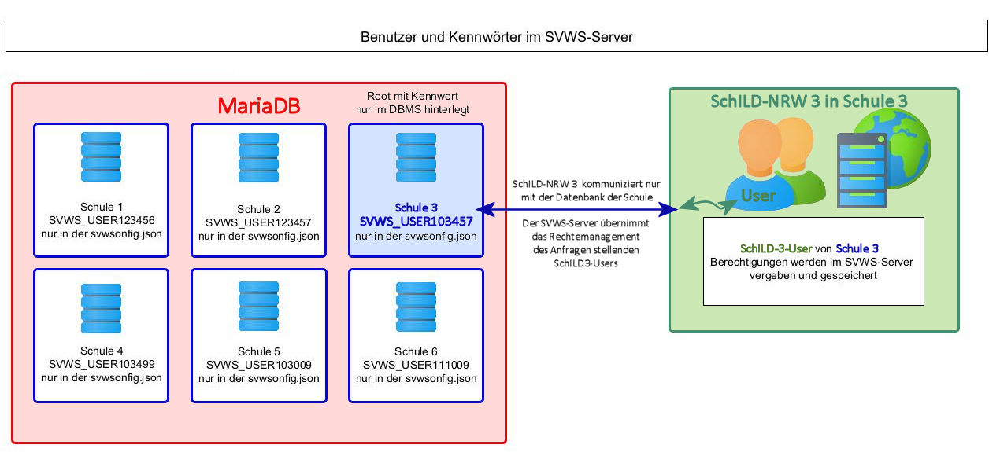

# Hinweise für IT

DienstleisterDer folgenden Artikel beinhaltet Hinweise zur Installation der
**S**chul**V**er**W**altungs**S**oftware, zu der auch SchILD-NRW 3
gehört. Eine detaillierte Anleitung wird vor der Veröffentlichung der
neuen SchILD-NRW-Version herausgegeben.

## Programmbausteine

 Die neue SchILD-Version besteht nicht mehr aus zwei,
sondern aus vier Programmbausteinen.-   Der SVWS-Server fungiert als Dienstprogramm, welches logische
    Aufgaben übernimmt und den Zugriff auf die
-   MariaDB-Datenbank regelt. Der Datenbankserver wird zusammen mit dem
    SVWS-Server installiert.
-   SchILD-NRW 3 dient als Anzeigeoberfläche der Datenbankdaten und
    übernimmt ebenfalls logische Aufgaben, die noch nicht im SVWS-Server
    implementiert wurden. SchILD-NRW 3 greift deshalb teilweise über den
    SVWS-Server und teilweise direkt auf die MariaDB zu.
-   Der SVWS-Client stellt die Technologie zur Anzeige der
    Datenbankdaten in einem Browserfenster zur Verfügung. Der
    SVWS-Client ist Bestandteil des SVWS-Servers und kann nur auf die
    logischen Aufgaben des SVWS-Servers zurückgreifen.  

## Datenbank und Installation

## Datenbank-Schemata

Unter Datenbank-Schema versteht man eine vorstrukturierte, leere
Datenbank. In der leeren Datenbank sind also schon alle Tabellen und
deren Abhängigkeiten angelegt, jedoch noch keine Daten enthalten.In einer MariaDB können mehrere Schemata liegen, die dann einer
einzelnen SVWS-Datenbank einer Schule entsprechen, auf die dann mit dem
SchILD-Client zugegriffen werden kann.In großen Systemen, etwa kommunalen Rechenzentren oder kommerziellen
Rechenzentren, könnten noch weitere Schemata in der MariaDB laufen, die
dann anderen Schulen gehören oder gar nichts mit Schulen zu tun haben.

## Die unterschiedlichen Nutzer
-   Ein *Root-Benutzer* ist ein Super-Administrator-Zugang auf den
    MariaDB-Server. Er hat Zugriffsrechte auf alle Datenbanken, kann
    diese anlegen und löschen. Er kann beliebige weitere
    Datenbank-Benutzer anlegen. Geht das Root-Kennwort für die MariaDB
    verloren, kann dieses Passwort nicht mehr angezeigt oder verändert
    werden und neue Schemas können nicht mehr angelegt werden.
-   Ein *Datenbank-Benutzer* oder auch *Schema-Benutzer* ist ein
    Administrator-Zugang mit vollen Zugriffsrechten auf ein Schema, d.h.
    eine einzelne "Datenbank". Ein Datenbank-Benutzer kann auch mit
    gleichem Namen und Passwort für mehrere Schemata/Datenbanken gelten.
    Er kann diese Datenbank nicht löschen, aber jede Veränderung
    innerhalb des Schemas/der Datenbank vornehmen. SchILD-NRW 3 nutzt
    die Zugangsdaten dieses Benutzers, um auf die Datenbank zuzugreifen.
    In den Beispielen dieses Wikis wird in der Regel der Name
    *svwsadmin* für diesen Benutzer verwendet.
-   Ein *SchILD-NRW-3-Benutzer* ist (meistens) eine reale Person mit
    eingeschränkten Zugriffsrechten auf die Datenbank über SchILD-NRW
    oder das Webinterface. SchILD-NRW regelt diese Rechte in der
    Benutzerkontensteuerung des Clients. Dies sind die Benutzer, über
    die mit SchILD-NRW gearbeitet wird. Einem solchen Benutzer können
    SchILD-NRW-Administrationsrechte zugewiesen werden, so dass über die
    Benutzeroberfläche von SchILD-NRW bereitgestellte
    Datenbankoperationen ausgeführt werden können.

Über SchILD-NRW lassen sich Benutzergruppen mit Rechten
definieren und SchILD-Nutzern zuweisen. Hierüber lassen sich auch sehr
hohe Rechte vergeben. Achten Sie bitte darauf, dass Sie auch über
Benutzergruppen nur Rechte an Nutzer vergeben, die diese benötigen und
haben sollen!

## Die Ordnerstruktur

Um die Sicherheit des Betriebssystems zu gewährleisten, stattet Windows
die unterschiedlichen Ordner mit unterschiedlichen Rechten aus. Der
SVWS-Server und SchILD-NRW 3 fügen sich hier in diesem Sinne korrekt
ein. Für die Benutzung des SVWS-Servers und SchILD-NRW werden vier
unterschiedliche Verzeichnisse verwendet.-   Das Verzeichnis, in dem der SVWS-Server *installiert* wird. In
    diesem Verzeichnis sollen Nutzer nichts ablegen können und **keinen
    Zugriff - auch nicht nur lesend!** - haben.
-   Das Verzeichnis, in dem der SVWS-Server die Datenbanken ablegt. In
    diesem Verzeichnis hat nur der Server Zugriff, **Nutzer sollen hier
    nichts lesen** oder verändern können.
-   Das Verzeichnis, in dem das reine Programm SchILD-NRW3 installiert
    wird. **Nutzer haben hier keine Schreibrechte** und es werden hier
    keine Arbeitsdaten erstellt.
-   Das SVWS-Arbeitsverzeichnis, in dem die Daten der Nutzer liegen, zum
    Beispiel die Reports oder die Export- und Importdateien. Hier haben
    Nutzer für die tägliche Arbeit Zugriff. Soll dieses Verzeichnis nach
    der Installation verändert werden, lässt sich dies über die
    *Admin.ini* im SchILD-NRW-3-Installationsverzeichnis mit dem Eintrag
    `GroupDir=D:\SVWS-Arbeitsverzeichnis` umstellen.

## Systemvoraussetzungen

Die Systemvoraussetzungen unterscheiden sich geringfügig von den
Systemanforderungen, die für Schild-NRW 2 gültig sind:-   Als Betriebssysteme der User-Rechner (Clients) benötigen Sie
    mindestens Windows 11 (64bit). Das komplette Programmpaket kann auf
    einem einzelnen User-Rechner installiert werden. SchILD-NRW 3 kann
    in einer solchen Client-Server-Umgebung entweder auf dem Server-PC
    installiert werden, so dass die Clients über eine Netzwerkfreigabe
    SchILD-NRW 3 starten können, oder die Schild-Anwendung wird auf
    jedem Windows-Client installiert.<!-- -->-   In einer Client-Server Umgebung benötigen Sie einen Windows-Server
    mit aktueller Windows-Server Version mindestens auf Basis von
    Windows 11 (64bit). In einer solchen Umgebung wird der SVWS-Server
    mit MariaDB auf dem Windows-Server installiert. Die Installation des
    SVWS-Servers mit MariaDB kann prinzipiell auch auf einem
    Linux-Server mit Debian 11 erfolgen. Für diese noch nicht in breiter
    Fläche erprobte Installation kann zu Testzwecken eine Anleitung zur
    Verfügung gestellt werden.

## Datenbankstruktur

Die Datenbankstruktur für SchILD-NRW 3 wurde grundlegend geändert und
zukunftsfähig aufgebaut. Während der Installation des SVWS-Servers
können bestehende Access-, MariaDB, MySQL- und MSSQL-Datenbanken in die
neue Struktur migriert werden, so dass ein Umstieg von SchILD-NRW 2 zu
SchILD-NRW 3 nahtlos möglich ist.

## Nicht unterstützte Systeme

Die Installation auf einem NAS wird nicht unterstützt.

## Installationsübersicht

 Der *SVWS-Server* ist innerhalb des *Verwaltungsnetzwerkes*
der Schule zu installieren.Der SVWS-Server selbst läuft er auf einer den - in Bezug auf Hardware
und Software - Systemanforderungen entsprechenden MS-Windows- oder
Linux-Umgebung.Er stellt die *MariaDB* und eventuelle Dateifreigaben zur Verfügung.
SchILD-NRW 3 kann zentral auf dem Server und per Dateifreigabe
aufgerufen werden oder einzeln auf Klienten installiert werden.

Die Kommunikation mit den Klienten läuft über die REST API und ist über
HTTPS auf Port 443 zu erreichen. Bei der Installation kann ein
Zertifikat erstellt werden, welches in MS Windows hinzuzufügen ist.

Die Klienten greifen entweder über die Weboberfläche oder ein
Klient-Programm wie SchILD-NRW 3 auf den Server zu.

Achten Sie darauf, dass der SVWS-Server weder vom
*pädagogischen Netzwerk* der Schule noch direkt von außen über das
Internet zu erreichen ist!

In kleinen Schulen sind auch Einzelplatzinstallationen möglich, bei

denen der SVWS-Server mit der MariaDB und der SchILD-NRW-3-Installation
auf dem einzelnen Arbeitsplatzrechner laufen.Für Dateiaustausche und Zugriffe, sind entsprechende Dateifreigaben
einzurichten.-   Auf die Verzeichnisse des *SVWS-Servers* und das der *SVWS-Daten*
    hat niemand außer dem Server selbst Zugriff.
-   Die Klienten im *Verwaltungsnetz*, die ein auf dem Server
    installiertes SchILD-NRW 3 starten sollen, benötigen Lese-Zugriff
    auf das *Installationsverzeichnis* von SchILD-NRW 3.
-   Die Klienten im *Verwaltungsnetz*, die mit SchILD-NRW 3 arbeiten,
    haben Lese- und Schreibrechte auf das *SVWS-Arbeitsverzeichnis*. Bei
    der Dateifreigabe sind feinere Abstufungen je nach Schule und
    Rollenverteilung denkbar. Eventuell sollen nicht alle Rechner
    und/oder Windows-Nutzer auf alle SchILD-Reports zugreifen können
    oder im SVWS-Arbeitsverzeichnis optional für die Dokumentenablage,
    Zeugnisse, Export- und Importdateien, Notendateien, Sicherungen oder
    Weiteres eingerichtete Verzeichnisse sollen gleich für alle
    Rechner/Nutzer zur Verfügung stehen.Nur die Klienten haben hier als normale Rechner des
*Verwaltungsnetzwerkes* Zugriff auf das Internet.

## Nutzer und Kennwörter

 Das Konzept von SchILD-NRW 3 sieht vor, die Datenbanken von
anderen Anwendungen oder Schulen abzuschotten, die ebenfalls auf der
MariaDB laufen und auch innerhalb von SchILD-NRW Nutzerrechte vergeben
zu können.

## MariaDB-root
Aus Sicht der Datenbank-Administration sind zwei Nutzer relevant: Der
**Root-Nutzer der MariaDB** dient dazu, einzelne Datenbankschemas - also
etwas unpräzise einzelne "Schul-Datenbanken" - anzulegen oder zu
löschen. Zuerst einmal ist ein Schema einfach nur die leere Struktur
einer Datenbank und ein Name. Jedes Schema entspricht hier somit im
Regelfall der Datenbank einer Schule.Geht dieses Kennwort verloren, laufen die Datenbanken zwar noch, das
Passwort kann aber weder angesehen noch verändert werden. Es können auch
keine Schemas neu angelegt oder entfernt werden.Der weitere Nutzer ist der

## Schema-Admin
Der **Administrator-User von jedem dieser Schemas**, per Standard wird
dieser Nutzer *svwsadmin* genannt, ist aber veränderbar. Für mehrere
Schemas können unterschiedliche svws-Admins angelegt werden, es können
aber auch mehrere Datenbanken von einem solchen Nutzer verwaltet werden.

Die Verwendung unterschiedlicher Nutzer für unterschiedliche Schemas auf
der gleichen MariaDB dient dazu, unterschiedliche Datenbanken
voneinander zu trennen. Das können unterschiedliche Schulen eines
Schulträgers sein, der alle Schulen zentral auf einer Serverarchitektur
laufen lässt. In großen Rechenzentren könnten aber auch weitere
Datenbanken auf der MariaDB laufen, wie zum Beispiel
KFZ-Zulassungsstellen, Standesämter oder beliebige andere Dienste
öffentlicher, geschäftlicher oder privater anderer Kunden.

Die jeweiligen Zugangsdaten werden im Arbeitsverzeichnis von SchILD-NRW
3 im Ordner "Connection-Files" als *\[schema\].con* als Hash hinterlegt
und von SchILD-NRW genutzt, um technisch auf die Datenbank zuzugreifen.Hinweise zu den unterschiedlichen Ordnern:-   Das Passwort ist in einer Konfigurationsdatei im
    *SVWS-Server-Datenverzeichnis* hinterlegt und daher ist darauf zu
    achten, dass normale Nutzer keinen Windows-Zugriff auf die Ordner
    der *SVWS-Server-Installation* und das
    *SVWS-Server-Datenverzeichnis* haben.
-   Auf das *Installationsverzeichnis von SchILD-NRW 3* wird lediglich
    Lese-Zugriff benötigt, um den Klienten zu starten.
-   Alle Nutzer-Zugriffe im Tagesgeschäft auf Dateiebene laufen über das
    *SVWS-Arbeitsverzeichnis*, das im Falle einer Neuinstallation (usw.)
    erhalten bleibt.Über diesen Schema-Nutzer kann direkt auf die jeweilige SchILD-Datenbank
(das Schema) zugegriffen werden, um im Bedarf ein
SchILD-Administrator-Kennwort (SchILD-Nutzer) zurückzusetzen.

Beachten Sie, dass für eigenmächtig veränderte
Datenbanken unter Umständen kein Support mehr übernommen werden kann.
Kontaktieren Sie bitte in einem solchen Fall unbedingt die Fachberatung
der betroffenen Schule.

## SchILD-Nutzer (Administrator)

**SchILD-Nutzer mit ihren Rechten** sind für Schulträger/IT nur bedingt
relevant. In der Regel dürfte sich die IT einen Administrator-Nutzer in
SchILD-NRW anlegen, so dass im Zweifel Benutzer gesperrt oder neu
angelegt und Kennwörter neu gesetzt werden können, ohne manuell in der
Datenbank tätig zu werden.

Die konkreten Rollen mit ihren jeweiligen Rechten werden innerhalb von
SchILD-NRW vergeben und sind schulintern zu organisieren. Der
SVWS-Server verwaltet diese Nutzer mit ihren Rechten, daher gelten diese
auch für die Zugriffssteuerung über Webinterfaces oder andere
Client-Programme.

Die in den Schulen für die SchILD-Administration verantwortlichen
Personen können hierzu die Artikel zum Benutzermanagement von SchILD-NRW
konsultieren.