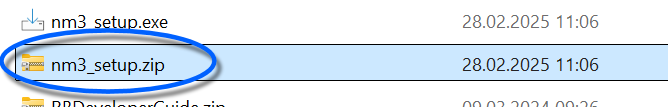
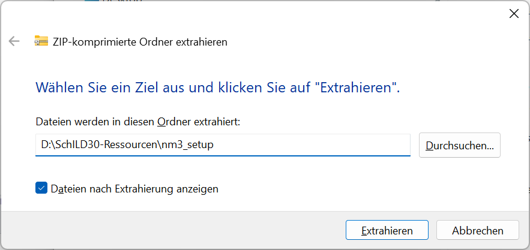
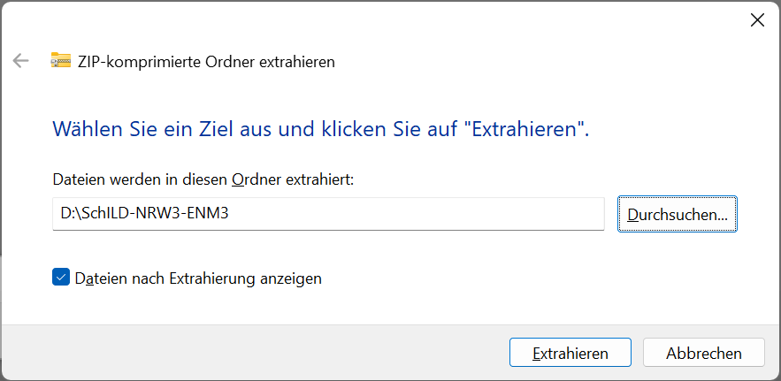
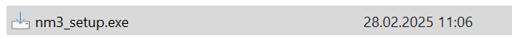
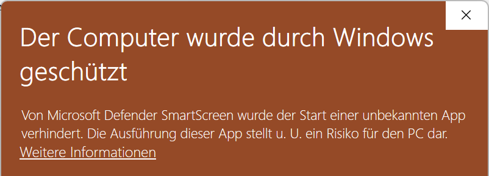
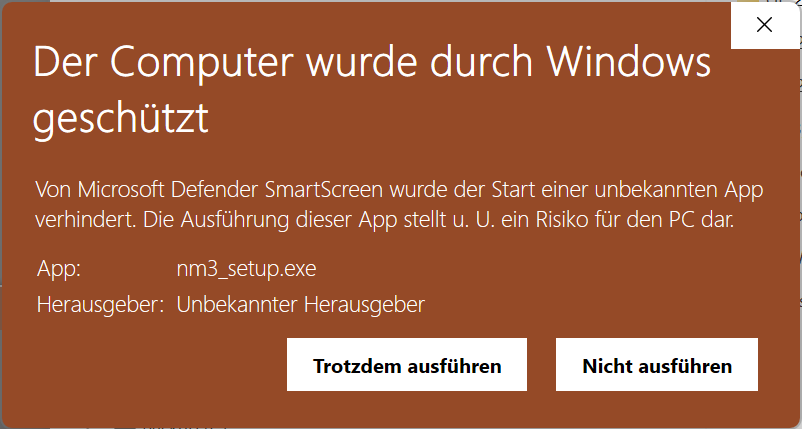
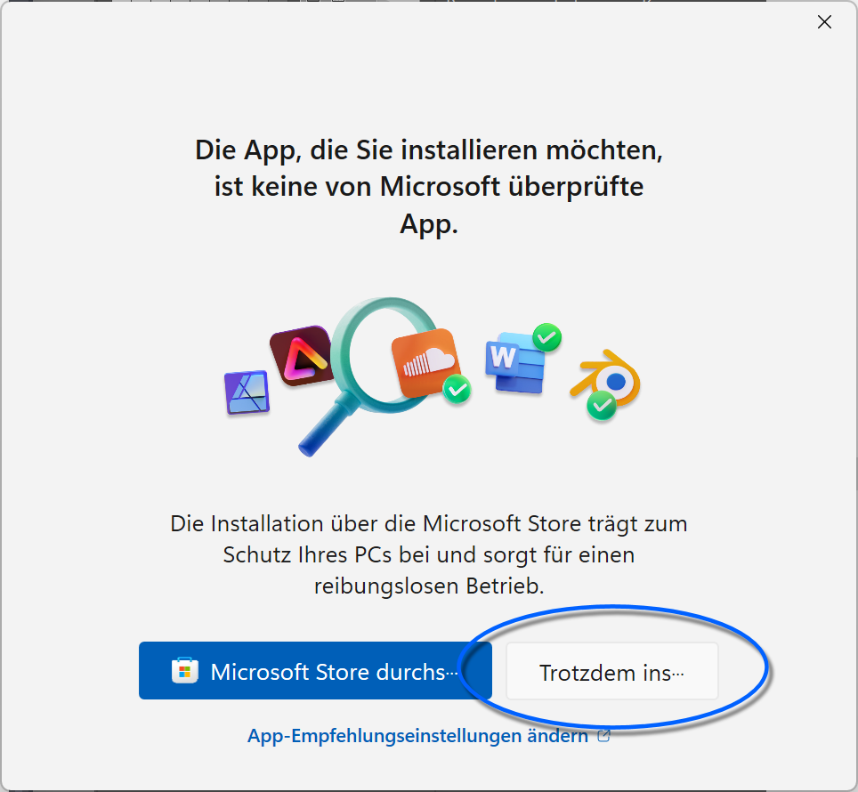
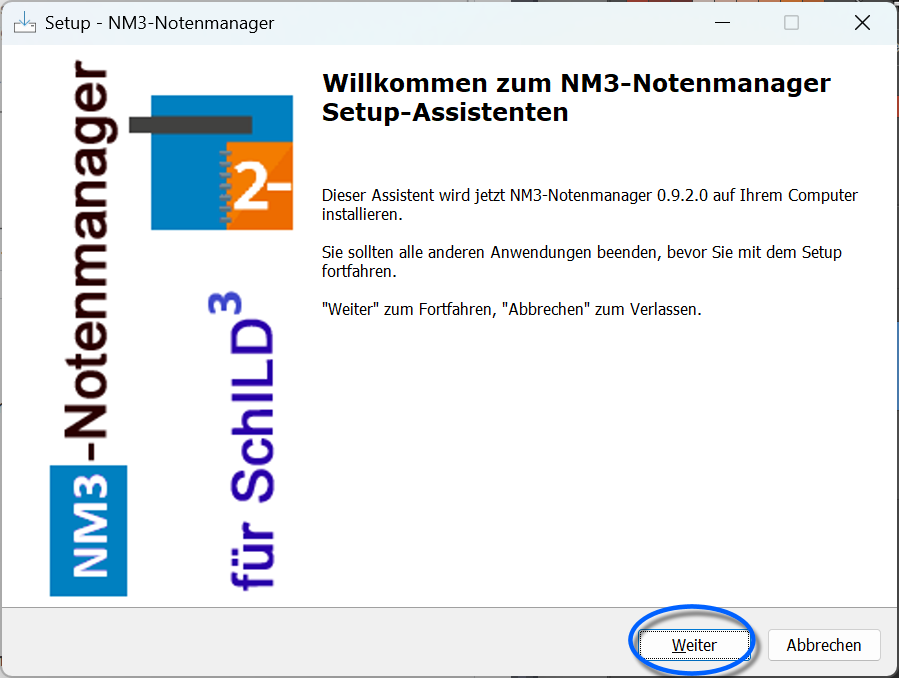
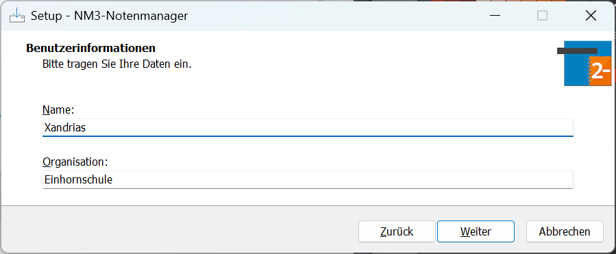
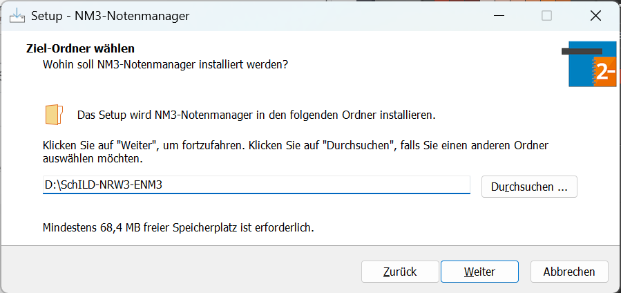

# Installation des Externen Notenmoduls (Tutorial)

Das Externe Notenmodul 3 (ENM3) steht derzeit als Betaversion zum
Download zur Verfügung. Laden Sie es über
<https://github.com/SVWS-NRW/ExternesNotenmodul/releases> herunter.Sofern es nicht mehr im Beta-Stadium ist, wird es über www.svws.nrw.de
angeboten werden.

Bei dem externen Notenmodul handelt es sich um ein
Programm ausschließlich für **MS Windows**, das installiert wird.Eine Lösung, die vom Betriebssystem unabhängig ist, wird später mit dem
**WebNotenManager** angeboten werden.Bitte verteilen Sie das Notenmodul direkt über Ihre Schule und verlinken
Sie nicht auf für alle Lehrkräfte auf die Seite des MSB.

Das Programm wird nicht im SchILD-NRW-3-Verzeichnis, sondern in ein

eigenes Verzeichnis installiert. In diesem gibt es auch das eigenen
ENM3-Arbeitsverzeichnis, in dem die Notendaten abgelegt werden.Wählen Sie das Installationsverzeichnis, per Standard wird der Desktop
vorgeschlagen.

Installieren Sie das ENM3 in der Schule, beachten Sie,
dass die Nutzer im Installationsverzeichnis von SchILD-NRW-3 keine
Schreibrechte mehr haben. Überlegen Sie, ob Sie das ENM3 in Ihr
SVWS-Arbeitsverzeichnis installieren möchten.

# Installation

Sie können die ausführbare Datei fest auf ihrem System installieren oder

nur die gepackte zip-Datei entpacken.Per Standard blendet Windows die Dateiendungen .exe und .zip aus. Diese
werden bei Ihnen also eventuell nicht angezeigt. Achten Sie hier auf die
Icons: Ist das Icon ein kleiner Reißverschluss an einem Ordner-Symbol,
dann haben Sie es mit der gepackten .zip-Datei zu tun.

Nach Möglichkeit sollten Schulen die .zip-Datei
verteilen, da die Installation auf MS Windows-Systemen einfacher ist und
keine erhöhten Benutzerrechte benötigt.

## Entpacken der .zip

Laden Sie die gepackte .zip-Datei herunter und speichern Sie die Datei
an einem sinnvollen Ort.Klicken Sie mit der `Rechten Maustaste` auf die Datei...... und wählen Sie `Alle extrahieren...`.  

Wählen Sie hier den Pfad, in den das Externe Notenmodul 3 entpackt
werden soll.Haben Sie die Datei schon in ein Verzeichnis gelegt, in dem es liegen
soll, können Sie den Vorschlag so lassen oder auch nur den letzten
Unterordner entfernen.  

Hier im Beispiel soll das ENM3 in einen anderen Pfad, der im Windows
Explorer direkt unter dem existierenden SchILD-NRW-3-Ordner angezeigt
wird.Nachdem Sie den passenden Pfad belassen oder gewählt haben, klicken Sie
auf `Extrahieren`.Sofern Sie eine neue Version über eine alte entpacken, können Sie
existierenden Dateien auf Nachfrage überschreiben lassen.  

## Installation der .exe

Legen Sie die Installationsdatei nm3_setup.exe, die Sie von Ihrer Schule
erhalten haben, an einem geeigneten Speicherort ab und klicken Sie diese
dann im Windows-Explorer doppelt an.  

Eventuell weist Windows Sie darauf hin, dass die Datei unbekannt sei.
Nehmen Sie die Warnung zur Kenntnis und installieren Sie die Datei
dennoch.  
Klicken Sie auf `Weitere Informationen` und dann auf...

... `Trotzdem ausführen`, um fortzufahren.  

Je nachdem, wie Ihr System eingestellt ist, werden Sie darauf
hingewiesen, dass die Datei nicht aus dem Microsoft Shop stammt.Klicken Sie auf `Trotzdem installieren.`  

Das Installationsprogramm startet und wir klicken auf `Weiter`.Nehmen Sie die folgenden Informationen zur Kenntnis und klicken Sie noch
einmal auf `Weiter`.  

Im Installer werden Sie aufgefordert, **Name** und **Organisation**
einzugeben.

Die Eingaben hier sind ohne Belang, wählen Sie, was Ihnen gefällt. Im
schulischen Kontext wählen Sie etwas, das seriös ist.Klicken Sie ein weiteres Mal auf `Weiter`.  

Geben Sie nun den **Pfad der Installation** ein. Hier wird ein
Verzeichnis gewählt, bei dem das Notenmodul alphabetisch direkt unter
dem Verzeichnis für SchILD-NRW-3 anzeigt wird.Wählen Sie einen Pfad, der für Sie Sinn macht.

Installieren Sie in der Schulumgebung, denken Sie daran,
dass Nutzer im SchILD-NRW-3-Verzeichnis selbst keine Schreibrechte haben
und dass im Notenmodul-Verzeichnis das ENM3-Arbeitsverzeichnis genutzt
werden muss.

Klicken Sie dann auf `Weiter`

.  

0Wählen Sie nun, ob der Installer Symbole zum Starten des ENM3 auf Ihrem
Desktop oder der Taskleiste anlegen soll.Wählen Sie, ob Ihnen das sinnvoll erscheint. Installieren Sie im
Standardvorschlag direkt auf dem Desktop, wird dort auch das Verzeichnis
zum direkten Anklicken liegen. Ein Symbol wäre damit nicht mehr
hilfreich. Klicken Sie dann auf `Weiter`.Dann klicken Sie auf `Installieren`.

Das Programm wird installiert.  

1Sie können nun warten, ob das Programm nach der Installation direkt
gestartet werden soll.Treffen Sie Ihre Wahl. Normalerweise liegen direkt nach der Installation
keine Notendateien im Arbeitsverzeichnis, daher ist ein direktes Starten
in diesem Fall noch nicht sinnvoll.Dann klicken Sie auf `Fertigstellen`.