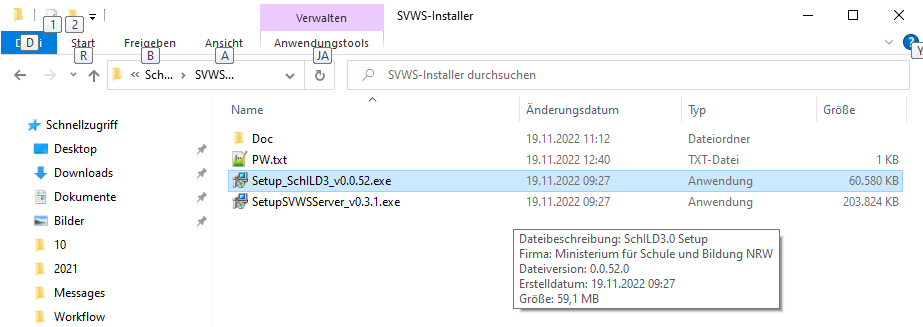
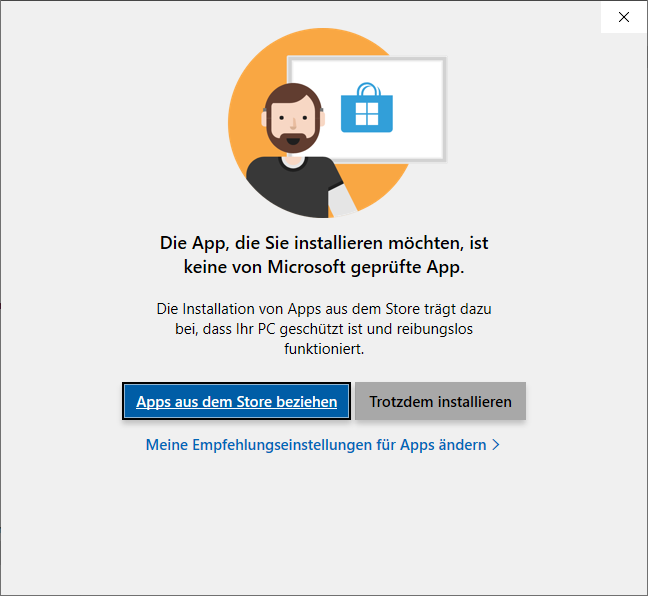
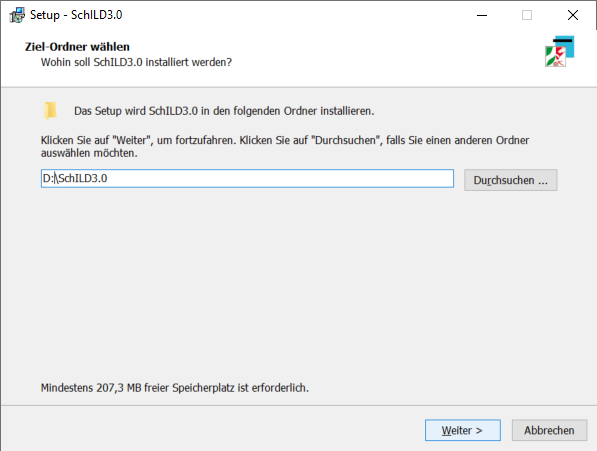
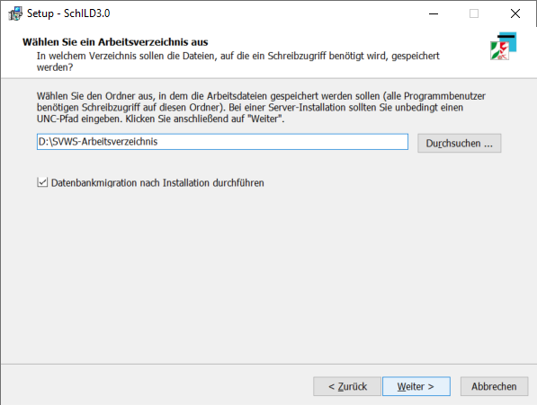
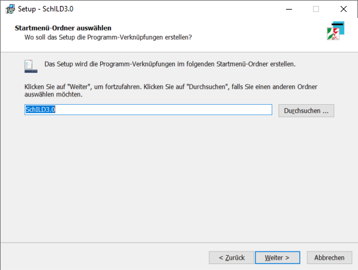
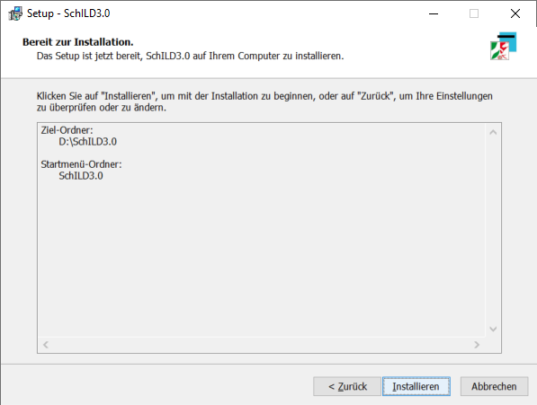
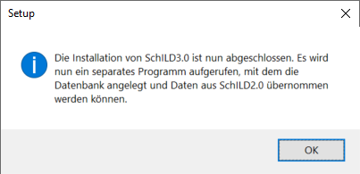
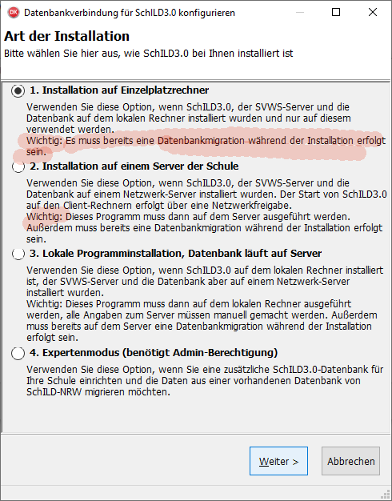
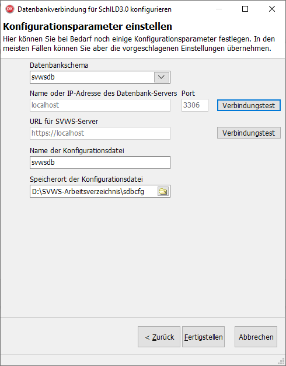
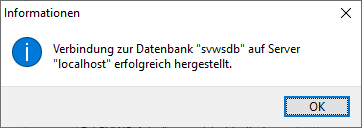

# Installation von SchILD-NRW

Um eine funktionierende Umgebung für SchILD 3 zu
installieren, müssen sowohl der SVWS-Server als auch der SchILD-3-Client
installiert werden.

**Eine Übersicht, wie der SVWS-Server und SchILD 3 zusammenspielen:**  

<youtube>sKt7ujuCO7k</youtube>

Diese Anleitung führt durch die Installation des Klienten SchILD 3.

## Installation von SchILD 3

Laden Sie zuerst SchILD 3 auf der Webseite für
[Schulverwaltungssoftware](https://www.svws.nrw.de) des MSB NRW
herunter. Über diese Seite können auch Updates für SchIlD 3 bezogen
werden.

 Klicken Sie dann die Installationsdatei an.  

 Je nach Berechtigungen in Windows und Einstellungen zur
Installation von Software wird Windows nachfragen, ob ein Programm,
welches nicht aus dem Windows-Store bezogen wurde, installiert werden
soll.Bestätigen Sie diese Nachfrage mit "Trotzdem installieren". Eventuell
wird auch noch einmal eine weitere Bestätigung eingefordert, bestätigen
Sie diese ebenfalls.  

## Angabe der Installationspfade

 Wählen Sie nun den Pfad, in dem Sie SchILD 3 installieren
möchten. Hier in diesem Beispiel wird SchILD auf Laufwerk D installiert.
In diesem Verzeichnis werden sich später ausschließlich die
Programmdateien für SchILD befinden.

Daher besteht kein Grund, reinen Nutzern Schreibrechte
auf diesem Pfad zu geben.

Sollten Sie planen, SchILD in einer Netzwerkumgebung als
reine Serverinstallation zu nutzen, muss dieser Pfad dann von den
Klienten im Netzwerk erreichbar sein. Kontaktieren Sie hier bei
Nachfragen Ihre Netzwerkadministration.

  

 Wählen Sie nun das SchILD-Arbeitsverzeichnis. In diesem
Verzeichnis werden alle Dateien abgelegt, die in Tagesgeschäft
geschrieben werden müssen. Zum Beispiel finden sich hier die Reports.

Auf diesem Verzeichnis benötigen die Nutzer
Schreibrechte.

  

 Wählen Sie, wie die Installation im Startmenü heißen soll.
Hier kann der Standard behalten werden. Klicken Sie auf "Weiter".  

 Kontrollieren Sie Ihre Eingaben und klicken Sie dann auf
"Installieren".  

## Das Konfigurationstool

 SchILD 3 wurde installiert und muss nun noch über ein
Konfigurationstool korrekt eingestellt werden.Über diese Tool wird nun gewählt, wie SchILD genutzt werden soll. Es
gibt hier drei Möglichkeiten:-   SchILD kann zusammen mit dem SVWS-Server auf einem
    Einzelplatzrechner betrieben werden. Hierbei liegen beide Programme
    auf dem gleichen Rechner und dieser wird nicht für das Netzwerk
    verwendet. Dieser Fall kann in sehr kleinen Schulen, in denen nur an
    einem Rechner zu zu Testzwecken zutreffen.
-   SchILD wird von einem Server aus betrieben. Hierbei laufen sowohl
    der SVWS-Server als auch der Klient auf einem Server und Nutzer
    starten SchILD, indem sie SchILD über eine Netzwerkfreigabe starten.
    Bei dieser Option muss SchILD nur auf der Server auf eine neue
    Version geupdatet werden, so dass alle Nutzer mit der aktuellen
    Version arbeiten. Für einen Betrieb im Netzwerk ist dies die
    Standardwahl.
-   Im Netzwerk läuft der SVWS-Server, aber SchILD soll auf einem
    bestimmten Einzelplatzrechner eigenständig installiert werden.
    Hierbei müssen alle Einzelplatzinstallationen gesondert gewartet
    werden.Weiterhin kann über einen Expertenmodus die manuelle Einstellung vieler
Optionen vorgenommen werden.

Führen Sie die Migration einer bislang verwendeten
SchILD-2-Datenbank schon bei der Installation des SVWS-Servers aus
beziehungsweise erstellen Sie bei der Installation des SVWS-Servers ein
neues Datenbank-Schema. Dieses nun existierende Schema wird dann bei der
folgenden Installation von SchILD 3 ausgewählt.

  

## Installation auf einem Einzelplatzrechner

 Hier im Beispiel wurde gewählt, SchILD auf einem
Einzelplatzrechner zu installieren. Es muss das bei bei der Installation
des SVWS-Servers gewählte Datenbankschema, also der "Name" der zu
verwendenden Datenbank, gewählt werden. Bei der Installation des
SVWS-Servers wurde der Standard beibehalten, daher lautet der Name hier
"svwsdb".

Bei einer lokalen Installation wird über den lokalen
Rechner auf die Datenbank zugegriffen, den "localhost".

Weiterhin können Name und Ort der Konfigurationsdatei angegeben werden.

Diese Datei enthält die verschlüsselten Zugangsdaten, um auf den
SVWS-Server zuzugreifen. Hierbei handelt es sich nicht um den
SchILD-Login der jeweiligen Benutzer! Normalerweise sollte hier der
Standard behalten werden, Abweichungen können durch die System- und/oder
Netzwerkadministration entschieden werden.Über "Verbindungstest" nimmt das Konfigurationstool einen Test vor, ob
der SVWS-Server mit den gewählten Einstellungen erreicht werden kann.  

 Der Verbindungstest zum SVWS-Server auf "localhost" bzw.
zur Datenbank war erfolgreich.  

0 Die Installation ist vollständig abgeschlossen, wenn die
Konfigurationsdatei erfolgreich angelegt werden konnte.  

1 SchILD 3 kann nun über diese Icon auf Ihrem Desktop
gestartet werden.  

## Installation in einer Netzwerkumgebung
Wird SchILD in einer Netzwerkumgebung installiert, werden sowohl der
SVWS-Server als auch SchILD auf einem Server installiert. SchILD wird
nun von den Nutzen gestartet, indem aus einer Netzwerkfreigabe das
SchILD 3 gestartet wird.Geben Sie in dem Fenster, in dem bei der Installation am Einzelplatz
"localhost" angegeben war, die korrekten Daten ein, wo der SVWS-Server
in Ihrem Netzwerk erreichbar ist. Weiterhin müssen Sie hier auch
Nutzernamen und Passwort für den SVWS-Server angeben. Diese wurden bei
dessen Installation gesetzt.

Auf das SchILD-Programmverzeichnis reichen für Nutzer
Leserechte aus. In das SVWS-Arbeitsverzeichnis muss auch geschrieben
werden können.

  

2

Um SchILD einfacher zu starten kann eine Verknüpfung auf
dem Desktop eines Nutzers angelegt werden, welche auf das Programm im
Netzwerkpfad verweist.

Hierzu muss mit der rechten Maustaste auf das Programm geklickt werden,

dann kann "Kopieren" gewählt werden.  

3 Nun kann mit der rechten Maustaste auf dem Desktop des
Nutzers mit "Verknüpfung einfügen" eine anklickbare Verknüpfung erzeugt
werden.

Klicken Sie nicht auf "Einfügen", dies fügt eine Kopie
des Programms ein und führt nicht zu einer funktionierenden
Verknüpfung.

  

## Update

Wurde SchILD einmal auf einem Rechner installiert, kann ein Update durch
ein Anklicken eines aktuellen Installationsprogramms gestartet werden.
Es müssen bei einem Update keine weiteren Einstellungen vorgenommen
werden.

### Videotutorial zur Installation von SchILD-NRW
<youtube>d6GbuzOx-Tc</youtube>
