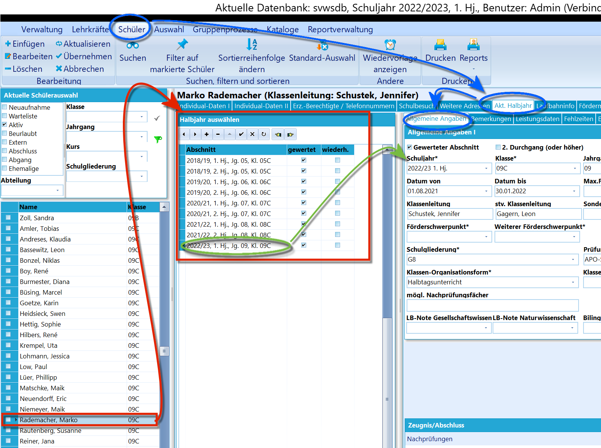
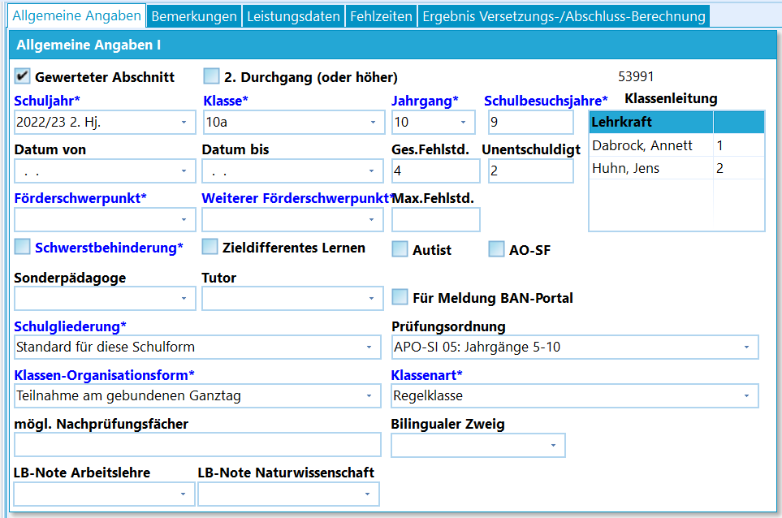
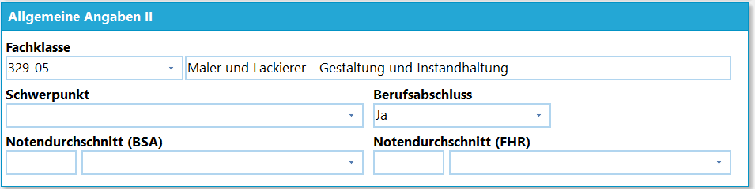
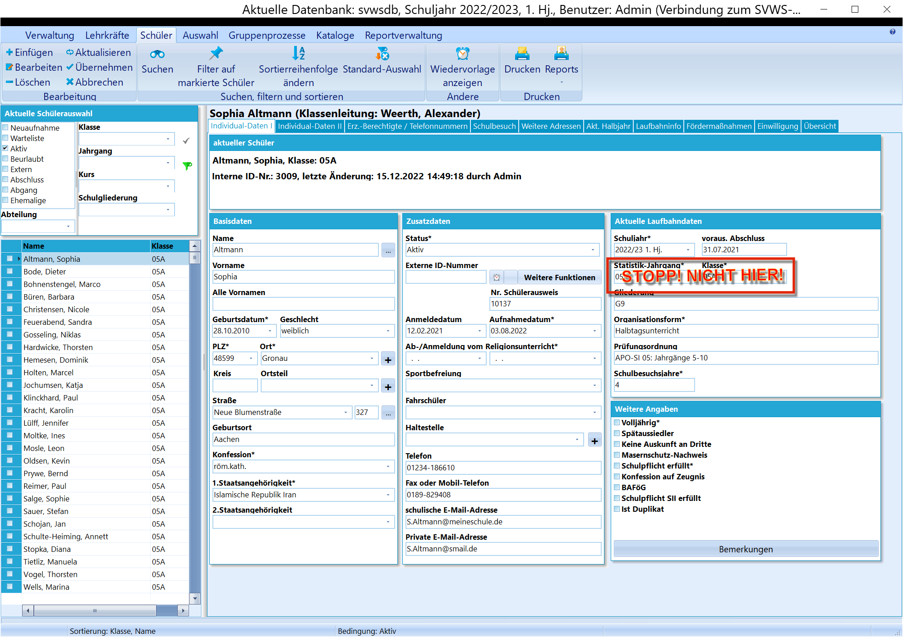
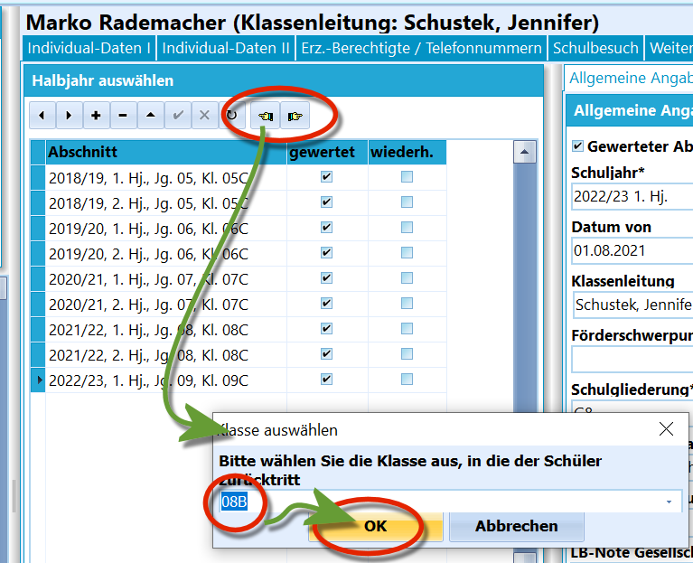
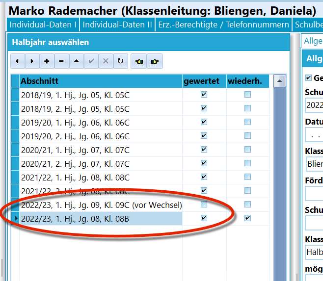
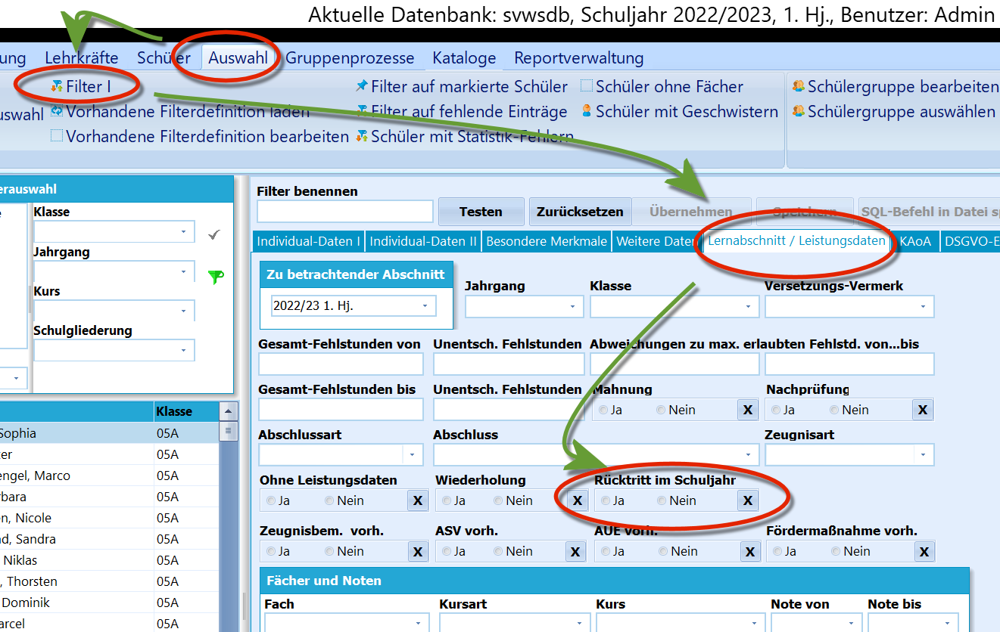
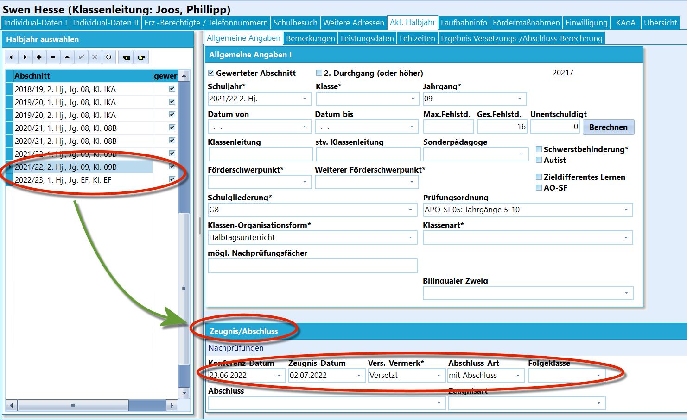

# Aktuelles Halbjahr / Aktueller Abschnitt (Schüler)

## Lernabschnittsübersicht

Unter *"Schüler"* ➜ *"Akt. Halbjahr"* finden sich alle Lernabschnitte,
die für einen im linken Container ausgewählten Lernenden angelegt
wurden.Wurde ein Abschnitt im rot markierten Abschnittscontainer markiert,
werden *Allgemeine Angaben"* zu diesem Abschnitt angezeigt.Lernabschnitte werden üblicherweise bei der Neuaufnahme, bei der
Versetzung und über einen Gruppenprozess vor der Versetzung automatisch
angelegt, es ist jedoch auch möglich, über das "**+**" und dem kleinen
Haken einen Lernabschnitt manuell anzulegen.  
Die Lernabschnitte führen jeweils das Schuljahr und den Abschnitt, also
Halbjahre oder Quartale, den Jahrgang und die Klasse auf.Weiterhin ist eingestellt, ob der Lernabschnitte *gewertet* wird und ob
es sich um eine *Wiederholung* handelt. Diese Haken können hier in der
Tabelle nicht verändert werden, die Veränderungen werden im jeweiligen
Abschnitt unter *"Allgemeine Angaben"* vorgenommen.

Tipp 1: Einen **Lernabschnitt manuell anzulegen** kann
sinnvoll sein, wenn ein neuer Lernender neu an der Schule aufgenommen
wird und die Noten des letzten Lernabschnitts oder noch weiter
zurückliegender Lernabschnitte der alten Schule mit in SchILD-NRW
aufgenommen werden sollen. Somit lassen sich Epochalfächer oder
Sprachenfolgen abbilden.Tipp 2: Wenn Zeugnisse oder andere Leistungsdaten aus einem Abschnitt
gedruckt werden sollen, etwa um noch Noten eines wiederholten
Lernabschnitts auszugeben, muss der Haken *"gewertet"* gesetzt sein,
damit Noten erscheinen. Der Haken kann nach dem Druck dann wieder
entfernt werden.

  

## Allgemeine Angaben

 Als erste Zeile in Bereich *"Allgemeine Angaben"* wird
angezeigt, ob es sich um einen gewerteten Abschnitt handelt oder nicht.Zusätzlich wird mit "**2. Durchgang (oder höher)**" angegeben, ob es
sich um eine Wiederholung handelt.

Als Faustregel kann hier gelten: Bei einem normalen
Abschnitt ist der Haken *"gewertet"* gesetzt. Bei einer Wiederholung
werden beim ersten, originalen Lernabschnitt beide Haken nicht gesetzt,
er ist also *Keine Wiederholung* und *nicht (mehr) gewertet*. Der neue,
nun aktuelle und wiederholende Durchgang wird somit ein *2. Durchgang
(oder höher)* und ist *gewertet*.Wird der Lernabschnitt noch einmal wiederholt, wäre der neue Abschnitt
mit beiden Haken gekennzeichnet, der vorherige Abschnitt würde auf
*nicht gewertet* geändert, bliebe aber nach wie vor ein *2. Durchgang
(oder höher)*.

Als Angaben folgen weiter das **Schuljahr** mit dem Abschnitt, der sich

auf ein Halbjahr oder Quartal bezieht, die zu diesem Abschnitt
gehörenden Angaben zu **Klasse** und **Jahrgang** sowie die Einträge
**Darum von** und **Datum bis**, welche Beginn und Ende des
Lernabschnitts angeben.Alle dieser Felder werden zusammen mit **Klassenleitung**, die alle
zugeordneten Lehrkräfte enthält, entweder über die *Versetzungstabelle*
(*"Kataloge"* ➜ *"Klassen-/Versetzungstabelle"*) oder bei der Versetzung
automatisch gesetzt.Zusätzlich zur Klassenleitung lassen sich Personen bei
**Sonderpädagoge** und **Tutor** erfassen.Ebenso werden im Regelfall automatisch gesetzt: die **Schulgliederung**,
**Prüfungsordnung**, **Klassenorganisationsform** oder die
**Klassenart**.Unter den Fehlstunden werden die Felder angewählt, mit denen
**Schwerstbehinderung**, **Autismus**, **Zieldifferentes Lernen** und
**AO-SF** erfasst werden.Ebenso können Schüler hier für die Meldung an das über den Haken **Für
Meldung BAN-Portal** markiert werden, wenn ihnen noch nicht klar ist,
was die betreffenden Schüler nach ihrem Abschluss/Abgang planen. Das
Portal gehört zu KAoA und *BAN-Portal* steht für *Belegungs-,
Abrechnungs- und Nachweisportal*. Nehmen Sie hierzu den Artikel zum
Export für das BAN-Portal zur Kenntnis.Ebenso lassen sich hier die beiden **Förderschwerpunkte** erfassen.
Achten Sie bitte auf eine statistikkonforme Eintragung.Unten in diesem Detailblock werden die beiden **Lernbereichsnoten** zu
*Gesellschaftswissenschaften* und *Naturwissenschaften* erfasst.Sofern ein **Bilingualer Zweig** vorliegt, wird dieser im entsprechenden
Feld vermerkt.  

## Fehlstunden

Die Fehlstunden werden über die gesamten Fehlstunden (**Ges.Fehlsdt.**)
und die unentschuldigten Fehlstunden (**Unentschuldigt**) erfasst. Diese
können auch per *Gruppenprozess* gesetzt oder das *Externe Notenmodul*
eingeholt werden.Wurde das Feld **Max. Fehlstd.** gefüllt, dies ist auch über einen
*Gruppenprozess* möglich, werden bei einer Überschreitung die
**Ges.Fehlstd.** fett markiert.Weitere Informationen zu Fehlzeiten, der Konfiguration und der Erfassung
von Fehlzeiten findet sich im Artikel über die

DEADLINK: Fehlzeiten - Fehlzeiten_(Aktuelles_Halbjahr_/_Aktueller_Abschnitt.md

.  

## Allgemeine Angaben II

An Berufskollegs finde sich hier das Feld *Allgemeine Angaben II* zur
**Fachklasse** und dem Berufsabschluss.Liegt ein **Schwerpunkt** des Bildungsganges vor, wird dieser hier
eingetragen. Die Schwerpunkte werden über *Kataloge ➜ Schwerpunkt*
definiert.  

## Vor- und Rücktritt im laufenden Schuljahr

 Um einen Vor- oder Rücktritt im laufenden Schuljahr bei
einem Lernenden durchzuführen, darf der aktuelle Lernabschnitt nicht
einfach in den Individualdaten I verändert werden.

Die betreffende Person wurde zum Schuljahreswechsel gültig in eine
Klasse versetzt - oder eben nicht versetzt - und ein Wechsel im
laufenden Schuljahr muss somit auch in der Laufbahn vermerkt werden.  

 Im Reiter "Schüler" ➜ "Akt. Halbjahr" gibt es oberhalb der
Liste mit den Lernabschnitten zwei Schaltflächen um einen freiwilligen
Rückgang beziehungsweise eine Vorversetzung durchzuführen.Der Rücktritt ist mit der nach links weisenden Hand *"Rücktritt im
laufenden Schuljahr"* anzustoßen. Nach dem Anklicken des Symbols gelangt
man zum Fenster, in dem die neue Klasse im vorherigen Jahrgang
ausgewählt wird. Die Wahl wird mit *"OK"* bestätigt.Analog wird bei *"Sprung nach oben im laufenden Schuljahr"* mit der nach
rechts weisenden Hand vorgegangen. Auch hier ist wieder die neue Klasse
zu wählen.Nachdem der Lernende im Hauptfenster von SchILD einmal ab und neu
angewählt wurde, sollte die neue Klasse beim unter *"Laufbahn"* im
Reiter *Individualdaten I* geprüft werden. Prüfen Sie auch den korrekten
*"Statistik-Jahrgang"*.  

 Es ist in der Laufbahn bei den Lernabschnitten zu sehen,
dass ein neuer Lernabschnitt angelegt wurde und es zum aktuellen
Abschnitt zwei Einträge gibt, wobei der ältere der beiden mit *"(vor dem
Wechsel)"* gekennzeichnet ist.  

 Über den *Schülerfilter* lassen sich Rücktritte im
laufenden Schuljahr finden.  

## Zeugnis/Abschluss

 Unterhalb der allgemeinen Angaben finden sich die
Informationen, die bei einem Lernabschnitt zu Zeugnis, Versetzung und
eventuellem Abschluss gesetzt wurden.Alle Eintragungen können hier oder unter dem Reiter *Leistungsdaten*
manuell vorgenommen werden. Der größte Teil der Eintragungen wird jedoch
per Gruppenprozess für komplette Jahrgänge vorgenommen. So lassen sich
per Gruppenprozess die Daten setzen oder eine automatische Versetzungs-
und Abschlussprüfung durchführen.  Zumindest werden ein **Konferenzdatum** und ein **Zeugnisdatum**
eingetragen.Beim **Versetzungsvermerk** können die folgenden Einträge gewählt
werden:-   *Versetzt*
-   *Vorversetzt*
-   *Freiwillig zurück*
-   *Nicht versetzt*
-   *N.v., Nachprüfung möglich*: hier wird SchILD die Fächer ausweisen,
    für die dem Algorithmus eine Nachprüfung möglich erscheint.
-   ''Abschluss"Weiterhin kann eine **Abschluss-Art** des Jahrgangs eingetragen werden,
ein eventueller konkreter **Abschluss** findet sich darunter. Ebenso
wird die eventuelle **Folgeklasse** behandelt. In Jahrgängen mit die
Schullaufbahn beendenden Abschlüssen, z.B. das Abitur in der Q2, bleibt
die Folgeklasse leer. Die Folgeklasse wird der *Versetzungstabelle*
entsprechend ausgefüllt.Der Jahrgang wie auch der eventuell erreichte Abschluss bestimmen die
**Zeugnisart**.