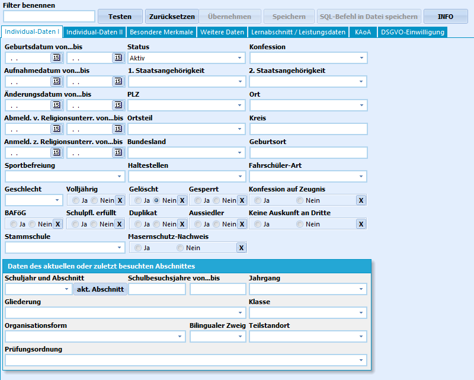
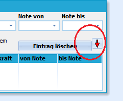
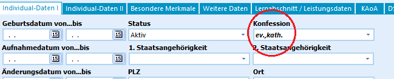
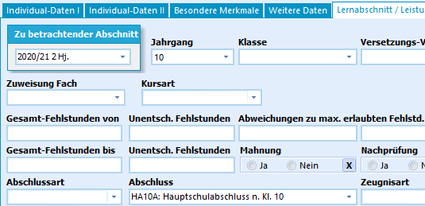

# Benutzung des Schülerfilters (Tutorial)

## Der Schülerfilter

 Dieses Tutorial gibt eine Einführung in die Benutzung des
Schülerfilters. Zuerst werden einige grundlegende Informationen gegeben,
dann wird die Benutzung anhand von kurzen Beispielen erläutert.Der Schülerfilter bietet diverse Selektionsmöglichkeiten, um die
gewünschte Schülermenge zu filtern. Der Schülerfilter findet sich unter
dem Menüpunkt **Auswahl**.Um Schülerinnen und Schüler nach bestimmten Merkmalen zu filtern hat man
hier eine Vielzahl von Auswahlmöglichkeiten. Die Filterbedingungen
lassen sich durch manuelle Eingaben sowie durch die Auswahl von
vorgegebenen Listenfeldern schnell zusammenstellen.-   Es ist eine Filterung über die Listenfelder der *Individualdaten I*
    und *Indivdualdaten II*, einigen weiteren Daten sowie über den
    Bereich der *Leistungsdaten* standardmäßig mit UND-Verknüpfungen,
    bei einigen Feldern auch mit ODER- Verknüpfungen möglich.
-   Häufig wird in einem Drop-Down-Menüs ausgewählt, indem man vor die
    jeweilige Auswahl klickt. Hier ist eine Mehrfachauswahl möglich.
-   Ein *Entfernen* gesetzter Filterbedingungen gelingt durch ein
    erneutes Anklicken des Feldes.
-   Es gibt weiterhin Felder, die durch das Anklicken von *ja* oder
    *nein* gefiltert werden. Bei letzteren lässt sich die Auswahl durch
    das Anwahl des *x* wieder entfernenGrundsätzlich entsprechend die Auswahlmöglichkeiten der Reiter im Filter
denen der Reiter in SchILD-NRW:-   Bei den Listenfeldern der **Individualdaten I** kann man vom
    *Status* über das *Geschlecht*, *die Staatsangehörigkeit*, das
    *Aufnahmedatum*, die *Klassenart* bis hin zur *Prüfungsordnung*
    diverse Filterbedingungen einstellen.
-   Entsprechend finden sich unter **Individualdaten II** stehen
    Filtermöglichkeiten zum *Migrationshintergrund*, zum
    *Grundschulbereich*, zur *Sekundarstufe I* und zur
    *sonderpädagogischen Förderung* bereit.
-   Die *Weiteren Daten* stellen Auswahlfilter zu den
    Erziehungsberechtigten und zu Vermerken zur Verfügung. Dort kann
    ebenfalls nach den Schulbesuchsdaten (zuletzt besuchte Schule,
    Entlassung von eigener Schule, Wechsel zu aufnehmender Schule)
    gefiltert werden.
-   Im Bereich der *Leistungsdaten* kann man neben anderen z. B. über
    das Schuljahr, den Jahrgang oder die Klasse, den Klassenlehrer, die
    Abschlussart und Versetzungsvermerke filtern (Beispiel siehe unten).
-   Darüber hinaus gibt es die Möglichkeiten unter dem Reiter *KAoA*
    nach bestimmten Maßnahmen der letzten Halbjahre zu suchen
-   Unter *DSGVO-Einwilligungen* stehen die unterschiedlichen
    Einwilligungen der Datenschutz-Abfragen zur Verfügung. Hier kann der
    Eintrag bei den Schülerinnen und Schülern entweder ignoriert oder
    die gefiltert werden, bei denen eine Zustimmung bzw. eine Ablehnung
    gesucht wird.  
===Mehrfachauswahlen=== 

Wenn ein roter Pfeil wie in der Abbildung links zu sehen
ist, kann man eine Mehrfachauswahl treffen. Nach jedem Auswählen eines
Eintrags klickt man auf den roten Pfeil und die Auswahl wird übernommen.
Durch das Klicken der rechten Maustaste kann man den Befehl *Eintrag
löschen* wählen und somit einzelne ausgewählte Punkte wieder
entfernen.

  

Um eine einzelne Bedingung zu negieren, führt man einen Doppelklick auf
die entsprechende Bedingung aus. Diese wird dann **fett** und *kursiv*
dargestellt.

Die Abbildung zeigt zum Beispiel die Filterung von Schülerinnen und
Schüler, die *weder evangelisch noch katholisch* sind.Dementsprechend können z.B. alle Schülerinnen und Schüler gefiltert
werden, die nicht in der 3a sind sind oder auch alle, die keine deutsche
Staatsangehörigkeit haben usw.  

## Suche nach Inhalten vergangener Lernabschnitte

 Ein weiterer häufig genutzter Fall ist das Suchen nach
Informationen aus vergangenen Halb- bzw. Schuljahren.Man kann unter dem Reiter *Lernabschnitt/Leistungsdaten* auf vergangene
Abschnitte zurück greifen. Hier sind im Bild beispielsweise alle
Schülerinnen und Schüler gesucht, die im Schuljahr 2020/21, 2. Halbjahr
die Schule mit einem Hauptschulabschluss nach Klasse 10 verlassen haben.
Auf der Individualseite I ist bei den Schülerinnen und Schülern der
Status *Abschluss* vermerkt.Den neu zusammengestellten Filter kann man nun `Testen` und anschließend
`Übernehmen` und gegebenenfalls zur späteren Wiederanwendung
speichern.  
----

## Videotutorial zum Schülerfilter
<youtube>Scrgk2y0w9s&t</youtube>
