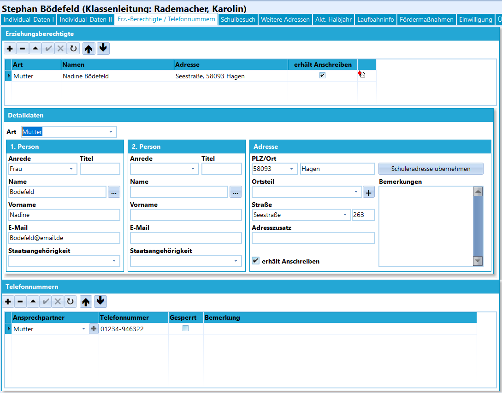

# Erz.-Berechtigte / Telefonnummern (Schüler) 

 Auf der Registerkarte *Schüler*➜
**Erz.-Berechtigte / Telefonnummern** werden die Erziehungsberechtigten,
deren Detaildaten und die Telefonnummern der Ansprechpartner erfasst.

## Erziehungsberechtigte

Die Auflistung zeigt die **Art**, also das Verhältnis zum Kind, wie etwa
*Eltern*, *Mutter*, *Vater*, *Jugendamt* usw.Weiterhin den **Namen** der Erziehungsberechtigten, die **Adresse** und
das Merkmal **erhält Anschreiben** für diese Person(en).Letzterer Schalter steuert auch, ob Serienbriefe für diesen Eintrag im
Reporting beziehungsweise beim Export in externe
Textverarbeitungsprogramme erzeugt werden.

Hier ist zu beachten, dass jeder Eintrag zu *Art* zwei
Personen enthalten kann. In der Regel werden hier also Mutter und Vater
erfasst. Sollte nur eine Person erfasst sein, beachten Sie bitte, diese
als die *1. Person* eingetragen wird, da ansonsten Adressbereiche in
Reports falsch formatiert sein können.

## Detaildaten

Das Feld **Art** wird von den Daten oben übernommen.Unter einer *Art* können bis zu zwei Personen mit Daten zu *Anrede*,
*Titel*, *Name*, *Vorname*, *E-Mail* und *Staatsangehörigkeit*, sowie
eine Adresse bestehend aus *PLZ/Ort*, *Ortsteil*, *Straße mit
Hausnummer*, *Adresszusatz*, *Bemerkungen* und die Festlegung, ob
*Anschreiben* an diese Adresse versendet werden sollen, erfasst werden.

Die zur Auswahl stehenden *Erzieherarten* werden über den entsprechenden
*Katalog* eingestellt.

## Telefonnummern

In dieser Auflistung können unabhängig von den obigen
Erziehungsberechtigten Telefonnummern zu verschiedenen Ansprechpartnern
erfasst werden.Ein Eintrag umfasst dabei die Angaben *Ansprechpartner*,
*Telefonnummer*, ein Kennzeichen, ob diese Telefonnummer *Gesperrt* ist
und eine *Bemerkung*.  
Die hier zur Verfügung stehenden *Telefonarten* werden ebenfalls über
den entsprechenden *Katalog* eingestellt.

Gesperrte Telefonnummern werden in der
Telefon-Datenquelle für Reports nicht berücksichtigt.

