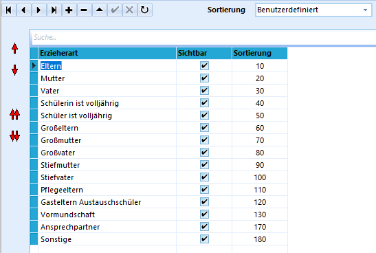

# Erzieher-Arten (Allgemeine Kataloge)

 Im Katalog *Erzieherarten* können Bezeichnungen für die Art
der Erziehungsberechtigten im Karteireiter *Schüler ➜
Erz.-Berechtigte/Telefonnummern* eingetragen werden.

Diese definierten Arten können dann über Dropdownmenüs verwendet werden.