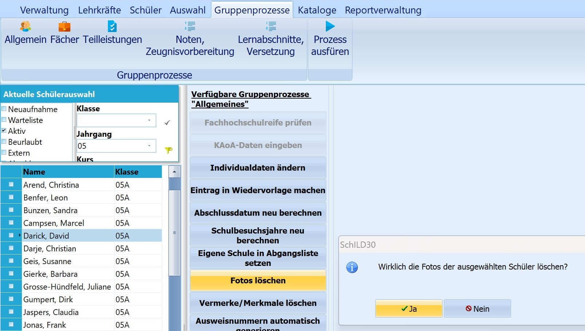

# Fotos löschen (Gruppenprozesse Allgemein)

 Dieser Gruppenprozess löscht bei allen Schülern der
aktuellen Auswahl die hinterlegten Bilder. Vor dem endgültigen Löschen
muss man nochmals bestätigen, dass die Aktion wirklich durchgeführt
werden soll.